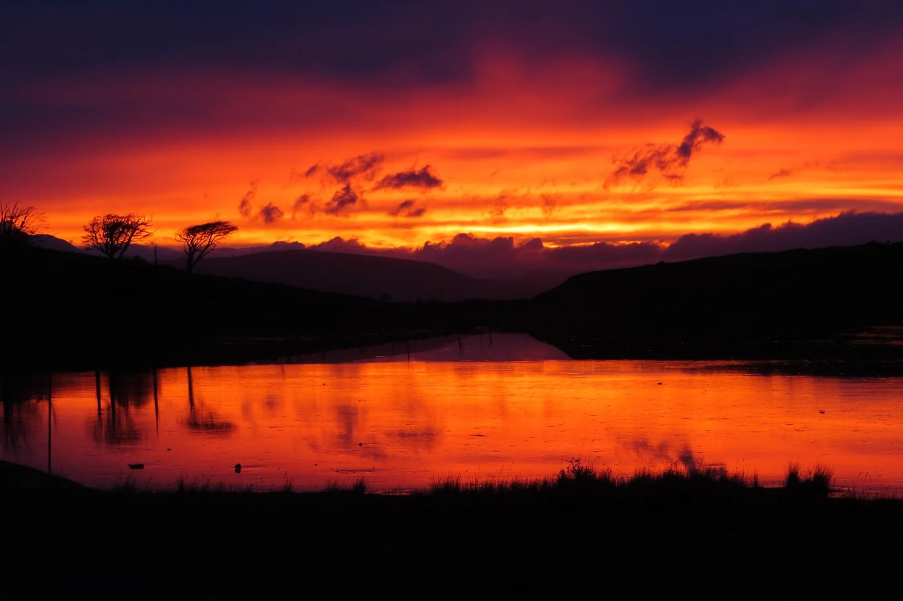
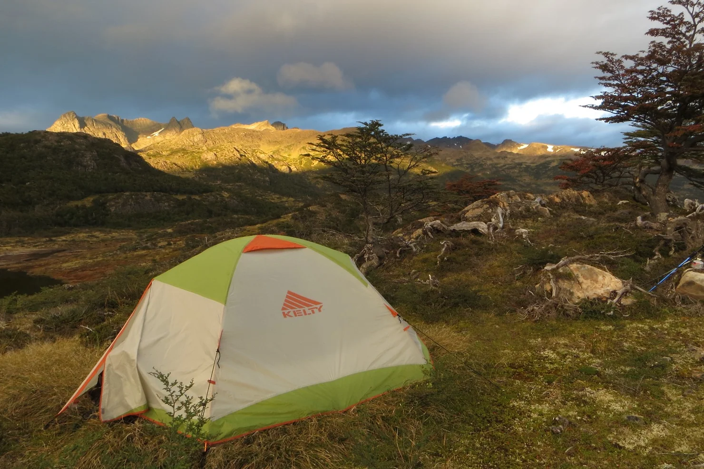
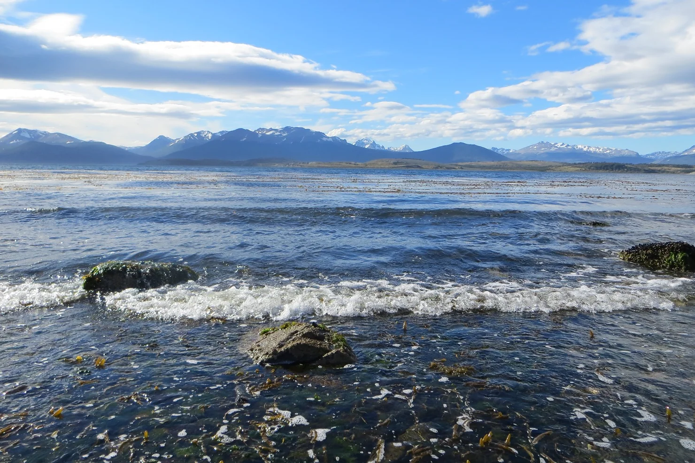

It is a cool morning, we have just reached the peak of a mountain in Navarino Island after a hard hike. We are surrounded by one of the most beautiful landscapes on the planet, where our vision gets lost among mountains, clouds, forests, and lakes. Navarino Island is located at the southern end of the Americas, in Southern Chile, and remains predominantly a wilderness area, one that has escaped much of the environmental degradation caused by industrial society. We take a long deep breath, look at each other, and contemplate the beauty that surrounds us. The howl of the wind as it hits off the mountain brings with it an incredible serenity, and we suddenly feel smaller, like we are part of the mountain itself; just another rock or piece of soil or drop of rain.

More and more, philosophers, writers, and scientists are lamenting the disconnect from nature that is so apparent in our lives. As of 2014, and for the first time in recorded history, 54% of the world’s population now live in cities (expected to rise to 66% in 2050). In cities, and in most developed countries in general, we are often detached from the most natural and elemental aspects of our being: the food we eat, the water we drink, the medicine we take. Of course, modern life brings many benefits. We are no longer subject to the vagaries of nature and weather, we have access to modern medicine, and transportation; our lives on the whole are much more convenient, and less insecure. But perhaps these benefits come at a cost. Perhaps the influx of convenience has made us forget who we fundamentally are, that we are, first and foremost, natural beings, part of nature and not opposed to it.

<figure>

</figure>

These days, it is often large corporations that go into natural places to produce consumer goods and necessities. Subject to the law of the market that keeps its eye firmly on the profit margin, these corporations will exploit the natural area, sometimes without consideration of environmental impacts. One example is the production of coffee; large corporations have begun to move away from traditional methods of coffee production to more efficient, but ultimately more environmentally damaging ways. Coffee grown in the traditional way includes the plants being cultivated under a canopy of trees; this provides a valuable habitat for native fauna, as well as preventing topsoil erosion. Due to market demands and the desire for profit, however, many corporations have opted for a newer method called “sun cultivation.” This involves cultivation under direct sunlight once the forest has been cleared. It is more efficient and productive but has a highly negative impact on the ecosystem and biodiversity as the animals lose their habitat and with soil erosion, as well as the loss of nutrients that were once provided by overhead foliage, the use of chemical fertilizers becomes a necessity. Although there are more efforts being made to factor in environmental concerns to market practices, examples of powerful organizations prioritizing profit over environmental health remain prolific.

Part of the problem may be the way in which we perceive nature. In our society, the lack of connection we feel towards nature has led us to view and talk about it as a ‘resource’ (natural resources). Many of us do not perceive nature to be morally valuable in itself, but rather place its worth in terms of its instrumental value (how useful it is to us). It is not just large corporations that are guilty of this, but us, the general public too. We tend to follow social patterns of high waste production, consumption, over-use of transport… and even simple things like drinking coffee... without considering the environmental impacts of our actions. A discipline that attempts to respond to this problem of perception is one that we are involved in, and it is called ‘environmental ethics.’ It emerged back in the 1970’s, around the same time that scientists began to realize the harm caused by industrial actions on natural ecosystems, including landscape change, interference to nutrient cycles, species extinction and climate change. These realizations caused philosophers and ecologists to question the human relationship with nature. Perceiving what they called a ‘human-centered bias’ in our morality and day-to-day life, they called for an extension of our ethical framework to include nature and natural entities. Aldo Leopold, one of the most influential of these environmental philosophers, argued for a new kind of ethic altogether, called the ‘land ethic.’ This ethic proposed that the role of humans be changed from “conqueror of the land community to plain member and citizen of it.” Interestingly, it was only when Leopold experienced nature and specifically, when he looked into the eyes of a dying wolf, that these ideas flourished in his mind. When he was in nature, experiencing it directly, he then became critical of the dominating way humans exist on this planet and feel a new kind of empathy towards natural things. As we sit here, surrounded by the vast beauty of Navarino Island, this message hits home. By experiencing nature, we begin to feel empathy with it. By experiencing nature, we realize that we are not the only ones or the most important, but that we sharethis planet.

<figure>

</figure>

We arrive to the edge of the lake, put down our heavy backpacks and set up camp. Although we are tired, the hike and the cold air makes our bodies feel good. Blood circulates through all of the muscles, fat does not accumulate in excess, and the cold keeps the immune system active and healthy. After all, we evolved as walker animals, and being active is essential to the proper functioning of our bodies. The song of birds and the smell of the forest lightens our spirit. We do not have any of our modern things, phones, computers or kitchen utensils. All we have is whatever we could fit in one backpack, a tent, some clothes, and enough food for two days. But we find ourselves completely happy. This seems in stark contrast to the message most of us receive today. Corporations and government, via advertising, create a vicious cycle of consumption that seems almost impossible to escape. We are told that whatever we have, it is not enough. We need to buy more, consume more, be more. Being in the middle of the mountains, with basically nothing but some shelter and food, we feel like a sweet liberation from that.

After two days in the mountains and forests of Navarino Island, we make our way back to civilization. As environmental issues are a primary concern for us in our careers, we can’t help but feel that one of the main causes of our environmental problems is the disconnection of western society from nature. We may never fully understand the consequences of our everyday actions on the environment if we do not change our perception towards natural things, and that cannot happen unless we begin to reconnect to our environment once again. That does not necessarily mean going off into the wilderness every weekend, but even simple things like going for a walk in the woods, learning about the native fauna and flora in your area, or watching a sunrise. Embedded in a society that connects happiness to consumerism, it’s often hard to find the motivation to do these things or even think about environmental matters, at all. However, more and more people are, including philosophers, ecologists, and many others. We need to link normal life with environmental philosophy and ecology, as well as important thinkers and ideas that present alternatives to dominant viewpoints and ways of thinking.

<figure>

</figure>