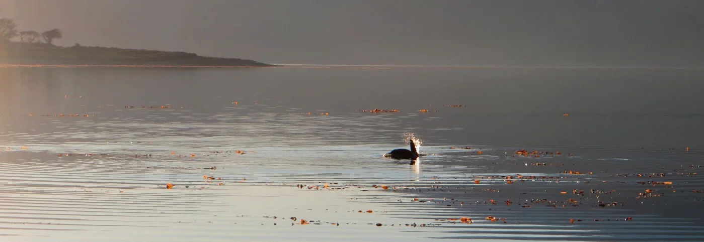

We wake up, prepare something for breakfast, and like every morning before starting work, read the news:

[IPCC climate report: human impact is ‘unequivocal’](https://www.theguardian.com/environment/2013/sep/27/ipcc-climate-report-un-secretary-general)

[IPCC climate report: humans ‘dominant cause’ of warming](https://www.bbc.com/news/science-environment-24292615)

[Humans creating sixth great extinction of animal species, say scientists](https://www.theguardian.com/environment/2015/jun/19/humans-creating-sixth-great-extinction-of-animal-species-say-scientists)

It is becoming increasingly common to see in the media or to read in newspapers and scientific journals that ‘humanity’ is destroying the planet. Scientists have shown that there is a high correlation between environmental issues and human activity. Indeed, many scientists are terming our current epoch, the Anthropocene — from Anthropo, for “man,” and cene, for “new” — to denote the extent to which human-kind has caused the mass extinctions of species, altered the environment, polluted the ocean, and changed the climate of this planet.

However, to blame “human activity” in a generalized way sounds a little unusual. We may be missing something.

When we talk about our adventures in Navarino Island, there are things that remain in our memories: the Yahgan culture, their wonderful stories, the way they enjoy their lives, and the skills they have to create tools, like canoes with tree trunks and handicrafts with rush and whale bones. The southern tip of South America was probably the last region that humans reached in their expansion around the world. The Yahgans, and related cultures, have inhabited the region for thousands of years, long before the Europeans came. During this time, they learned to adapt while living in kinship with nature. They displayed a thorough knowledge of the land, and showed regard and empathy for the creatures that lived in the forest and the sea. They had a minimal impact on the ecosystems and are not known to have contributed to the extinction of animals in the area. Sea lions were a big portion of the Yahgan diet, for example, and while they hunted them for thousands of years, it was not until the colonialists arrived seeking sea lion fur that the population declined dramatically.

This way of respecting and interacting with nature, however, is not limited to the Yaghan culture but can be seen today in many indigenous worldviews. Another example is the Koyukon. The Koyukon are an Alaska Native Athabaskan people who have traditionally lived along the Koyukuk and Yukon rivers and have survived by hunting and trapping animals for millennia. Many of the Koyukon still subsist today in this manner, eating the animals that reside in the rich ecosystems of Alaska, including fish and bear. According to the Koyukon people, the history of animals, plants and humans go back to a remote place, that they call Distant Time. During this time, animals were humans; that is they existed in human form, spoke a human language, etc. At some point in Distant Time, however, particular humans died and were changed into animal or plant beings, and transformed into the species that surround them now. For the Koyukon, therefore, the animals and plants around them are literally their kin; their ancestors, brothers, sisters, and past relatives. This cosmovision has enabled them to live in accordance with natural laws, practice moderation, respect the environment, and coexist with animals for thousands of years without declining species populations.

<figure>

</figure>

These cultures have several things in common. The territories where they live were colonized by Europeans, and as a result, they have incorporated many Western customs and tools, such as technology, lifestyles, language, etc. Their children are speaking their native languages less and less, and instead adopting the official language of the nation(s) to which they now belong. In fact, the Yahgan grandmother Cristina that lives in Puerto Williams is the last pure Yahgan that speaks the native language fluently. When she leaves this world, the language will leave with her, and disappear, as has happened with many other cultures around the world. This process is known as cultural homogenization, and it involves the diversity of human life and culture being dissolved under the fierce expansion of larger empires.

From learning and spending time with indigenous people, we begin to realize the error of blaming humanity as a whole for our environmental problems. As Ricardo Rozzi and others have said, to claim that humanity is responsible for environmental problems is an ethically unfair oversimplification on human diversity. There are specific agents driving most of these changes, and many of these agents (but perhaps not all) belong to the Occidental cultural tradition with its emphasis on individualism, competition, and profit. The free market system that was largely established in modern Europe is one that promotes the exploitation of nature in order to maintain a constantly growing economy. However, many other cultures, and those that are often relegated by more dominant ones, have rich traditions of environmental ethics and co-inhabit nature in ways that can enrich our own.

These days, the term “sustainability” is becoming increasingly popular, with many people, businesses, and governments trying to find ways to become more sustainable. However, instead of trying to find innovative ways to achieve this, it may be beneficial to look to what is already there. Instead of looking forward, in accordance with ideas of progress so embedded in our ideology, maybe we should look back instead. Indigenous people around the world, often who have not contributed to global environmental problems, may have a lot to teach us. We need to open our minds and our hearts to comprehend the different ways of interacting and connecting with animals, plants and mountains, because in this diversity may be where we can find solutions to many of our biggest problems. Instead of blaming humanity as a whole, therefore, it may be better to focus on what parts of our world are driving the harm, and what parts are making it better.
