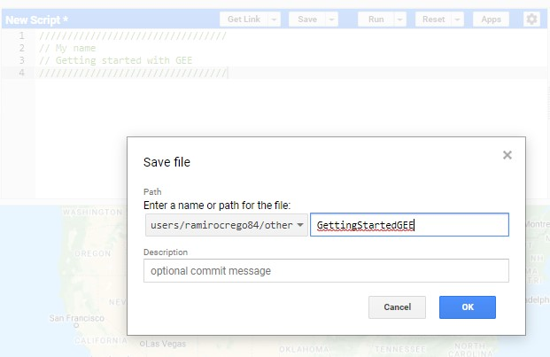
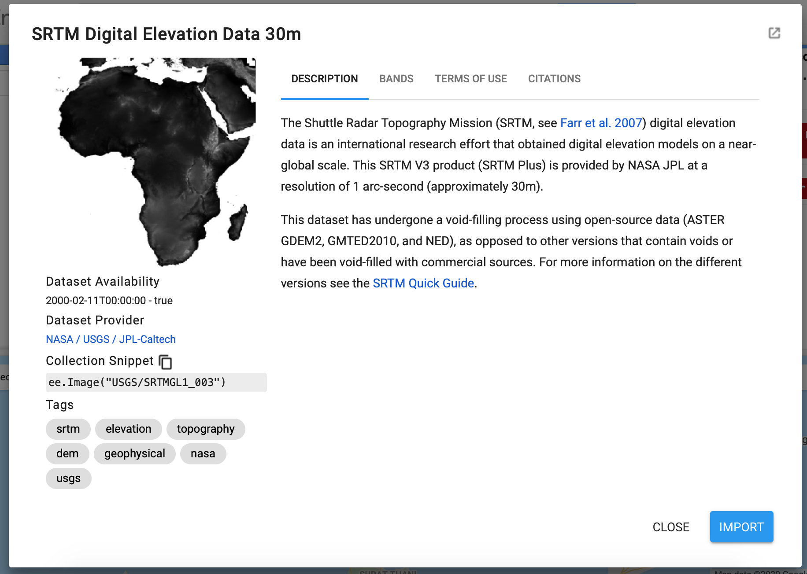

## Preface

Google Earth Engine is a cloud-based platform hosted by Google that uses
Google’s high-performance and intrinsically parallel computing system
that subdivides computations across the Google computational
infrastructure, accelerating computational processes (Gorelick et al.,
2017). It has been primarily designed to process and analyze satellite
imagery and geospatial datasets, making computationally demanding
workflows more accessible for research, education and other nonprofit
use at no user cost. Thus, it is totally free.

Up to 2008, using satellite imagery for data analysis was expensive. In
2008, however, the United States Geological Survey (USGS) opted for a
free and open policy on the use of the most popular satellite, Landsat
(Woodcock et al., 2008). The release of Landsat catalog to be freely use
by the public opened enormously the possibilities to expand earth
research (Woulder et al., 2019). However, with so much data available,
the limitation became data processing rather than data gathering.
Personal computers are generally limited in computation power to analyze
the amount of data that a composite of Landsat images require and data
storage is also limited. Supercomputers can do that job, but access them
is only optional for researchers working in certain institutions. Google
opened the option for all users with internet access to operate on a
high computing infrastructure through the new platform, Google Earth
Engine.

When the increase of satellite data accessibility is combined with free
access to fast computing processes, researchers and students have the
possibility to carry out extremely high computing demanding projects in
matter of minutes. For ecologists, this has opened the horizons of
research possibilities in unthinkable ways. And while lot of attention
has been put into the use of Google Earth Engine for remote sensing
scientists (Tamimina et al., 2020), the tool has not reached yet the
spatial ecological field in its full capacity. In this book, we explore
the different applications that this platform provides to analyze data
for projects focused on spatial ecology.

Here I present a tutorial that will guide you on the use of different
model techniques for data analysis. The main goal is that after reading
and practicing with this tutorial, you will be able to analyze your data
using Google Earth Engine interface.

The tutorial is organized in 3 main chapters. Chapter 1 is an
introduction to Google Earth Engine and the JavaScript language we use
to code. Chapter 2 will guide you on the use of images and geometries,
or raster and vector data. Chapter 3 is an introduction to image
classifications. I have a differnet tutorial for fitting Species
Distribution Models with GEE, that you can check out [here](link to SDM).

Each chapter will guide you on the use of code and all that code is
available [here](https://code.earthengine.google.com/?accept_repo=users/ramirocrego84/IntroToGEE).

I assume that the user of this tutorial has a minimal understanding on
remote sensing and geographic information system theory. For instance, I
assume that you are familiar with raster files, image bands, and the
different type of image resolutions. Similarly, I assume you know the
different type of vector data. While not knowing those terms will not
prevent you from using the book, it will definitely make it easier for
you to follow the more advance analyses.

### References

Gorelick, N., Hancher, M., Dixon, M., Ilyushchenko, S., Thau, D., &
Moore, R. (2017). Google Earth Engine: Planetary-scale geospatial
analysis for everyone. Remote Sensing of Environment, 202, 18–27.
<https://doi.org/10.1016/j.rse.2017.06.031>

C.E. Woodcock, R. Allen, M. Anderson, A. Belward, R. Bindschadler, W.
Cohen, F. Gao, S.N. Goward, D. Helder, E. Helmer, R. Nemani, L.
Oreopoulos, J. Schott, P.S. Thenkabail, E.F. Vermote, J. Vogelmann,
M.A. Wulder, R. Wynne. 2008. Free access to Landsat imagery. Science,
302 (5879), p. 1011

Michael A. Wulder, Thomas R. Loveland, David P. Roy, Christopher J.
Crawford, Jeffrey G. Masek, Curtis E. Woodcock, Richard G. Allen, Martha
C. Anderson, Alan S. Belward, Warren B. Cohen, John Dwyer, Angela Erb,
Feng Gao, Patrick Griffiths, Dennis Helder, Txomin Hermosilla, James D.
Hipple, Patrick Hostert, M. Joseph Hughes, Justin Huntington, David M.
Johnson, Robert Kennedy, Ayse Kilic, Zhan Li, Leo Lymburner, Joel
McCorkel, Nima Pahlevan, Theodore A. Scambos, Crystal Schaaf, John R.
Schott, Yongwei Sheng, James Storey, Eric Vermote, James Vogelmann,
Joanne C. White, Randolph H. Wynne, Zhe Zhu. 2019. Current status of
Landsat program, science, and applications, Remote Sensing of
Environment, 225, 127-147, <https://doi.org/10.1016/j.rse.2019.02.015>.

Haifa Tamiminia, Bahram Salehi, Masoud Mahdianpari, Lindi Quackenbush,
Sarina Adeli, Brian Brisco. 2020. Google Earth Engine for geo-big data
applications: A meta-analysis and systematic review. ISPRS Journal of
Photogrammetry and Remote Sensing, 164, 152-170,
<https://doi.org/10.1016/j.isprsjprs.2020.04.001>.

## A brief introduction to Google Earth Engine

Google Earth Engine (GEE) is an online Integrated Development
Environment (IDE) for rapid development and visualization of complex
spatial analyses using the JavaScript or Phyton coding languages,
allowing users to conduct data heavy analysis. While computer coding can
sound challenging for ecologists, researchers, students or managers that
have never used code before, it is rather simple and opens the spectrum
of data analysis enormously. The integrated platform that Google Earth
Engine provides allows not only traditional remote sensing scientists,
but also a much broader spectrum of users to run spatial analysis,
without the need to have deep expertise on the use of supercomputers.

The GEE platform has the main advantage of providing access to:

1.  Petabytes of remote sensing imagery and other spatial products;

2.  High-speed parallel processing and machine learning algorithms;

3.  A library of Application Programming Interfaces (APIs) with
    development environments

These three features enable the user to visualize and analyze a bast
range of geospatial data fast and for free, without the need to access a
supercomputers (Gorelick et al., 2017).

Google Earth Engine Application Programming Interface (API) can be run
in popular coding languages, such as JavaScript and Phyton. In this book
we will focus on the use of JavaScript. In this first chapter we will
explore the basics of Google Earth Engine, from understanding how to set
up an account, to understand the interface to explaining the basics of
JavaScript coding language.

This video will run you through the materials of this chapter.

**Introduction to GEE and JavaScript**:


### Setting up a Google Earth Engine account:

The first step to start using Google Earth Engine is to create an
account in this [link](https://signup.earthengine.google.com/#!/).

Once you have been accepted, you will receive an email with instruction
on how to complete the account setting process.

### The Google Earth Engine Interface

Once your Google Earth Engine account is set, you will be able to aces
the Code Editor to start working on it in your browser at
<https://code.earthengine.google.com/>.

The Google Earth Engine interface is an interactive web-based
environment for data analysis. It has four main panels (Fig. 1):

1.  The `Code Editor panel` to write JavaScript code.

2.  The `Left panel` for managing and hosting programming scripts,
    accessing Google Earth Engine documents and managing and uploading
    external data sets such as shapefiles.

3.  The `Right panel` with tabs for printing, queering maps and
    exporting products or long-running tasks.

4.  The `Interactive map panel` for visualizing maps and outputs.

Additionally, on top of the interface is the `search tab`, that allows
you to search and find data sets and places. At the top right is a
`help menu` that links to a user guide, help forum and other types of
support (Fig. 1).

<figure>

<figcaption aria-hidden="true">Figure 1. Google Earth Engine is a
web-based environment that consists on four main panels.</figcaption>
</figure>

Each main panel has a variety of elements that will explore more in
detail (Fig. 2). Among this are:

1.  The **Docs tab** or documentation tab

2.  The **Scripts tab** or Git-based Script Manager

3.  The **Assets tab** or asset manager

4.  The **search bar**

5.  Several buttons in the script panel to **save**, **run** and manage
    scripts

6.  The **Inspector tab** or interactive map query

7.  The **Console tab**

8.  The **Tasks tab**

9.  **Geometry drawing tools** in the interactive map panel

<figure>

<figcaption aria-hidden="true">Figure 2. Google Earth Engine web-based
environment.</figcaption>
</figure>

Let’s explore the different panels and elements more in detail.

#### The code editor panel

The **code editor panel** is the area where you will write the
JavaScript code to perform all type of analysis. Above the code editor
panel are buttons to save your current script, run it, and clear the
script. The **Get Link button** (Fig. 4) generates a unique URL for the
script in the address bar that allows you to share the script and/or
open it in a new browser tab. This is a unique characteristic of GEE
that allows you to share your work and make it reproducible by any other
user with a GEE account.

<figure>

<figcaption aria-hidden="true">Figure 3. The “Get Link”
button.</figcaption>
</figure>

The **drop-down button** at the right of the **Get Link button** has the
option to “Manage Links.” Clicking this button opens a new tab that
allows you to access, remove and download previously generated script
links. If you choose to download the script, this will be saved to your
personal computer as a zipped folder containing a .txt file with the
code.

Next to the **Get Link button** is the **Save button**. This button
allows you to save the script as a new script and subsequent updates.

Next is the **Run button** that allows you to run the script. The
**drop-down button** allows you to run the script with profiler (See
Profiler tab below).

To the right, the **Reset button** will reset all tabs on the right
panel. The **drop-down button** will allow you to clear the script to
start a new one.

Next is the **Apps button**. This opens the App window display that we
will explore later on the book.

Finally, there is a **Settings button** that allows you to activate
options to underline code suggestions and to auto-complete pairs such as
quotation marks, parentheses and brackets. You can activate or
deactivate these two options depending on your coding preferences.

#### The left pannel

##### The Docs tab – API reference

The **Docs tab** (Fig. 4) contains the entire JavaScript API
documentation developed by Google. Here, you will find all the
information necessary to understand functions. We recommend you to get
familiar with this tab as it gets really useful for writing scripts and
running more complicated analysis. You can use the search tab to filter
methods and find specific functions.

<figure>

<figcaption aria-hidden="true">Figure 4. The Docs tab.</figcaption>
</figure>

When clicking on any build in function, you will find a description of
the function, the arguments that the function takes, and the what the
function returns.

##### The Scripts tab – Script manager

The **Scripts tab** is where private, shared and all script examples
hosted by Google are stored. The **Owner level** stores all your private
scripts, the ones that only you can see and edit. The **Writer level**
stores scripts that has been shared (access granted) with you by another
user. Sharing repositories and scripts can be really useful to work on
collaborative projects. Once someone has added you to a repository, you
can add new scripts, modify existing scripts, and manage access to the
repository for other users. Of course, you can create and share
repositories and scripts with other users. The **Reader level** contains
scripts for which you have read access granted by the script owner, but
you cannot edit the scripts. The **Example level** has script examples
created and managed by Google, that are really good for some basic
operations. Take a look at the scripts available in this folder. The
**Archive level** is for scripts that users have access to read but have
not been migrated by their owner from an older version of the Script
Manager. The search tab allows you to search for scripts within all
these levels.

<figure>

<figcaption aria-hidden="true">Figure 5. The Scripts tab.</figcaption>
</figure>

The **New button** allows you to create a new repository in the **Owner
folder** or to create folders and files within existing repositories. It
is a good practice to keep your repositories and scripts organized. Give
folders and scripts proper names, something that you will be able to
recognize after several months of not working on them. Your brain can
forget things pretty quick. Once you have created your repositories and
scripts, they can be renamed and deleted by the **Rename and Delete
buttons** that appear at the right on the script while positioning the
pointer on top of the script. Scripts can be dragged and dropped into
new folders or copied into new repositories. The **Revision History
button** allows to compare with previous versions and recover them.
Always important in case that you delete something by mistake.
Similarly, positioning the pointer on top a repository allows to delete
and access the history of the repository. The **Configure button**
allows you to manage access to the repository. As we said before, you
can grant access to other users to your repository. Repositories can be
configured to be accessed using Git, so you can manage and edit your
scripts outside the Code Editor, or sync them with an external system
like Git Hub (Fig. 6).

For this book we have created a repository that you can access in the
reader level.

<figure>

<figcaption aria-hidden="true">Figure 6. You can manage repositories to
share with other users.</figcaption>
</figure>

##### The Asset tab – Asset manager

The **Asset tab** allows you to upload and manage your own image assets,
shapefiles, and CSV files (Fig. 7). You can click on **NEW** to upload
new assets from your personal computer. We will learn how to do this
with later examples in the following chapters. For now, it is good to
get familiarized with the different parts of the interface.

<figure>

<figcaption aria-hidden="true">Figure 7. The Asset tab.</figcaption>
</figure>

#### Search bar tool

The **search bar** located in the top of the Code Editor that says
‘Search places and data sets…’ allows you to search the GEE data
archive. Here you can type different keywords of data products, sensors
or places, to filter the data base. If you search for a place, clicking
on the place will make it visible in the map. If you search for a data
product, such as Landsat, you will see a detailed description of each
one. Click **Import** to add the data product into your script as an
import (Fig. 8), which will appear at the top of the script. It is also
possible to import data products using code, so you do not have to
search and click the **Import** button if you want to reuse the script
for another work. Additionally, you can see the JavaScript code to
import any product by clicking on the copy button next to the code and
pasting it into your script. You can delete imports you have added to
your script by positioning your pointer next to the import and clicking
the delete icon.

<figure>

<figcaption aria-hidden="true">Figure 8. Example of product desription
on Google Earth Engine.</figcaption>
</figure>

#### The right panel

##### Inspector tab

The **inspector tab** allows you to interactively query the different
map layers you have displayed (Fig. 9). When you clicking on the tab,
the pointer becomes a crosshair, meaning the function is activated. You
can click now on any part of the map and the tab will display the
location and values of all layers on the map. This can be useful to
inspect the values of your layers across different locations when
performing an analysis or when inspecting different layers in any area
of interest.

<figure>

<figcaption aria-hidden="true">Figure 9. The inspector, console and task
tabs.</figcaption>
</figure>

##### Console tab

The **console tab** is located next to the **inspector tab** (Fig. 9).
This tab is where all the information you print on the code will be
displayed. We will see later how to print information when using
JavaScript. For now, it is enough to remember that this is the tab in
which you will interact with the data and where you can display
information and results from operations. Those can be text, objects or
charts. This console tab is interactive, meaning that you can expand
printed objects to get more details about them. We will start to use
this tab in the next section when you start writing your first
JavaScript code.

##### Tasks tab

The **tasks tab** is located next to the console tab. This tab will
display long running tasks when exporting products from your analyses.
Those could be images or feature collections. Once the export was called
from the code editor, you will need to run it by clicking the run button
next to the exported task. A dialog window will appear, which allows you
to configure your export. Once you have run the task, the status will
display. Tasks can be canceled while running by clicking on the spinning
icon next to the task.

#### Profiler

The **profiler** is a tab that will appear next to the task tab on the
right upper panel when you run the script with the run with profiler
option (or the shortcuts, holding down Alt for PC or Option for Mac, and
clicking run, or pressing Ctrl+Alt+Enter/control+option+return). The tab
displays information about CPU time, memory consumed and other
computation parameters by the algorithms run and the display of all
layers in the map. This can be useful to understand why a script is
running slow or failing due to memory limitations. Not too important at
the beginning, but something to keep in mind for when you start to me
more advanced with Earth Engine analyses. Each row in the profiler tab
corresponds to each algorithm, computation, or asset loaded as described
in the **Description** column. The count column indicates the
proportional number of times the operation was invoked, and the compute
column indicates the CPU time taken by the operation. The **Peak Mem**
column indicates the maximum memory used on any single computation node
for the operation. The **Current Mem** appears only when there is an
error given memory limitation and shows the amount of memory that was in
use on any single compute node when the error occurred.

#### The interactive map panel

##### Layer manager

At the top-right corner of the interactive map panel is the **layer
manager** that allows you to adjust the display of all layers you added
to the map. From here you can activate and deactivate layers display and
adjust its transparency with the slider. By clicking the setting icon,
you can adjust the visualization parameters of each individual layer
(Fig. 10). From here you can customize the stretch of pixel value
display, adjust opacity (transparency), adjust gamma display and change
the color palette. You can manually choose different colors. Click Apply
button to apply the new visualization parameters to the current display.
You can also use the Import button to load the new visualization
parameters object as a new variable in the imports section of your
script that you can use to display other layers on the interactive map.

<figure>

<figcaption aria-hidden="true">Figure 10. Visualization parameters for
layers displayed on the map.</figcaption>
</figure>

At the right of the **layer manager** are buttons to choose different
map backgrounds: Google street view, terrain view or satellite view with
the option to activate labels. Another icon allows you to get into a
full-screen view.

##### Geometry tools

In addition to images, you can import geometries (i.e., vector data in
Earth Engine language) to your script by drawing them on the map. To
create a geometry, use the **geometry drawing tools** in the upper-left
corner of the interactive map panel. There are four different geometries
you can create: points, lines, polygons, and rectangles. When using the
drawing tool, any geometry created will automatically create a new
geometry layer in the import section of your script. Place the pointer
on the **Geometry Imports** button and then click the **+new layer**
link. Then choose the type of geometry you want to draw and start
clicking on the map to draw your geometries. In the case of polylines
and polygons, double click to finalize the drawing. Geometry display on
the map can be activated and deactivated from the **Geometry Imports**
section. We will learn more about geometries in the second chapter of
this book. You can delete geometries by activating them using the hand
tool, and pressing **Delete** on your keyboard or by directly clicking
the **delete button** on the **Imports section** of the script.

You can configure the way geometries are imported into the script by
using the settings button that appears when positioning the pointer on
top of the geometry on the **Geometry Imports** section. After clicking
settings, a dialog box will be displayed (Fig. 11). Note that geometries
can be imported as geometries, feature or feature collections and you
can choose on the button that appears on the box. We will learn more
about this in the next chapter. You can also modify the name and the
color of the layer. Finally, you can click the lock button to lock and
unlock the geometry, what can be useful to prevent edits or deletions by
accident.

<figure>

<figcaption aria-hidden="true">Figure 11. Dialog box for
geometries.</figcaption>
</figure>

#### The help button

On the upper-right corner of your browser window you will find a help
button. When clicking it, you will find links to the developer user
guide with more detail information about all we just covered
([link](https://developers.google.com/earth-engine/guides/getstarted),
and also links to forums where users post questions and help each other.
These forums are of great help and you can post your own questions.
Before posting questions make sure to do a good search as there is a
good chance that someone else encounter a similar problem before and the
answer to your problem is already there.

### The data catalog

One of the most notable features of Google Earth Engine is the enormous
amount of data available to be used. The database consists on about a
petabyte-scale archive of publicly available remotely sensed imagery and
other related data sets. It includes products from the most popular
satellites such as Landsat, MODIS, National Oceanographic and
Atmospheric Administration Advanced Very High Resolution Radiometer
(NOAA AVHRR), Sentinel 1, 2, 3 and 5-P; and Advanced Land Observing
Satellite (ALOS), and other data such as precipitation data, sea surface
temperature data, CHIRPS climate data, topography data, and land cover
data (Gorelick et al., 2017). This database increases daily as new
satellite imagery is taken, processes and uploaded. New products are
also being uploaded frequently. You can explore the data sets at the
following [link](https://developers.google.com/earth-engine/datasets/).

In addition to GEE, there is an online community working collaborating
further to distribute open source data. New products and datasets are
constantly being uploaded and can be find in the following
[link](https://samapriya.github.io/awesome-gee-community-datasets/projects/grip/).
Also, a weekly list of new products updated to GEE can be found in the
following [GitHub
repository](https://github.com/samapriya/Earth-Engine-Datasets-List).

### A brief intro to JavaScript for Google Earth Engine

Now that we have a better understanding of the GEE layout, it is time to
start coding. The API of GEE uses JavaScript coding language. This is an
object-oriented language with first-class functions, and is best known
as the scripting language for Web pages, but it’s used in many
non-browser environments as well. It is a prototype-based,
multi-paradigm scripting language that is dynamic, and supports
object-oriented, imperative, and functional programming styles (xxx).

In this first section we will learn the basics of JavaScript coding.
There are certain code statements that are proper of GEE. We will later
dive into those specifics.

#### The basics

The code editor panel on the interface is probably the one that you will
use the most. If this is the first time you are facing a coding language
to perform data analysis, the recommendation is to take it slow. As you
get familiarized with the code structure and functions, things will get
easier, we promise.

Let’s start with a simple JavaScript statement. Go to the
[code.earthengine.google.com](code.earthengine.google.com) and type into
the code editor panel:

    print('This is my first code');

After, click **Run**. The text ‘This is my first code’ will appear on
the **Console tab**. The parenthesis is used to pass arguments to
functions. Here print is the function that prints the argument on the
console.

In JavaScript, each statement ends in semicolon (But if you do not write
it, the code will run anyway, but it may help you to keep your code
organized). You will learn to write entire analysis that will be
composed of multiple statements like that one.

It is really important that you keep your code organized and knit. One
way of doing this is by commenting your code statements. Add `//` before
the text you want to add after the statement. For example:

    print('This is my first code'); //This is my first statement to print text

JavaScript will read the first section of the statement, but will omit
all the text that comes after the `//`. You can also comment out
statements by placing `//` at the beginning of it. This will prevent the
statement from running without having to delete it from the code.

    //print('This is my first code'); 

------------------------------------------------------------------------

> A note of writing your script: As you continue working on your script,
> you will add new lines of code. In Earth Engine, every time you click
> **run** the entire code will be computed. If there is an error in some
> line, the computation will end up there and an error message will be
> prompted in the console pointing to the line number that has the error
> that stopped the code from continuing processing. You will need to
> debug and fix the error for the entire script to run successfully to
> the end.

------------------------------------------------------------------------

JavaScript works with objects that you can store and later use in other
operations. You can save objects using `var` at the beginning of the
statement followed by a name for the objects. There are several types of
data types that JavaScript recognize and that we can use: strings,
numbers, list and dictionaries.

Strings are text that are defined by single or double quotes (but never
mix them). Generally, it is preferred to use single quotes. You can make
a string and store it as a new object called myfirststring and print it.

    var myfirststring = 'This is my first code';

Numbers can also be saved as objects.

    var number = 57;

Now we can pass this object to the function `print`. But this time, we
are giving two arguments to the function as follows:

    print('My favorite number is:', number);

When looking in the console, now the string and the number have been
printed.

Another useful data type are lists. Lists are defined using brackets
`[]`. For example, we can create a list of numbers.

    var myfirstlist = [0,1,2,3,4,5,6];

    print('This is my first list of numbers:', myfirstlist);

Or also a list of strings.

    var list2 = ['a','b','c','d'];

    print(list2)

We can also create arrays, that will add another dimension to the list.
We use brackets to define each dimension. The first brackets define the
columns of first dimension and the second brackets (inside the first
ones) define the rows or second dimension.

    var myfirstarray = [[1,2],[3,4],['a','b']];

    print (myfirstarray);

Note that we have mixed numbers and strings here.

Dictionaries are composed of pairs of keys and values and they are made
using curly brackets `{}`. When defining a dictionary, you need to
specify the key (a name) and the value (e.g., a number, a string, a
list), separated by a colon. Add comma after the first pair of key and
value if you want to have more than one. For instance:

    var myfirstdictionary = {
      first: 1,
        second: 'a string',
        third: [1,2,3,5,8,12]
    };

    print (myfirstdictionary);

One important feature of dictionaries is that you can access the
dictionary items suing square brackets or dot notation:

    print(myfirstdictionary['first']);

    print(myfirstdictionary.first);

Dot notations are handy in JavaScript coding architecture. We will use
it more frequently when running different functions in a line of code.

#### Functions

Now that we have seen the different data types, we are going to start
building and using functions. Functions allow to perform a myriad of
operations. While, there are multiple functions that are already built
within Earth Engine (Remember the **Code Editor Docs** tab to see all
built-in functions), sometimes it is useful to create your owns.
Moreover, understanding the basic components of a function will help you
understand all the built-in ones. Functions need to be stored as
variables as before. Functions are defined with the keyword `function`
followed by parentheses within which you can define different parameters
on which the function will operate. After the parentheses, follow the
statements that make up the function and go inside curly brackets. The
last statement is `return`, which indicates the output of the function.

    var myfirstFunction = function(parameter1, parameter2) {
    statement1;
    statement2;
    return statement;
    };

There is no limit on the number of parameters that a function can take,
and it can also use variables declared outside the function.

For example, we can build a function that adds 2 to a number. We will
name the function add2

    var add2 = function(number) {
      var result = ee.Number(number).add(2);
      return result;
    };
    print('Result of add2:',add2(4)); //Adds 2 to the number 4

#### Engine objects

So far, we have been using JavaScript code working with our computer
processor, also known as the *client side*. However, we are going to be
using Google computing infrastructure to run operations, rather than the
processor of your own computer, or the *server side*. Thus, we need to
create objects that can be sent in a form that is understood by Google
servers. These are the **Earth Engine objects**. These are written in
the form of `ee.thing` with thing being a data type, also known as
containers. Maybe, you noticed that in the previous function, we
specified `ee.Number` so that Google Server could compute the sum.

Now on, in order to created variables, we are going to assign those
variables to the corresponding container, which depends on the data
type, so that Google can recognize it and operate on it.

For strings, we have the `ee.String()` container

    var simpleString = 'Text to send to server';

    var eeString = ee.String(simpleString);

    print('This is:', eeString);

Now the print() function will send the container to Google server to be
evaluated, and then is sent back to your computer, where the container
is opened to be displayed.

Similarly, for numbers we use `ee.Number()`, for lists `ee.List()` and
so on. The `ee.Thing` are constructors that take arguments and
parameters to be processed by Google servers and returns a container
with a Earth Engine object that you can manipulate, export, print or
plot in your code.

Note that print, Map, Chart, and other function we will use are on the
*client side*. They run on your computer, not on Google servers. WE will
see next how to operate Google objects on the *server side*.

#### Working with Earth Engine objects

Now we have seen how to create objects that Google servers can read and
process. It is important to incorporate this concept because it will be
critical for developing more complicated codes.

Once you have created an Earth Engine object, then JavaScript operations
will not work, instead you have to use operations defined for those
Earth Engine objects. Thus, while we are using JavaScript to code, we
are now going to use a specific set of functions created to operate on
Google Earth Engine. On the **Doc tab** on the top-left panel, you can
find all the methods and functions available to work with Earth Engine
objects.

Within the built-in function set, you will find a variety of useful
functions that will make your work easier. For example, you can create a
sequence of numbers using `ee.List`:

    var eeList = ee.List([1, 2, 3, 4, 5]);

But also you can use the built-in Earth Engine function sequence, to
create the same variable:

    var sequence = ee.List.sequence(1, 5);

Now that the `ee.List` has been saved as a variable, you can use other
Earth Engine functions to interact with this object. This will be the
building block of many functions that we will be using along this book.
One important function is `get`, that gets something from the `ee.List`
object. For example, you can get the second component of the list.

    var value = sequence.get(2);

    print('Value at index 2:', value);

One important aspect to consider when accessing variables created with
Earth Engine functions is the data type. Many times, the object that
returns from a specific function does not come with a data type
assigned. Consequently, when trying to operate on those new variables,
you will get an error stating that the argument is not a function. For
instance, if you try to add a number to the value extracted from the
sequence in the previous step, you will get an error saying *value.add
is not a function*.

To avoid this problem, you need to reassign the corresponding container
for the specific data type, in this case a `ee.Number`:

    print(ee.Number(value).add(5));

This process is known as casting.

#### Earth Engine dictionaries

Dictionaries can be really useful in Earth Engine. Similar to the
JavaScript dictionary, we can create Engine containers for dictionaries
using `ee.Dictionary` and specifying the different keys. Lets create a
dictionary containing keys for a species information:

    // Create an Earth Engine dictionary
    var dictionary = ee.Dictionary({
      Common_name: 'Tiger',
      Genus: 'Panthera',
      Species: 'Panthera tigris'
    });

    // Get the species name from the dictionary.
    print('Species:', dictionary.get('Species'));

    // Get all the keys:
    print('Keys: ', dictionary.keys());

Note that with the Earth Engine dictionary, now you cannot access the
elements using JavaScript code as before. You need to use an Earth
Engine function with Earth Engine objects. To extract a key you need to
use the function get. Remember, as we explained before, the returning
objects does not have an data type specified, and you will need to
specify `ee.String` to use the object in another Earth Engine function.
Finally, you can also use the function `keys` to extract all keys, and
the resulting objects is going to be an `ee.List`.

#### Passing arguments to functions by name

Something that can be handy to remember before we move to more
complicated operations and data manipulation in Google Earth Engine, is
that you can pass argument to functions by name, using a similar
structure to a dictionary. In this way, you can visualize the name of
the different parameters, what can help understand the function. You can
write the parameters in any order. For instance, the function
`Map.setCenter()` centers the map view at a specific zoom level. It then
takes tree arguments, lat, long and zoom. You can run the function as
follow:

    Map.setCenter(99.2, 12.6, 6);

Or you can pass the arguments using a dictionary to visualize the name
of the arguments:

    Map.setCenter({lon:99.2, lat:12.6, zoom:6});

The arguments by name can be in any order:

    Map.setCenter({lon:99.2, zoom:6; lat:12.6});

#### Dates in Google Earth Engine

Many times you will find yourself working with data and imageries from
different times that you will need to filter. To manage time in Google
Earth Engine, you need to use date Earth Engine objects using `ee.Date`.
You can construct an `ee.Date` object using a string to specify the
date:

    // Define a date in Earth Engine.
    var today = ee.Date('2020-6-9'); //This is a year/month/day format
    print('Today is:', today);

You can also use another less orthodox method that is using a JavaScript
Date that represents milliseconds since midnight on January 1, 1970.
This seems strange at first, but you will see later on that it becomes
handy for multiple operations.

    // Get current time using JavaScript Date
    var now = Date.now();
    print('Milliseconds since January 1, 1970', now);

Later in this book, we will explore different functions to filter data
sets by date or use data in more complex analysis.

#### Final notes on operations

We saw how to package objects created in the *client side* into
containers to be used on the *server side*, the ee.Thing. Sometime,
however, you may need to convert earth engine objects into client-side
objects. In this case, you can open the container to access its
information using `.getInfo()`. Another method is using the function
`evaluate()`, which retrieves the values inside the earth engine
objects. This is strictly not recommended by Google, so you need to use
only when it is absolutely necessary. The difference with `.getInfo()`
is that the later will stop the rest of the code from continuing
processign until all information is retrieved from the Earth Engine
object, whereas `evaluate()` will allow other porcesses to continue
operating.

Retrieving the information in the containers and mixing the client and
server side is not recommended by Google, and you should only use it
when absolutely necessary. It is always better to operate on the server
side. Check the [Google user
guide](https://developers.google.com/earth-engine/guides/client_server)
to learn more about this.

#### Data structures in Google Earth Engine

We have seen so far some important data structures in Earth Engine,
*String*, *Number*, *Array*, *List*, *Dictionary* and *Date*. Those are
fundamental blocks of Earth Engine code. However, in Google Earth Engine
we will be working with geospatial data, thus, two other important
geographic data structures are *Image* and *Feature*. These two data
structures correspond to the raster and vector data types. Images are
composed by a combination of bands and a dictionary with properties and
features by a combination of a geometry and dictionaries with
properties. If you are not familiar with raster and vector data, this is
a good moment to refresh those concepts before you continue with the
next chapter.

### Conclusion

In this first chapter we have cover an overview of the Google Earth
Engine platform. By now, you should have an account set and be
familiarized with the web-based interface. We have also seen the basics
of JavaScript coding language and how it works within Earth Engine. In
the following chapter we will start using some data and learn how to
work with it.

For a more in depth description and tutorials to use GEE, remember to
visit the [Google Earth Engine
guide](https://developers.google.com/earth-engine/guides?hl=de) and
[tutorials](https://developers.google.com/earth-engine/tutorials?hl=de).

### References

Gorelick, N., Hancher, M., Dixon, M., Ilyushchenko, S., Thau, D., &
Moore, R. (2017). Google Earth Engine: Planetary-scale geospatial
analysis for everyone. Remote Sensing of Environment, 202, 18–27.
<https://doi.org/10.1016/j.rse.2017.06.031>

C.E. Woodcock, R. Allen, M. Anderson, A. Belward, R. Bindschadler, W.
Cohen, F. Gao, S.N. Goward, D. Helder, E. Helmer, R. Nemani, L.
Oreopoulos, J. Schott, P.S. Thenkabail, E.F. Vermote, J. Vogelmann,
M.A. Wulder, R. Wynne. 2008. Free access to Landsat imagery. Science,
302 (5879), p. 1011

Michael A. Wulder, Thomas R. Loveland, David P. Roy, Christopher J.
Crawford, Jeffrey G. Masek, Curtis E. Woodcock, Richard G. Allen, Martha
C. Anderson, Alan S. Belward, Warren B. Cohen, John Dwyer, Angela Erb,
Feng Gao, Patrick Griffiths, Dennis Helder, Txomin Hermosilla, James D.
Hipple, Patrick Hostert, M. Joseph Hughes, Justin Huntington, David M.
Johnson, Robert Kennedy, Ayse Kilic, Zhan Li, Leo Lymburner, Joel
McCorkel, Nima Pahlevan, Theodore A. Scambos, Crystal Schaaf, John R.
Schott, Yongwei Sheng, James Storey, Eric Vermote, James Vogelmann,
Joanne C. White, Randolph H. Wynne, Zhe Zhu. 2019. Current status of
Landsat program, science, and applications, Remote Sensing of
Environment, 225, 127-147, <https://doi.org/10.1016/j.rse.2019.02.015>.

## Data management in Google Earth Engine

In this second chapter we will learn how to import, operate and display
images and features on Google Earth Engine (GEE). This is the basic
building block for any ecological spatial analysis and with time, this
set of operations and functions will become a simple habit.

In order to learn the basic procedures and functions to work in GEE, we
will develop a simple example. The idea is that after completing this
chapter, you will have a basic understanding on how to change the area
of interest, load and work with different data sets (both, images and
features) and perform some of the most common functions and operations.

This video will guide you through the code of this chapter.

**Data Management in GEE**:


### Getting started

The first step in any project that involves coding is to start and save
a script where you can safely keep your work progress. First, using the
forward slash to comment out code, write a header to your script,
providing general information such as, your name and a title. Something
like this:

    /////////////////////////////////
    // My name
    // Getting started with GEE
    /////////////////////////////////

You can also comment chunks of code using a slightly different code:
`/* text */` This can be more handy for when you need to activate and
deactivate several lines of code at the same time.

    /*
    My name
    Getting started with GEE
    */

You can choose the method that is easier for you.

After you completed the header, click on the **New button** on the
Scripts tab of the left panel. From the dropping menu, chose **File**.
This will open a window where you can provide a name and chose the
repository where to save your script. Give scripts proper names. You can
also provide a brief description of your project if desired. Once you
have saved the script for the first time, you just need to click
**Save** (Above the code editor panel) every time you want to save
updates to the script (Fig. 1).

<figure>

<figcaption aria-hidden="true">Figure 1. Saving a new
script.</figcaption>
</figure>

As you may recall from the introductory chapter, you can also create new
repositories and folders to keep your work organized and share them with
collaborators.

### Defining your study area

The study area for our example is in south-east Asia, encompassing the
south of Myanmar and Thailand. We will use this area to learn the basics
of data manipulation in GEE, but you can pick any place on the globe.

To position the map display on the area of interest, we will use the
function `Map.setCenter()`, for which we need to provide coordinates and
a zoom level (higher numbers indicate larger scale or more zoomed in).
You may recall this from the previous chapter.

    Map.setCenter({lon:99.2, lat:12.6, zoom:6});

The next step is to define a geometry, in this case a rectangle, that
will represent the study area. Click on the rectangle icon from the
geometry tools and draw a rectangle that covers the area of interest
(see Fig. 2). We need to provide a name to the new geometry. Name it
StudyArea.

> Hint: You cannot use spaces for names, so we use capital letters or
> underscores to differenciate words. At the end, it does not matter
> what name you use, but it is good to use names for variables that you
> can recognize.

After you finish, the geometry will appear in your imports (top of the
script editor) as a polygon with four vertices. We will discuss more
about geometries later in this chapter.

<figure>

<figcaption aria-hidden="true">Figure 2. Rectangle geometry demarcating
the study area</figcaption>
</figure>

You can rename the geometry and save it as a new object using code:

    var Bounds = StudyArea;

You have now defined the study area. Later, we will use this polygon to
clip images and restrict the extent of our analysis.

### Working with images

In GEE, raster data are represented as **Image objects** and are the
main type of data to work with. All images are composed on one or more
bands, where each band has a name, data type, scale, mask and
projection, as well as metadata stored as a set of properties. Let’s
start working with some simple images.

#### Loading images

The first step for our workflow is to import an image. Let’s start
working with a simple image with one band which contains information
about elevation, also known as Digital Elevation Models.

Remember from previous chapter that you can search for places, images,
image collections, and feature collections on the GEE Data Catalog.

To find the elevation data, on the search bar type: ‘SRTM Digital
Elevation Data 30m.’ Now, click on it to display the data description
where you can find information about the temporal availability, data
provider and collection ID (Fig. 3). This data set corresponds to a
digital elevation data from the Shuttle Radar Topography Mission (Farr
et al. 2007) and contains information of elevation at 30m spatial
resolution. You can click **import** to add it to your imports, or you
can use code. We encourage you to use code, so you get more familiarized
with it and also helps you to keep the work organized.

<figure>

<figcaption aria-hidden="true">Figure 3. SRTM Digital Elevation Data
description.</figcaption>
</figure>

The function `ee.Image()` allows you to import image catalogs. To import
the elevation data, we need to provide the directory to the data within
the parenthesis of the function. Remember to assign the image to a new
object using **var** as follows:

    var Elev = ee.Image("USGS/SRTMGL1_003");

You have just imported the elevation data for the entire world.

When working in spatial ecology, frequently, slope, aspect and hillshade
are variables of interest as many species respond positively or
negatively to changes in the terrain surface. Thus, these data sets can
be good predictor variables in several models. We only have information
about elevation, but you can calculate slope, aspect and hillshade and
save them as new objects using other GEE built-in functions.

To calculate all these terrain variables, we will use the built-in
function `ee.Algorithms.Terrains()`.

Let’s apply the function to the elevation image and save it as a new
object.

    var Terrain = ee.Algorithms.Terrain(Elev);

At this point, you should be familiarized with the code syntax to create
objects and use built-in functions in GEE.

Print both elevation images to display the information on the console.

    print(Elev);
    print(Terrain);

You will see that differently from the Elev image that contains one
band, the new image created (Terrain) contains four bands, one for each
variable: elevation, slope, aspect and hillshade. All of these three new
bands where calculated from the elevation data. If you want to know more
about the algorithms used to obtain these results, remember that for all
the Engine built-in functions you can use the API reference on the Docs
tab to see a description and all the parameters used by the function.
The `ee.Algorithms` category contains a list of currently supported
algorithms for specialized or domain specific processing.

Look for the `ee.Algorithms.Terrains()` function in the Docs tab (Fig.
4).

<figure>

<figcaption aria-hidden="true">Figure 4. View of the
ee.Algorithms.Terrains description in the Docs tab.</figcaption>
</figure>

This exercise shows you the versatility and power of conducting spatial
analysis on GEE. You can in matters of seconds, download elevation data
and calculate slope, aspect and hillshade for the entire world!

In many cases, we are only interested in one specific area and not the
entire planet. We can use the GEE built-in function `clip()` to crop the
image to our area of interest, the polygon we crated earlier.

Using the dot notation, we add the function `clip` to the image object
you want to crop, and specifying in between parenthesis the object
representing the area of interest we previously created.

    var Terrain = Terrain.clip(Bounds);

You have now an image object cropped to the area of interest.

### Displaying data on the map

Often, you will be interested in visualizing the images. To display the
elevation data on the map, you can use the function `Map.addLayer()`. To
the previous code, now add the function to display the data as follows:

    Map.addLayer(Terrain);

Parameters for functions may have default values, and then, you only
need to specify the parameter if you want to change its default value.
For instance, the previous function displays a gray surface. You need to
change the default parameters for the appearance of the image to be able
to visualize elevation change.

In the case of the `Map.addLayers()` function, it contains five
arguments (Fig. 5). The first argument is the ee.Object to display, in
our case the **Elev object**. The second argument are the visualization
parameters, which you can pass to the function as a dictionary. Those
include the bands to display (when you have more than one band in the
image, such as the Terrain image created that has 4 bands), the minimum
and maximum values to display, and colors (Remember that you can also
change those parameters from the Layers button in the display). The
third argument is the name of the layer (a string). The fourth argument
is a Boolean number (i.e., 1 for TRUE or 0 for FALSE) and indicates
whether the layer should be displayed by default or be activated by the
user manually by clicking on the layers tab. The last argument in the
opacity, which goes from 0 (transparent) to 1.

<figure>

<figcaption aria-hidden="true">Figure 5. Description of the
Map.addLayers function.</figcaption>
</figure>

    Map.addLayer(Elev, {min: 0, max: 1000}, 'DEM', 1);
    Map.addLayer(Terrain, {bands:['elevation'] ,min: 0, max: 1000}, 'Elevation', 1); //Same as before but from the terrain object
    Map.addLayer(Terrain, {bands:['slope'] ,min: 0, max: 40, palette:'white,red'}, 'Slope', 1); //Display slope and add a color palette

Note the difference between an image that was cropped and the one that
was not cropped. Play with the image visualization using the Layers
button in the display.

#### Image collections

We have so far worked with a single image. Now, we are going to access
an entire image collection. Image collections can contain hundreds of
images across long periods of time, such as images from satellites.
Similarly to the elevation image, you can search for image collections.
Let’s access the image collection of Landsat 8. Landsat images come with
different levels of pre-processing. Here we will work with T1, that is
the highest level of pre-processing.

Use the search bar to find the name of the Landsat 8 T1 image collection
and import it using the function `ee.ImageCollection()`.

    var landsat8 = ee.ImageCollection("LANDSAT/LC08/C02/T1")

You just imported the entire image collection of Landsat 8 for the
entire Earth land surface. You could try to print the image collection
to see all the images contained in the list. However, because there are
too many images, printing it will either be very slow, time out, or
return an error.

#### Filtering and sorting

What we need to do to work with image collections is to filter them and
reduce the number of images in the list to the ones that we are
interested in. To do this, we will use filters.

Filters are a set of functions that allows you to select a set of images
based on certain parameters such as position, time windows, numbers,
properties, depending on the type of object you are trying to filter,
such as image collections, feature collections, lists or geometries.
Lets see how this works for image collections.

Let’s start by filtering our image collection by space and by time,
specifying the area and the time frame in which we are interested in
(Remember different satellite products contain images for different time
periods and that information is provided in the data description of each
product). We need to use `filterBounds()` to select images from our area
of interest (the object Bounds) and `filterDate()` to keep only images
from 2019, thus specifying a time window between 2019-01-01 and
2019-12-31. Note how we can add functions to the same line of code using
the dot notation.

    var landsat8 = ee.ImageCollection("LANDSAT/LC08/C02/T1")
        .filterBounds(Bounds)
        .filterDate('2019-01-01', '2019-12-31')

The new object contains only images for which the path overlaps our area
of interest and that were obtained during 2019.

In addition, we are interested in finding images that are cloud-free.
Here we will use another function to solve this problem. All Landsat
images contain information about cloud cover in the metadata. We can use
this information to sort the image collection from lowest cloud cover to
highest cloud cover using the function `sort()`, which operates on the
image metadata. You could apply a new function to the object created
with the previous line of code. You can also simplify things by
concatenating functions in the same line of code, again using the dot
notation.

    var landsat8 = ee.ImageCollection("LANDSAT/LC08/C02/T1")
        .filterBounds(Bounds)
        .filterDate('2019-01-01', '2019-12-31')
        .sort('CLOUD_COVER', true);
        
    print(landsat8) //The image collection contains 240 images

The new image collection is now sorted by the cloud cover percentage,
from lowest to highest. We also see that the collection contains now 240
images.

You can save the first image (lowest cloud cover) as a new object and
display it. This time, you are displaying an image composed by a series
of bands and the final color display depends on the combination of bands
assigned to the tree main colors, red, green and blue. If you assign the
bands corresponding to the three colors, then you obtain a true color
display. You can also try a false color composition or displaying just
the thermal band.

    var first_image = landsat8.first();

    // True color
    Map.addLayer(first_image, {bands: ['B4', 'B3', 'B2'], min: 7000, max: 10000}, 'Landsat8-RGB', 1);

    // False color
    Map.addLayer(first_image, {bands: ['B5', 'B4', 'B3'], min: 7000, max: 18000}, 'Landsat8-FalseColor', 1);

    // Thermal
    Map.addLayer(first_image, {bands: ['B10'], min: 19000, max: 24000, palette: ['blue', 'red', 'orange', 'yellow']}, 'Landsat8-Thermal', 1)

As always, you can access the complete GEE filtering functionality by
tipping `ee.Filter` into the search bar of the **Docs tab**.

#### Reducing

We have so far selected and printed the first image of the list. Now we
want to create a full mosaic of the study area with images that are free
of clouds. The reduce function allows to reduce image collections to a
single image. It is a way to aggregate data over time
(`imageCollection.reduce()`), space (`image.reduceRegion()`,
`image.reduceNeighborhood()`) or bands (`image.reduce()`).

The `ee.Reducer()` can be a used to operate a simple statistic for
aggregating data (e.g. minimum, maximum, mean, median, standard
deviation, etc.), or for more complicated analysis on the input data
(e.g. histogram, linear regression, list). In all these cases, the
reducer takes an input data set and calculates a single output. When a
single input reducer is applied to a multi-band image, such as Landsat
image, GEE automatically applies the reducer separately to each band,
producing an output image with the same number of bands as the input.

Continuing with our example, this time we will select all images with
less than 10% cloud cover and estimate the median value for each pixel
and each band in the Landsat 8 collection. To retain only images with
&lt;10% cloud cover we will use the function, `filterMetadata()` that
requires three arguments: The name of the metadata property, the name of
a comparison operator (it can be: “equals”, “less\_than”,
“greater\_than”, “not\_equals”, “not\_less\_than”, “not\_greater\_than”,
“starts\_with”, “ends\_with”, “not\_starts\_with”, “not\_ends\_with”,
“contains”, or “not\_contains”) and a number for the cloud cover
percentage to compare against. We will also increase the time period to
include images from the first day of 2015 to the last day of 2019 to
obtain a five years mosaic of our study area.

    var l8_mosaic_1 = ee.ImageCollection("LANDSAT/LC08/C02/T1")
        .filterBounds(Bounds)
        .filterDate('2015-01-01', '2019-12-31')
        .filterMetadata('CLOUD_COVER', 'less_than', 10)
        .reduce(ee.Reducer.median());

    print(l8_mosaic_1)

The reducer is going to change the name of the bands. When printing the
image, you can see that the band names have changed (Fig. 6).

<figure>

<figcaption aria-hidden="true">Figure 6. Band names for the mosaic after
applying a median reducer.</figcaption>
</figure>

Instead of using the reducer, you can use the built-in function
`median()` that will do the same operation on each pixel across the
stack of all matching bands but retain the original band names.

    var l8_mosaic_2 = ee.ImageCollection("LANDSAT/LC08/C02/T1")
        .filterBounds(Bounds)
        .filterDate('2015-01-01', '2019-12-31')
        .filterMetadata('CLOUD_COVER', 'less_than', 10)
        .median();

    Map.addLayer(l8_mosaic_2, {bands: ['B4', 'B3', 'B2'], min: 7000, max: 12800}, 'Landsat8-Mosaic', 1);

As we develop more complex analysis along the book, we will learn more
specifics on the reducer functions. You can look into the `ee.Reduce`
methods that exist in the API.

#### Band math

Another powerful functionality is performing mathematical operations on
images or image bands. For example, you can use a combination of bands
to calculate vegetation indexes. One of the most widely used vegetation
indexes is the Normalized Difference Vegetation Index (NDVI). This index
provides an estimation of vegetation productivity, thus, is widely used
in spatial ecology studies. It is calculated using the near infrared and
red bands as follows:

*N**D**V**I* = (*N**I**F*−*R**E**D*)/(*N**I**R*+*R**E**D*)

To demonstrate the versatility of GEE to perform mathematical operations
on images, we will calculate NDVI using different methods.

Some simple image math can be performed by using `add()`, `subtract()`,
`divide()`, `multiply()`, `pow()`, etc. Those operators can be applied
on numbers, images or arrays. We can use these operators to calculate
NDVI.

First, we need to `select` the desired bands from the image and then
apply the mathematical operation. For our example, we need the red band
(band 4) and the near infrared band (band 5):

    // Method 1 - Applying band operations
    var ndvi_1 = l8_mosaic_2.select('B5').subtract(l8_mosaic_2.select('B4'))
      .divide(l8_mosaic_2.select('B5').add(l8_mosaic_2.select('B4')));

However, it is generally the case that you need to perform more
complicated mathematical operations. For those cases, you can use the
`expression()` function, which allows to represent math operation in
text forms.

    // Method 2 - Applying band opperations using a expression
    var ndvi_2 = l8_mosaic_2.expression('(B5 - B4) / (B5 + B4)', {
        B5: l8_mosaic_2.select('B5'),
        B4: l8_mosaic_2.select('B4')
    });

Note that `expression()` returns an integer if two integers are divided,
so that the expression 10 / 20 = 0. To obtain decimal numbers as
results, you need to have decimal numbers in the operations. For
instance, in the previous case, you have to multiply one of the operands
by 1.0: 10 \* 1.0 / 20 = 0.5.

For many basic operations, such as calculating vegetation indexes, often
exists a built-in function in Earth Engine that makes things much
easier. Here, we will use the `normilizedDifference()` function. We need
to provide the name of the two bands to use.

    // Method 3 - Using a built-in function
    var ndvi_3 = l8_mosaic_2.normalizedDifference(['B5', 'B4'])

Finally, it may be the case that you want to write your own function.
The advantage of writing a function is that you can then apply the
function to any image you want to work with. Here, we are going to write
a function that calculated NDVI (function `normilizedDifference()`),
renames the resulting band as NDVI (function `rename()`) and adds it to
the image as a new band (function `addBands()`).

    // Method 4 - Building your own function to compute NDVI and add it as a new band to the image
    var addNDVI = function(image) {
        var NDVI = image.normalizedDifference(['B5', 'B4']).rename('NDVI')
        return image.addBands(NDVI) //with addBands, the new NDVI is added as a new band to the existing bands.
    };

    // Apply the function to the mosaic
    var l8_mosaic_3 = addNDVI(l8_mosaic_2);

You can also use the function `map()` to apply the addNDVI function you
have created to an entire image collection. As a result, all the images
on the collection will have an additional band called NDVI.

    var l8_NDVI = ee.ImageCollection("LANDSAT/LC08/C02/T1")
        .filterBounds(Bounds)
        .filterDate('2015-01-01', '2019-12-31')
        .filterMetadata('CLOUD_COVER', 'less_than', 10)
        .map(addNDVI);

#### Masking

Another common operation when working with images is masking. Masking
refers to setting certain pixels from an image to no data values (i.e.,
making them transparent) in order to exclude them from analyses. Masking
is usually done to remove pixels with poor data, representing clouds or
any other area that wants to be excluded.

Every pixel in a band of an `ee.Image`, in addition to its value, has a
mask which ranges from 0 (i.e., no data) to 1. In Earth Engine, all
masked pixels (0) are treated as no data. When applying a mask, pixels
with a value of 0 are then excluded from operations. For instance, when
applying `image1.mask(image2)`, the values of image2 are taken and used
as a mask of image 1, meaning that pixels in image2 that have the value
0 will be made transparent in image1.

Continuing with our example, we may be interested in removing all the
ocean water from the NDVI image. We need to create a mask that will
retain only the land pixels (Fig. 7).

<figure>

<figcaption aria-hidden="true">Figure 7. Masking process.</figcaption>
</figure>

Using the elevation data, we can use the function `gt()` (grater than)
to create a binary image with a value of 1 for all pixels with
elevations greater than 0, and a value of 0 to pixels with values lower
than 0. Then we use the function `updateMask()` to retain only NDVI
values from the land (i.e., elevation &gt; 0).

    // Create a land mask using SRTM elevation data.
    var watermask =  ee.Image("USGS/SRTMGL1_003").gt(0);

    // Update NDVI mask with the land mask.
    var maskedndvi_1 = ndvi_1.updateMask(watermask);

    // Display the masked result.
    Map.addLayer(maskedndvi_1, {min:0, max:1}, 'NDVI masked');

Masks can be particularly useful in cases where you cannot find images
that are cloud free and you need to mask those pixels for analysis. We
will explore more of these type of operations using the image metadata
on pixel quality to create cloud masks for different satellites in
following chapters.

### Working with features

In addition to the raster datasets, we can use vector data in GEE.
Vector data is handled with the Geometry type. Geometries in Earth
Engine can be **Point** (a list of coordinates in some projection),
**LineString** (a list of points), **LinearRing** (a closed LineString),
and **Polygon** (a list of LinearRings where the first is a shell and
subsequent rings are holes). **MultiPoint**, **MultiLineString**, and
**MultiPolygon** are also supported.

#### Geometries and features

You can create Geometries using the Code Editor geometry tools, as you
did at the beginning of the chapter to define your study area. However,
you can also use code to create geometries, by providing a list of
coordinates. The following code will create the polygon representing the
study area defined earlier. All we need is a list of pair of
coordinates, indicating the vertices of the polygon. Check that the
first and last coordinates are the same.

    var polygon = ee.Geometry.Polygon([
      [[97.58, 9.32], [100.43, 9.32], [100.43, 14.43], [97.58, 14.43], [97.58, 9.32]]
    ]);

Geometries can then be converted into features. A **Feature** is an
object with a geometry property storing a **Geometry** object (or null)
and a **property** storing a dictionary of other properties. In order to
create a feature, you need to provide a geometry, but also a dictionary
with other properties of interest.

    var polyFeature = ee.Feature(polygon, {Area: 'Tanintharyi'});

**Geometry** and **Feature** objects can be printed or added to the map
similarly to images using `Map.addLayer()`. The default visualization
parameters will display vectors with solid black lines and semi-opaque
black fill. You can change the colors similarly to images.

    print(polyFeature);
    Map.addLayer(polyFeature, {}, 'Study area');
    Map.addLayer(polyFeature, {color: 'red'}, 'Study area - red');

#### Feature collections

Similar to image collections, you can create a feature collection, that
is as the name implies, a collection of features. To do this, we need to
apply `ee.FeatureCollection()` on a list of features. For instance, we
can create a list of feature points, each of which represents a town
with its coordinate (the geometry) and a dictionary with the name of the
town. We can then combine all the town into a feature collection.

    // Make a list of Features
    var feature_list = [
      ee.Feature(ee.Geometry.Point(98.62, 12.44), {name: 'Myeik'}),
      ee.Feature(ee.Geometry.Point(98.76, 11.25), {name: 'Bokpyin'}),
      ee.Feature(ee.Geometry.Point(98.52, 13.39), {name: 'Pe Det'})
    ];

    // Create a FeatureCollection from the list, print it and display it on the map
    var Towns = ee.FeatureCollection(feature_list);
    print(Towns);
    Map.addLayer(Towns, {color: 'blue'}, 'Towns');

Google Earth Engine offers several **Feature collections** through the
Data Catalog that can be imported. They are mostly data sets for the USA
but, in addition to the protected areas we used, there are also country
boundaries and ecoregions, among others. This is a much smaller catalog
than the one for image collections, but the amount of data available
grows every day.

#### Filtering feature collections

Feature collection can be large, and similar to image collections, we
may need to filter them. We will also use filters to do this. Here, we
will load the World Database on Protected Areas and filter it to our
study area, similarly to what we did before to filter the Landsat image
collection.

    var PA = ee.FeatureCollection('WCMC/WDPA/current/polygons');

    var PA_filtered = PA.filterBounds(Bounds);

You can now check how many protected areas are within the study area by
using `size()` which returns the number of entries in a dictionary.

    print('Count after filter:', PA_filtered.size());

Now, let’s filter the protected areas on our study area that are Marine
National Parks. We can use the `ee.Filter.eq()` (eq for equal) function
to retain only those protected areas designated as Marine National Park
and check how many there are. As with the `filterMetadata`, you need to
provide the property name of the feature to filter on and the value to
compare against.

    var MarineNatParks = PA_filtered.filter(ee.Filter.eq('DESIG', 'Marine National Park'));

    print('Number of Marine National Parks:', MarineNatParks.size());

### Mapping functions over feature collections

Similar to what we learned about mapping functions over image
collections, we can do it on feature collections. Let’s say you are
interested in calculating the area of each Marine National Park. We will
do this as an exercise even though the Protected Area database already
has a property with the area of each feature.

First, we define a function to apply to each feature. The function
calculates the area using the `area()` function. We then divide this by
1000000 to obtain area in square kilometers. The resulting number is set
to each feature as a new property that we called areakm2.

Second, we map the `addArea` function we created across the
**MarineNatParks** feature collection.

    // Compute the area of each National Park in km2

    // Function to compute patch area and perimeter and add it as a property
    var addArea = function(feature) {
      return feature.set({areakm2: feature.area().divide(1000 * 1000)});
    };

    // Map the area using the function over the FeatureCollection
    var Area = MarineNatParks.map(addArea);

#### Reducing feature collections

We can also apply reducers to feature collections. The idea is the same
than for image collections, aggregate data over the collection. Here, we
use the `reduceColumns()` function on the Area feature collection
previously created. We need to specify the reducer we want to apply, in
this case the `ee.Reducer.mean()`, and the property or list of
properties we want to reduce, in this case `areakm2`. When printing this
object we have a new property with the mean area of all National Parks
in the collection.

    // Calculate the mean area across parks
    print('Mean National Park area (km2):', Area.reduceColumns(ee.Reducer.mean(), ['areakm2']));

#### Displaying fature and feature collections on the map

Finally, you can display the protected areas and Marine National Parks
on the map. We use the same function than more images,
`Map.addLayers()`.

    Map.addLayer(PA_filtered, {color: 'green'}, 'Protected Areas');
    Map.addLayer(MarineNatParks, {color: 'blue'}, 'Marine NP'); 

### Exporting resuts

Lastly, at the end of an analysis you may want to export your results
and data products. There are many reasons you may want to do this. The
most obvious is to create figures and maps using another software, such
as [QGIS](https://qgis.org/en/site/) or to use raster and vector
products in other analysis in software such as
[R](https://www.r-project.org/).

There are different type of products that can be exported from GEE.
These include images, map tiles, features, tables and videos. The data
can be exported to your linked Google Drive account, as a new Earth
Engine asset that will appear on your asset manager, or to Google Cloud
Storage (Note this is a fee-based service). We will not cover Cloud
Storage in this book, but you can learn about Cloud Storage
[here](https://developers.google.com/earth-engine/cloud/earthengine_cloud_project_setup?hl=en)
and how to set projects
[here](https://developers.google.com/earth-engine/cloud/projects?hl=en).

Here, we are going to demonstrate how to export an image and a feature
collection. We will see more about these functions along the different
chapters.

#### Exporting an image

Imagine that you want to create a map of your study area displaying the
NDVI values across the region. You can then export the final NDVI image
we created previously **maskedndvi\_1**. We will export the image to
Google Drive, where it can be downloaded to be used in other software.
For this, we will use the function `Export.image.toDrive()`.

All export functions have a series of arguments that we need to
complete. First, we need to specify the `image` we want to export, in
our case the **maskedndvi\_1**. Second, we need to provide a
`description` that will be the file name when saved in Google Drive.
Then we need a `scale` parameter, the spacial resolution or pixel size
in meters, and a `region`, a ee.Geometry object that defines your area
of interest. In our example, we have been using **Bounds**. Another
important argument is the `maxPixels`. The default is 1e8 pixels, but
you can increase this number as needed. Note that when the image is too
big, it will be exported in tiles as 2 or more images that then you can
combine. The image default output is **GeoTIFF**, but the **TFRecord**
format is also supported.

There are several other optional arguments for this functions. Here we
show two extra arguments. The `folder` within your Google Drive to keep
it organized (By default the image will be saved in the Drive root
directory) and the `crs`. The coordinate reference system is optional,
but we include it here because it is important to keep track of the crs
used when exporting data to use in other GIS software.

Here is the code:

    // Export raster images to Google Drive
    Export.image.toDrive({
      image: maskedndvi_1,  // Export the masked NDVI as an example
      region: Bounds,
      description: 'NDVI-30m',
      folder: 'GIS',
      scale: 30,
      fileFormat: 'GeoTIFF',
      maxPixels: 1e10,
      crs: 'EPSG:4326'
    });

In other cases, you may be interested in saving an image as an asset, so
you can use it later in other analyses. To do this, we will use the
function `Export.image.toAsset()`. The difference with exporting to
Google Drive is that we now need to provide an `assetId` as an extra
parameter and that we do not need to specify a file format anymore.

    // Export raster image to asset
    Export.image.toAsset({
      image: maskedndvi_1,  // Export the masked NDVI as an example
      region: Bounds,
      description: 'NDVI-30m',
      assetId: 'NDVI30mExport',
      scale: 30,
      maxPixels: 1e10,
      crs: 'EPSG:4326'
    });

There are other optional arguments that can be modified. Look into the
Export of the Docs tab to explore other arguments.

### Exporting a feature collection and tables

Similar to images, we can export feature collections or tabular data,
such as a future collection with no geometry, as CSV, ESRI Shapefile
(SHP), GeoJSON, KML, KMZ or TFRecord formats. Again, we can export to
Google Drive using the function `Export.table.toDrive()` or as an asset
`export.table.toAsset()`. The arguments that we need to specify include
the `collection` to export and a `description` with the name for the
resulting file. When exporting to Google Drive we also need to provide
the `fileFormat` and we will also specify a `folder` in Google Drive.
When exporting as an asset, we need to provide the `assetId`.

Here we will export the marine national parks (the object
**MarineNatParks**) as a shapefile and also save it as an asset.

    // Export feature to Google Drive
    Export.table.toDrive({
      collection: MarineNatParks,  // Export the marine parks as an example
      description: 'Marine_Parks_Tanintharyi',
      fileFormat: 'SHP',
      folder: 'GIS'
    });

    // Export feature to asset
    Export.table.toAsset({
      collection: MarineNatParks,  // Export the marine parks as an example
      description: 'Marine_Parks_Tanintharyi',
      assetId: 'MarineParksExport'
    });

    // Export table data
    Export.table.toDrive({
      collection: Area,
      description: 'exportMarineNationalParkArea',
      fileFormat: 'CSV',
      folder: 'GIS',
      selectors: ['areakm2'] //A list of properties to include in the export; either a single string with comma-separated names or a list of strings.
    });

Finally, we will export the Marine National Park area as table data in a
CSV format. This object will not have a geometry associated, only the
area we calculated for each feature. For this we use the
`Export.table.toDrive()` we used before with the difference that now the
`fileFormat` is CSV. We also use the `selectors` argument to specify the
property we want to export, NAME and areakm2 of each park. You can add
other properties if wanted.

    // Export table data
    Export.table.toDrive({
      collection: Area,
      description: 'exportMarineNationalParkArea',
      fileFormat: 'CSV',
      folder: 'GIS',
      selectors: ['NAME','areakm2'] //A list of properties to include in the export; either a single string with comma-separated names or a list of strings.
    });

Note that to complete the export process you need to submit the task by
clicking the `run` button on the Tasks tab on the right panel (Fig. 8).
When the process is completed, the taks changes to a blue color as shown
in Fig. 8.

<figure>

<figcaption aria-hidden="true">Figure 8. Exporting images and
features.</figcaption>
</figure>

You will see the csv file in your Google Drive (Fig. 9).

<figure>

<figcaption aria-hidden="true">Figure 9. CSV file exported with name and
area of Marine National Parks.</figcaption>
</figure>

### Conclusion

So far, we have seen some common functions to apply on images and
features. There are an enormous amount of possible operations that can
be applied to filter collections, calculate new bands, etc. As we
progress with different types of analyses, you will get more
familiarized with the different possible operations.

## Land-Cover Land-use classification in Google Earth Engine

In this chapter we will learn how to perform a Land-Cover Land-use
classification using Google Earth Engine.

There are two main types of classification, supervised and unsupervised
classifications. In the unsupervised classification, you let the
algorithm define the land cover classes based on the data. In the
supervised classification you will define the land cover classes and
train the algorithm.

Here, we will work with the supervised classification process.

### Define your study area

We will start with a fresh new script. As before, set up your name, date
and topic of the analysis.

    //////////////////////////////////////////////////
    // My name
    // Date
    // Land cover Land use supervised classification
    //////////////////////////////////////////////////

The next step is to define your area of interest or study area. Remember
you can do this using the drawing tools or you can define a polygon
using code.

    //Specify 'Focal Area' for your impact study
    var StudyArea = ee.Geometry.Polygon([
      [96.20400705077832,23.942516412253614],
      [96.3197926495332,23.942516412253614],
      [96.3197926495332,24.021486550182036],
      [96.20400705077832,24.021486550182036],
      [96.20400705077832,23.942516412253614]
    ]);

Next, center the map into the study area that you just defined.

    Map.centerObject(StudyArea);

### Loading the satellite imagery

The main component of any land cover classification is the satellite
imagery. The information on the different bands of the image is what we
are going to use to classify the different types of land use.

Here, we will work with Landsat 8. At this point, you should be familiar
with some basic functions regarding this data set, such as, loading the
image collection and filtering the image collection.

We will get the image cleaning process to another level of complexity.
Before, we removed all images with clouds to avoid having clouds that
will affect the classification process (You want to have a clear image
of the land surface.). This time, we are going to use the metadata of
the Landsat image to mask all the pixels that contain clouds or have a
bad quality.

> Note that we are working with Landsat 8. There are other Landsat
> products that require some modifications to the filters. We will
> examine that later on when classifying images from the past to access
> land cover change.

What we need to do first is create a function that will mask all pixels
that correspond to clouds or cloud shadows. The information is contained
in a band called **QA_PIXEL**.

This function first creates a mask converting all pixels from the
*QA_PIXEL* band of the Landsat image (Fig. 1) that correspond to cloud
and cloud shadows
`image.select(['QA_PIXEL']).bitwiseAnd(Math.pow(2,3)).` into zeros
`eq(0)`, the mask. It then applies the mask to all the bands on that
image.

<figure>

<figcaption aria-hidden="true">Figure 1. Landsat 8 Surface Reflectance
image collection.</figcaption>
</figure>

The expression `Math.pow(2,3)` obtains the bit value that identifies the
pixel with cloud of cloud shadow. You could do the same for snow, water,
etc.

    // Function to mask clouds based on QA values from the Landsat Surface Reflectance Code (LaSRC) - for Landsat 8
    var lasrcMask = function (image) {
        var mask = image.select(['QA_PIXEL']).bitwiseAnd(Math.pow(2,3)).eq(0).and(  // Cloud shadow
                   image.select(['QA_PIXEL']).bitwiseAnd(Math.pow(2,5)).eq(0));  // Cloud
        return image.updateMask(mask);
    };

We are also going to create a function to `select()` and `rename()`
certain bands from the Landsat image. This may not be really useful if
you are working with only one Landsat product, but because different
Landsat satellites have different bands, it became important for more
advanced analysis that needs to integrate images from different
satellites (Landsat 4 and Landsat 8 for instance.).

    // Function to rename Landsat 8 bands for cross-Landsat compatibility & rescale
    var renameBandsL8 = function(image) {
        var imgNewBands = image.select(['SR_B2', 'SR_B3', 'SR_B4', 'SR_B5', 'SR_B6']).rename(['blue', 'green', 'red', 'nir', 'swir1']);
        return imgNewBands.copyProperties(image,['system:time_start']);
    };

Finally, we will create a function to compute NDVI. This one should be
more familiar. Note that we want to add the new NDVI band to the rest of
the bands in each image, thus, we add `add.Bands(ndvi)` to the return of
the function.

    // Function to compute NDVI
    var addNDVI = function(image) {
        var ndvi = image.normalizedDifference(['nir', 'red']).rename('ndvi');
        return image.addBands(ndvi);
    };

Now that we have all the functions defined, we can load the Landsat 8
Surface Reflectance collection.

We will apply a couple of filters. First `filterBounds()` to keep images
that intersect the study area. We will also retain images that have less
than 20% of cloud coverage. Finally, we will work with images from 2019
to create a year composite.

    // Load Landsat surface reflectance images from 2016-2018
    var l8sr = ee.ImageCollection('LANDSAT/LC08/C02/T1_L2')
                    .filterBounds(StudyArea)
                    .filterMetadata('CLOUD_COVER', 'less_than', 20)
                    .filterDate('2019-01-01', '2019-12-31');
    print(l8sr);

If you print the image collection to the console, you will see that you
have retained 15 images:

<figure>

<figcaption aria-hidden="true">Figure 2. Landsat 8 Surface Reflectance
filtered images.</figcaption>
</figure>

We now can apply the functions to mask cloud pixels, rename bands and
add NDVI by using the function `map()`.

Finally, we will create a median composite by calculating the `median()`
value for each pixel in each band across all available images and
`clip()` the final image to the study area.

    // Apply functions
    var l8sr8nocld = l8sr.map(lasrcMask)
                          .map(renameBandsL8)
                          .map(addNDVI);
                        
      
    // Create a median composite image (takes the median value from each band across all available images)
    var l8srcomp = l8sr8nocld.median().clip(StudyArea);

You can now display some band combinations into the map. We will use the
final composite together with the high resolution image provided by
Google to create training data.

    // Display image
    Map.addLayer(l8srcomp, {bands: ['red', 'green', 'blue'], gamma: 1, max: 14139, min: 8505, opacity: 1}, 'L8 SR True color');
    Map.addLayer(l8srcomp, {bands: ['nir', 'red', 'green'], gamma: 1, max: 18376, min: 9196, opacity: 1}, 'L8 SR False color');
    Map.addLayer(l8srcomp, {bands: ['ndvi'], palette: ['white','green'], max: 1, min: 0, opacity: 1}, 'NDVI');

### Idenifying land cover classes

The next step in the supervised classification process is to define the
classes that you will work with. This is an important step. Complete….

For this example, we will work with four classes: 1. Forest 2. Water 3.
Sand 4. Agriculture

We need to train a model to identify these four land cover classes
across the image composite. Thus, we need to indicate to the algorithm
where those areas are. For this, we will use the drawing tools to draw
polygons on top of the Landsat image composite where the land cover is
distinctive. You can use the high-resolution image provided by Google to
help you find clear areas. If your polygons are not well defined, then
the algorithm will confuse classes.

> Note that some areas are highly dynamic, such as the sand banks along
> the river. Make sure your polygons match the Landsat image, as this is
> the image you are using to train the algorithm.

You need to create a new geometry for each class. Then you can draw as
many polygons as you want for each class. Start with at least 10
polygons for each class. Try to account for all possible spectral
variation across the class.

Choose a proper color to represent each class.

Here is a demonstration on how to crate and name the different
geometries for the four classes.

Use the hand tool to select and edit any polygons or delete them.

### Creating training and validation data sets

The next step is to create random points in each polygon to extract the
spectral information on those pixels. This is going to be the data set
to train and validate your classification model.

The first step is to combine all geometries using the `merge()` funtion.

    // Merge training polygons for land cover map
    var LandCovers = [Forest,Agriculture,Sand,Water];

The next steps are going to be more challenging. Take your time to
understand every step in the code.

Now that we have all geometries combined, we need to convert them into a
feature and add a numeric class property. Instead of doing this one by
one, we can create a loop.

In a loop we start with the command `for()`. The `for()` takes 3
arguments. The first one is the variable to loop over and the value at
which to start (We call this variable i and start at 0). The second
argument is where to end the loop. Here instead of hard coding 3
(Remember that in java script the first element is in position 0, so the
fourth element is in position 3), we will use the function
`LandCovers.length` to get the number of classes and use the symbol `<`
to get one minus the total number of classes. The advantage of using
code is that you can later add more classes, and the loop will still
work as it will automatically adjust for the new classes. The final
argument increases the value each time the code in the loop is executed.

    // Convert training data geometries to features and add numeric 'Class' property
    for (var i = 0; i < LandCovers.length; i++){
        LandCovers[i] = ee.Feature(LandCovers[i]).set('Class', i);
    }

> Remember that we need to use the ee.Thing notation.

It is ideal to have ground independent data to validate your model
predictions. However, many times it is not possible to gather such
information. One solution is to split your data set into a percentage
for training and the rest for validating. We will use 70% for training
and 30% for validation.

We also need to define the number of random points that we want to
sample per class. A rule of thumb is to have for *n* bands of data, at
least 10*n* pixels for each class. For this example we are
going to work with 6 bands (blue, green, red, nir, swir1, ndvi) and 4
classes.

    // SAMPLE TRAINING AND VALIDATION PIXELS FROM EACH CLASS
    var split = 0.7;   // What proportion of your data are used to train the model?
    var N = 500;       // Define the number of pixels for each class to be randomly sampled from training polygons

Now we need to create random points for each class to extract the pixel
values and split the data set into training and validation as previously
defined.

To do this, we will have to loop over all polygons created.

We first need to define two functions that we will need inside the loop.
One function to transform each point into a feature and add a property
class. And a second one to reassign the class after processing.

    var addClass = function(poly){
      return ee.Feature(ee.Geometry(poly)).set('Class',i);   // convert to feature and set Class
    };
      
    var ptsClass = function(f) {
      // Set class value for sampled points
        return f.set({
          Class: thisClass
        });
    };

Now define two empty variables to store the training and validation data
sets.

    // Define empty variables
    var trainVals;
    var testVals;

Now is the big loop. Here is the entire code, and then we will walk
trough line by line

    for (var i = 0; i < LandCovers.length; i++){
      var geometries = LandCovers[i].geometry().geometries();   // extract individual geometries
      var extractpolys = ee.FeatureCollection(geometries.map(addClass));
      var extractpolys = extractpolys.randomColumn();  // add random number to each feature as property
        
      // Split into training/testing based on random number property
      var trainingPartition = extractpolys.filter(ee.Filter.lt('random', split));
      var testingPartition = extractpolys.filter(ee.Filter.gte('random', split));   
        
      // Sample random pixels from both sets of polygons
      var trainpts = ee.FeatureCollection.randomPoints(trainingPartition.geometry(), (N*split));
      var testpts = ee.FeatureCollection.randomPoints(testingPartition.geometry(), (N-N*split));
        
      // Extract values of current class from training data
      var thisClass = ee.Feature(LandCovers[i]).get('Class');
      
      // Create a function to the class property
      trainpts = trainpts.map(ptsClass);
      testpts = testpts.map(ptsClass);
      
      // Extract pixel values from composite at sampled points
      var trainPixelVals = l8srcomp.sampleRegions(trainpts, ['Class', 'label'], 30);
      var testPixelVals = l8srcomp.sampleRegions(testpts, ['Class', 'label'], 30);
      
      // Combine points across classes
      if (i === 0) {
         trainVals = trainPixelVals;
         testVals = testPixelVals;
      } else {
        trainVals = trainVals.merge(trainPixelVals);
        testVals = testVals.merge(testPixelVals);
      } 
    }

Let’s look at each line:

We first define the arguments for the loop as before, to loop over each
land cover category:

`for (var i = 0; i < LandCovers.length; i++){`

The second line extracts the individual geometry of each polygon for the
first class `i` of the loop:

`var geometries = LandCovers[i].geometry().geometries();`

The third line applies the function `addClass()` to each individual
geometry:

`var extractpolys = ee.FeatureCollection(geometries.map(addClass));`

And the next line adds a random number as a new property to the feature.
We will use this random number to split the data set into training and
validation:

`extractpolys = extractpolys.randomColumn();`

Using the filter `ee.Filter.lt()` (less than) and `ee.Filter.gte()`
(greater or equal than) we split the polygons into training and
validation using the random number we created in the previous line.

`var trainingPartition = extractpolys.filter(ee.Filter.lt('random', split));`

`var testingPartition = extractpolys.filter(ee.Filter.gte('random', split));`

Now we will create random points inside those polygons, first the ones
for training and then the ones for testing. For this, we use the
function `randomPoints()` that takes the polygon geometries as the first
argument and the number of points to create as the second. We will
divide the number of points we previously specified into 70 and 30%.

`var trainpts = ee.FeatureCollection.randomPoints(trainingPartition.geometry(), (N*split));`

`var testpts = ee.FeatureCollection.randomPoints(testingPartition.geometry(), (N-N*split));`

The created random points do not have the class assigned. The next three
lines add the class to the point depending on which polygon they come
from that corresponds to the cycle of the loop. Remember that in the lop
we first perform all these functions to class 1 and then 2 and so on.

`var thisClass = ee.Feature(LandCovers[i]).get('Class');`

`trainpts = trainpts.map(ptsClass);`

`testpts = testpts.map(ptsClass);`

So far we just have created the random points for validation and testing
on the class. Now the important part, get the pixel values from the
image composite. For this, we use the function `sampleRegions`. The
resulting variable will be the points with all the pixel values for each
band and the corresponding class as properties. The number 30 is the
spatial resolution of the Landsat image.

`var trainPixelVals = l8srcomp.sampleRegions(trainpts, ['Class'], 30);`

`var testPixelVals = l8srcomp.sampleRegions(testpts, ['Class'], 30);`

Finally, we have a conditional statement in order to combine all the
points created for the class. If the loop is going trough the first
class, then it is saved into the previously created variables (trainVals
or testVals). If the loop is going trough the second, third, etc. cycle,
then the points are merged to the variables. This is needed because you
cannot merge points into an empty variable.

`if (i === 0) {      trainVals = trainPixelVals;      testVals = testPixelVals;   } else {     trainVals = trainVals.merge(trainPixelVals);     testVals = testVals.merge(testPixelVals); }  }`

Now, lets print and inspect the trainVals variable.

    print(trainVals)

### Applying the classifier

Now that we have the training and validation data sets, we can move to
the next step, training the classifier algorithm. There are many
different type of classifiers. You can look at them typing ee.Classifier
into the search bar of the Docs tab.

For this tutorial, we are going to use the random forest classifier.

The first thing we need to do is to define the bands that we are going
to use for the classification.

    // Indicate input bands for classifier
    var bands = ['blue', 'green', 'red', 'nir', 'swir1', 'ndvi']; 

Now we will apply the random forest classifier using the function
`ee.Classifier.smileRandomForest()`. The argument is the number of
decision trees to create. We will use 100 for fast computation, but you
should use at least 500. The `train()` function specifies the collection
of features to rain the classifier, using the specified numeric
properties of each feature as training data.

    // Classify using Random Forest
    var rfClassifier = ee.Classifier.smileRandomForest(100).train(trainVals, 'Class', bands);

Once we have trained the classifier, we can classify the image composite
(l8srcomp) using the `classify()` function and providing the trained
classifier as the argument. Note that we only select the bands from the
image that we used to train the classifier.

    var rfClassified = l8srcomp.select(bands).classify(rfClassifier);

And now you have a classified image.

The final step is to display the classification on the map.

Use a pallet with colors that are representative of the land cover
classes.

    //Generate pallet   
    var colors = ['darkgreen','orange','yellow','darkblue']

    // Add classified image to the map
    Map.addLayer(rfClassified.clip(StudyArea), {
      palette: colors, 
      min: 0, 
      max: (LandCovers.length-1) // #classes-1
    }, 'Land Cover Map');

### Model validation

The last task in a classification is to test the accuracy of the model.
Thus, how well the classifier actually classified the image. If the
classification is not really accurate, you need to modify the training
data and repeat the process until you get an accuracy value that
satisfies your work.

The first step is a familiar one now, use the `classify()` function
again, but this time on the 30% validation data set.

Next, you will apply the `errorMatrix()` function that computes an error
matrix by comparing the actual values of the training data with those
predicted by the classifier. You need to specify in the arguments the
name of the property containing the actual value and the name of the
property containing the predicted value. You can print the error matrix
in the console.

    // Check the accuracy of your classification
    var rfTest = testVals.classify(rfClassifier);
    var rfAccuracy = rfTest.errorMatrix('Class', 'classification');
    print('RF Error Matrix: ', rfAccuracy);

You can use the confusion matrix to estimate the accuracy of each band,
and with that, see for which classes the model is performing better or
worse. Here, we will use the function `accuracy()` to get the overall
accuracy of the classification, defined as correct classified pixels
over the total.

    var frOvAccuracy = rfAccuracy.accuracy().getInfo();
    print('RF Overall Accuracy: ', frOvAccuracy);

### Conclussion

This concludes the supervised classification exercise. In the next
chapter, we will see how to perform classifications using multiple
Landsat products in order to access land cover change trough time.

## Species Distribution Models

The tutorial for SDMs can be found here.
