## Foreword

Geographic Information Systems, use of satellite imagery, modeling, and
mapping have become essentials in the toolbox of many researchers,
natural resource managers, and conservationists. Yet, these resources
are often not readily accessible to practitioners around the world. Most
restrictive is the limited access to specialized and expensive
commercial software. In recent years, several powerful open-source tools
for geospatial analysis have emerged. R is a widely used statistical
programming language with considerable geospatial analysis capabilities.
This training focuses on performing geospatial work in R.

## Learning Outcomes

By the end of these tutorials, you will be able to:

1.  Understand R coding language
2.  Understand how to troubleshoot for R errors
3.  Perform database and spatial queries in R
4.  Create and import spatial data in R
5.  Know basic raster and vector analysis functions in R
6.  Project spatial data in R
7.  Use R to create maps and visualize data
8.  Extract environmental values for spatial points and regions
9.  Fit Generalized Linear Models and predictions over space
10. Learn to simulate that and the basics of Bayesian statistics.

## About this material

This content has been the product of years of work and collaborations
with many amazing people. Some of the code has been provided by them.

We thank Dr. Quingyu Huangm, Dr. Grant Connette, and Dr. Joseph Kolowski
for their inputs.

## Required software

During the course, students will use R and R-Studio. R is a programming
language and free software environment for statistical computing widely
used by researchers. R-Studio is an integrated development environment
for R that makes the software more user friendly. Both R and R-Studio
are compatible with the most common operating systems and are free to
use. Before the course begins, you should have the software installed on
your personal computers. Installation files can be accessed at:

-R: <https://www.r-project.org>

-RStudio Desktop: <https://rstudio.com/products/rstudio/>

## Data access

All the data used in the tutorials are available in this
[link](https://github.com/ramirocrego/R-Tutorials/)

# An intro to the R programming language

## What is R and why use R?

**R** is a very powerful statistical programming language that is used broadly by researchers around the world. **R** is an attractive programming language because it is free, open source, and platform independent. With all the libraries that are available (and those that are in rapid development), it is quickly becoming a one-stop shop for all your analysis needs. Most academic statisticians now use **R**, which has allowed for greater sharing of **R** code or packages to implement their recommended methods. One of the very first things academics often ask when hiring someone is simply, “Can you describe your **R** or statistical programming experience?” It is now critical to have this background to be competitive for scientific (and many other) positions.

Among the reasons to use **R** you have:

1.  It’s free – open source! If you are a teacher or a student, the
    benefits are obvious.
2.  It runs on a variety of platforms including Windows, Unix and MacOS.
3.  It provides an unparalleled platform for programming new statistical
    methods in an easy and straightforward manner.
4.  It contains advanced statistical routines not yet available in other
    software.
5.  New add-on “packages” are being created and updated constantly.
6.  It has state-of-the-art graphics capabilities.

**R** does have a steep learning curve that can often be intimidating to
new users, particularly those without prior coding experience. While
this can be very frustrating in the initial stages, learning **R** is
like learning a language where proficiency requires practice and
continual use of the program.

Our advice is to push yourself to use this tool in everything you do. At
first, **R** will not be the easiest or quickest option. With
persistence, however, you will see the benefit of **R** and continue to
find new ways to use it in your work.

## R or RStudio? How to get them?

**R** is available for Linux, MacOS X, and Windows (95 or later)
platforms. Software can be downloaded from one of the [Comprehensive R
Archive Network](https://cran.r-project.org/) (CRAN) mirror sites. Once
installed, **R** will open a console where you run code. You can also
work on a script file, where you can write and save your work, and other
windows that will show up on demand such as the plot tab (Fig. 1).

<figure>

<figcaption aria-hidden="true">R console, script and plot
tabs.</figcaption>
</figure>

**RStudio** is an enterprise-ready professional software tool that
integrates with **R**. It has some nice features beyond the normal **R**
interface, which many users feel it is easier to use than **R** (Fig.
2). Once you have installed **R**, you should also download and install
[RStudio](https://www.rstudio.com/products/rstudio/download/). For this
course, we will work exclusively in *RStudio*.

<figure>
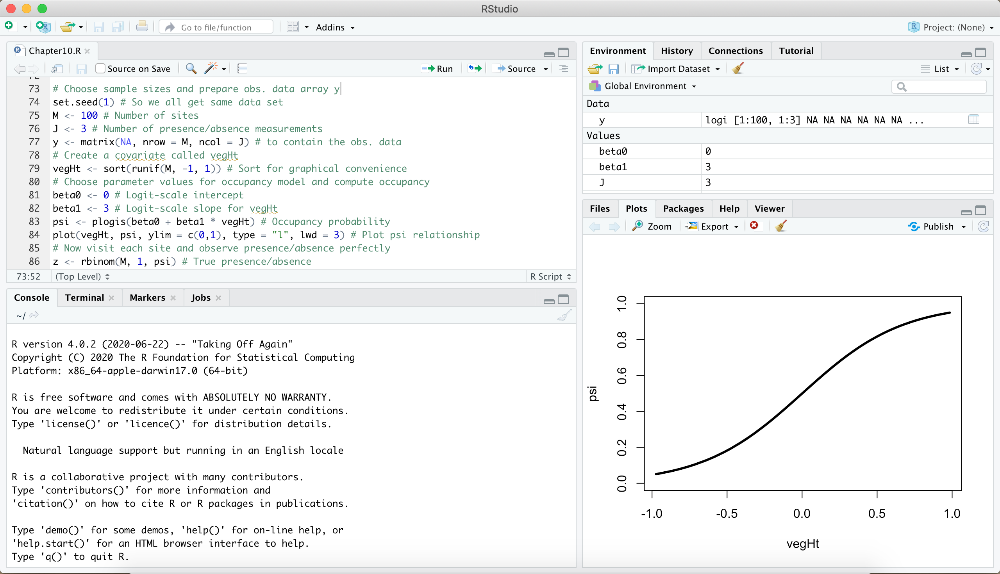
<figcaption aria-hidden="true">RStudio sowfware</figcaption>
</figure>

## Getting Help

One of the most useful commands in **R** is `?`. At the command prompt
(signified by `>` in your Console window), type `?` followed by any
command and you will be prompted with a help tab for that command (e.g.,
`?mean` Fig. 3). You can also search through the help tab directly by
searching functions on the search bar.

<figure>
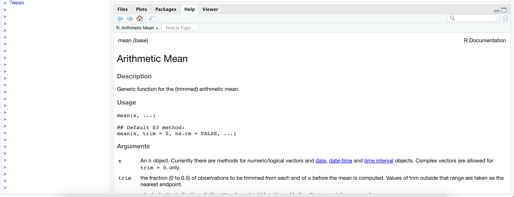
<figcaption aria-hidden="true">Getting help on R.</figcaption>
</figure>

The internet also contains a vast quantity of useful information. There
are blogs, mailing lists, and various websites (e.g.,
<https://stackoverflow.com/>) dedicated to providing information about
**R**, its packages, and potential error messages that you may encounter
(among other things). The trick is usually determining the key terms to
limit your search. I generally start any web-based search with
**“R-Cran”**, which limits and focuses the search. Using “**R**” as part
of your key terms does not, by itself, limit the search.

## Basic R concepts

There are a few concepts that are important to keep in mind before you
start coding. The fact that **R** is a programming language may deter
some users who think “I can’t program”. This should not be the case for
two reasons. First, **R** is an interpreted language, not a compiled
one, meaning that all commands typed on the keyboard are directly
executed without requiring you to build a complete program like in most
computer languages (C, Pascal, . . . ). Second, **R**’s syntax is very
simple and intuitive. For instance, a linear regression can be done with
the command `lm(y ~ x)` which means fitting a linear model with y as the
response and x as a predictor.

In **R**, in order to be executed, a function always needs to be written
with parentheses, even if there is nothing within them (e.g., `ls()`).
If you type the name of a function without parentheses, **R** will
display the content of the function.

When **R** is running, variables, data, functions, results, etc…, are
stored in the active memory of the computer in the form of objects that
you assign a name.The user can do actions on these objects with
operators (arithmetic, logical, comparison, . . . ) and functions (which
are themselves objects).

The name of an object must start with a letter (A-Z or a-z) and can be
followed by letters, digits (0-9), dots (.), and underscores (\_).

When referring to the directory of a folder or a data file, **R** uses
forward slash “/”. You need to pay close attention to the direction of
the slash if you copy a file path or directory from a Windows machine.

It is also important to know that **R** discriminates between uppercase
and lowercase letters in the names of objects, so that x and X can name
two distinct objects (even under Windows).

------------------------------------------------------------------------

## Starting with R

### Setting your working directory

Like in many other programs, you should start your session by defining
your working directory - the folder where you will work. This will be
the location on your computer where any files you save will be located.
To determine your current working directory, type:

    getwd()

Use `setwd()` to change or set a new working directory. For instance,
you can set your working directory to be in your Documents folder on the
C: drive, or in any folder you prefer.

    setwd("C:/Documents/R_Practice")

In *RStudio*, you can do some basic operations, such as setting your
working directory, using the point-and-click interface: Session &gt; Set
Working Directory &gt; Choose Directory … as shown in Fig. 4.

<figure>
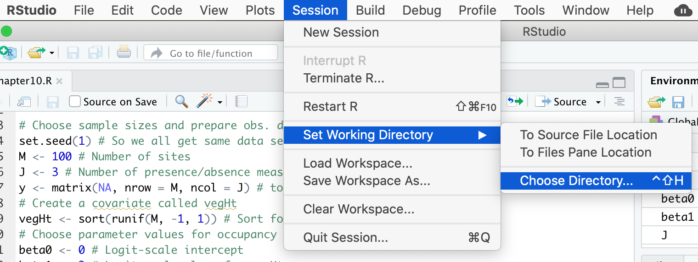
<figcaption aria-hidden="true">Setting working directory in
RStudio</figcaption>
</figure>

You can also work with **R projects**. R projects have the advantage
that they enhance organization, collaboration, and reproducibility in
R-based work by providing a structured and isolated workspace for your
projects. They contribute to a more efficient and transparent workflow,
particularly when working on multiple projects or collaborating with
others.

The main advantage is that R Projects create a dedicated workspace for
your R-related work, keeping all files, scripts, data, and outputs
within a well-defined directory. This isolation helps avoid conflicts
between projects and ensures a clean environment for each project. R
projects use relative paths, allowing you to refer to files and
directories within the project without specifying the full path. This
enhances portability and makes it easier to share your project with
others.

To start a new R Project click File &gt; New Project or directly click
on the R Project icon and follow the directions. You can set up your new
project on a new folder or an existing folder.

<figure>
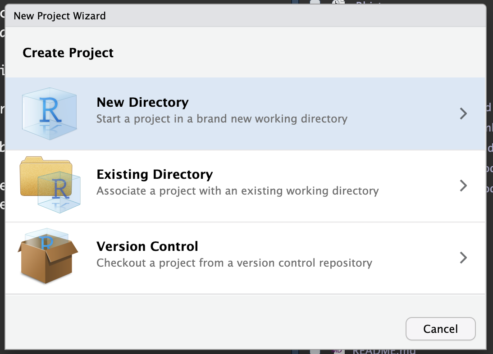
<figcaption aria-hidden="true">RStudio sowfware</figcaption>
</figure>

## **R** Fundamentals

### Data Types

There are four fundamental data types in **R** that you will work with:

1.  Character
2.  Numeric
3.  Integer
4.  Logical

You can check the data type of an object using the function `class()`.
To convert between data types you can use: `as.integer()`,
`as.numeric()`, `as.logical()`, `as. character()`.

For instance:

    city <- 'Nairobi'
    class(city)

    ## [1] "character"

    number <- 3
    class(number)

    ## [1] "numeric"

    Integer <- as.integer(number)
    class(Integer)

    ## [1] "integer"

    logical <- 3 > 5
    logical

    ## [1] FALSE

### Assigning data to objects

Since **R** is a programming language, we can store information as
objects to avoid unnecessary repetition. *Note again that values are
case sensitive; ‘x’ is not the same as ‘X’!*

    city <- "front royal"
    summary(city)

    number <- 2
    summary(number)

    character <- as.character(2)

Data are very often stored in different folders to maintain an
organizational pattern in your projects. In those cases, it is not
necessary to re-set the working directory every time we want to import
files to **R** that are stored in different folders, as long as these
folders are within the root directory you have previously set. For
instance, let’s say you have a table stored in a folder called *data*,
which is a subfolder within your root working directory
*(C:/Documents/R\_Practice)*. You can point to the *data* folder when
reading the table as in the example below:

    table <- read.csv(file="data/TheDataIWantToReadIn.csv", header=TRUE) # read a csv table stored in the data folder

Note that because *data* is a subfolder in your root directory, you do
not need to provide the complete directory information when reading the
table **“data/TheDataIWantToReadIn.csv”**. You can always provide the
full directory of a data file stored on your local drive to avoid
confusion.

### Special characters

The \# character is used to add comments to your code. \# indicates the
beginning of a comment and everything after \# on a line will be ignored
and not run as code. Adding comments to your code is considered good
practice because it allows you to describe in plain language (for
yourself or others) what your code is doing.

    #This is a comment

The semicolon (;) defines a line continuation character so that you can
write different commands on the same line of code.

    a <- 3; b <- 6; c <- a+b
    a

    ## [1] 3

    b

    ## [1] 6

    c

    ## [1] 9

## R Data Structure

### Vectors

Vectors are a basic data structure in **R**. They contain a sequence of
data and can contain characters, numbers, or be TRUE/FALSE values.
*Remember: If you are unsure or need help, use the help function (e.g.,
`help(seq)` or `?seq`)*. Below are several ways to create vectors in
**R**.

    1:20

    ##  [1]  1  2  3  4  5  6  7  8  9 10 11 12 13 14 15 16 17 18 19 20

    c(1,2,3,4,5)

    ## [1] 1 2 3 4 5

    seq(0,100,by=10)

    ##  [1]   0  10  20  30  40  50  60  70  80  90 100

    rep(1:5,5)

    ##  [1] 1 2 3 4 5 1 2 3 4 5 1 2 3 4 5 1 2 3 4 5 1 2 3 4 5

    rep("A rolling stone gathers no moss",4)

    ## [1] "A rolling stone gathers no moss"
    ## [2] "A rolling stone gathers no moss"
    ## [3] "A rolling stone gathers no moss"
    ## [4] "A rolling stone gathers no moss"

#### Extract subset of values from a vector using \[\] notation

    x <- 1:10
    y <- c(1.5, 9, 3.46, 12.2)

To see only part (i.e., a subset) of the data stored in a vector, you
need to “ask” **R** to extract the information you want using square
brackets. Most commonly, you will indicate in square brackets the
position of the data you want to extract (from beginning of the vector
\[1\] to the Nth slot in the vector \[n\]). If you only wanted to see
the first 5 values of ‘x’, how would you do that? Or only the 2nd and
4th element of y? What if you wanted to see all the records in `y`,
except for the 2nd and 3rd records? There are more ways to use notation
to select subsets of data, which we will cover in more detail below.

    x

    ##  [1]  1  2  3  4  5  6  7  8  9 10

    (x <- 1:10)

    ##  [1]  1  2  3  4  5  6  7  8  9 10

    x[1:5]

    ## [1] 1 2 3 4 5

    y[c(2,4)]

    ## [1]  9.0 12.2

    y[-c(2,3)]

    ## [1]  1.5 12.2

### Matrices and Dataframes

Matrices and dataframes are common ways to store tabular data.
Understanding how to manipulate them is important to be able to conduct
more complex analyses. Both matrices and dataframes are composed of rows
and columns. The main difference between matrices and dataframes is that
dataframes can contain many different classes of data (numeric,
character, etc.), while matrices can only contain a single class.

Create a matrix with 4 rows and 5 columns using the data from `x` above.
Consult the help (e.g., `help(matrix)` or `?matrix`) to determine the
syntax required.

    test_matrix <- matrix(data = x, nrow = 4, ncol = 5)
    test_matrix

    ##      [,1] [,2] [,3] [,4] [,5]
    ## [1,]    1    5    9    3    7
    ## [2,]    2    6   10    4    8
    ## [3,]    3    7    1    5    9
    ## [4,]    4    8    2    6   10

    # Note, I can assign any name to an object that I create.  Generally it is best to name things in a way that is meaningful, but we'll have some fun here!
    superman <- matrix(data = x, nrow = 4, ncol = 5)

#### Subset of Matrices and Dataframes

Now, if we wanted to reference any value in the matrix, we could do so
with matrix notation. The first value in matrix notation references the
row and the second value references the column. COMMIT THIS TO MEMORY! I
remember this by thinking **R**oman **C**atholic. So, if you wanted to
view only the value in the 1st row, 5th column, you’d type:

    #test_matrix(row,column)
    test_matrix[1,5]

    ## [1] 7

In addition to using positive integers to indicate the exact location of
the subset of data we want to extract, you can also use other notation
to indicate subsets of data that you want to include or exclude. You can
use: negative integers (to exclude data at a specific location), zero
(to create empty objects with consistent format), blank spaces (to
select the entire row/column), logical values (to select the data
associated with TRUE values), or names (to select specific columns or
rows by their names). Try to understand how each type of notation works!

For example, what if you wanted to view all the values in the 5th
column? This literally says, extract all rows but only the 5th column
from the object called test\_matrix.

    test_matrix[,5]

    ## [1]  7  8  9 10

What about the 4th row?

    test_matrix[4,]

    ## [1]  4  8  2  6 10

What if we wanted to view the values in the 3rd row, but only the 2nd
and 4th columns?

    test_matrix[3,c(2,4)]

    ## [1] 7 5

What happens to the matrix if we append a character field? Use the
`cbind()` (column bind) command to bind a new column, called
‘countries’. Note that I am not changing the contents of test\_matrix.
Can you figure out how to do a row bind (hint: use `rbind()`)

    countries <- c("United States", "Pakistan", "Ireland", "China")
    cbind(test_matrix,countries)

    ##                            countries      
    ## [1,] "1" "5" "9"  "3" "7"  "United States"
    ## [2,] "2" "6" "10" "4" "8"  "Pakistan"     
    ## [3,] "3" "7" "1"  "5" "9"  "Ireland"      
    ## [4,] "4" "8" "2"  "6" "10" "China"

    #Note that I am not changing/overwriting the contents of test_matrix.  I could, but I'd have to change my code to
    #test_matrix <- cbind(test_matrix,countries)

Why is everything inside the table now enclosed in quotes? Recall what
we said about matrices only containing one data type. What happens if I
coerce this to a dataframe?

    test_dataframe <- data.frame(test_matrix,countries)
    test_dataframe

    ##   X1 X2 X3 X4 X5     countries
    ## 1  1  5  9  3  7 United States
    ## 2  2  6 10  4  8      Pakistan
    ## 3  3  7  1  5  9       Ireland
    ## 4  4  8  2  6 10         China

    # Have I changed the file type?
    class(test_dataframe)

    ## [1] "data.frame"

Can I rename the column headings?

    names(test_dataframe) <- c("Val1", "Val2", "Val3", "Val4", "Val5", "Countries")
    test_dataframe

    ##   Val1 Val2 Val3 Val4 Val5     Countries
    ## 1    1    5    9    3    7 United States
    ## 2    2    6   10    4    8      Pakistan
    ## 3    3    7    1    5    9       Ireland
    ## 4    4    8    2    6   10         China

    # Also see the colnames() function

Can I use the same matrix notation to reference a particular row and
column? Are there other ways to reference a value?

    test_dataframe[3,5]

    ## [1] 9

    test_dataframe[,5]

    ## [1]  7  8  9 10

    test_dataframe$Val5[3]

    ## [1] 9

    test_dataframe$Val5

    ## [1]  7  8  9 10

    test_dataframe[,"Val5"]

    ## [1]  7  8  9 10

You can also use some very simple commands to determine the size of
dataframes or matrices.

    nrow(test_dataframe)

    ## [1] 4

    ncol(test_dataframe)

    ## [1] 6

    dim(test_dataframe)

    ## [1] 4 6

You can delete individual objects to clear your working directory
(`rm(dataset)`), or start every script with the following command to
make sure you are starting fresh (this is good programming practice):

    #rm(list=ls())

## Functions

**R** functions can be defined as a collection of arguments structured
together for carrying out a definite task. Functions have optional input
and output arguments that return a value. Custom functions can be easily
constructed in **R**. Most often, however, we will use built-in
functions within base packages or other downloadable packages.

Most functions have optional arguments or are given default values (in
the function’s help document, under the ‘Usage’ section, the optional
arguments are given a default value following the “=” symbol). When you
don’t specify the optional arguments, they will take the default values.
Functions normally can be called using the following format:
function\_name(input\_data, argument1, argument2.)

    print(2+2)

    ## [1] 4

    x <- matrix(1:10, 5, 2)
    x

    ##      [,1] [,2]
    ## [1,]    1    6
    ## [2,]    2    7
    ## [3,]    3    8
    ## [4,]    4    9
    ## [5,]    5   10

    y <- matrix(1:5)
    y

    ##      [,1]
    ## [1,]    1
    ## [2,]    2
    ## [3,]    3
    ## [4,]    4
    ## [5,]    5

    df.example <- cbind(x, y)
    df.example

    ##      [,1] [,2] [,3]
    ## [1,]    1    6    1
    ## [2,]    2    7    2
    ## [3,]    3    8    3
    ## [4,]    4    9    4
    ## [5,]    5   10    5

*?function\_name* can load the function help file. Also note that any
functions in non-base packages will require installing and loading that
package.

Here, for example, we install and load package named “ggplot2” that we
will use for data visualization.

    install.packages("ggplot2")
    library(ggplot2)

### Pre-existing Functions

**R** also contains many pre-existing functions in the base software.
Numeric functions include `sum()`, `mean()`, `sd()`, `min()`, `max()`,
`median()`, `range()`, `quantile()`, or `summary()`. Try a few of these
on the numeric vectors you have created.

    sum(x)

    ## [1] 55

    summary(x)

    ##        V1          V2    
    ##  Min.   :1   Min.   : 6  
    ##  1st Qu.:2   1st Qu.: 7  
    ##  Median :3   Median : 8  
    ##  Mean   :3   Mean   : 8  
    ##  3rd Qu.:4   3rd Qu.: 9  
    ##  Max.   :5   Max.   :10

    range(y)

    ## [1] 1 5

### Calculations & Arithmetic Operators

**R** can be used to perform basic calculations and report the results
back to the user.

    4+2

    ## [1] 6

    6*8

    ## [1] 48

    (842-62)/3

    ## [1] 260

Exponentiation: ^

    2^3

    ## [1] 8

Max and Min: max(), min()

    vector_numbers <- c(2, 3, 4, 10)
    max(vector_numbers) 

    ## [1] 10

    min(vector_numbers)

    ## [1] 2

> Can you calculate the square root and then subtract 5 for each element
> in vector\_number?

### Relational Operators

&lt;,&gt;, =, !=, &gt;=, &lt;=, Evaluate a conditional expression and
return TRUE or FALSE

    3 > max(c(2,3,4,5))

    ## [1] FALSE

## Loops

The for loop is used to iterate over a sequence (numeric vector, list,
or other iterable objects). Loops are very important to perform
opperations and especial building blocks of many advanced models.

Here is a simple for loop that print numbers 1 to 5. As you can see, i
is the element in which the loop is iterating. It can take a value of 1
to 5, and the loop ends when it reaches the last element of the
sequence.

    for (i in 1:5) {
      print(i)
    }

    ## [1] 1
    ## [1] 2
    ## [1] 3
    ## [1] 4
    ## [1] 5

But the loop can iterate not just on numbers, but also lists.

    my_list <- c("apple", "orange", "banana")
    for (fruit in my_list) {
      print(fruit)
    }

    ## [1] "apple"
    ## [1] "orange"
    ## [1] "banana"

We can create a vector from which we will add 5 to each element and save
it in a new vector. For this, we first need to create an empty vector
where we will save the new numbers. Note how we use **\[\]** to access
the elements in the **i** positions.

    vector <- c(2,3,4,5,2) #Data vector
    newdata <- NULL #Vector to store output
    for (i in 1:length(vector)){
      newdata[i] <- vector[i] + 5
    }
    newdata

    ## [1]  7  8  9 10  7

Finally, we can nest loops. A loop inside a loop. Make sure you
understand dimensions before trying to understand the nested loop.

    vector <- c(1,2,3,4,5) #Data vector
    newdata <- matrix(NA, 5,5) #Vector to store output
    for (i in 1:5) {
      for (j in 1:5) {
        newdata[i,j] <- vector[i] * vector[j]
      }
    }
    newdata

    ##      [,1] [,2] [,3] [,4] [,5]
    ## [1,]    1    2    3    4    5
    ## [2,]    2    4    6    8   10
    ## [3,]    3    6    9   12   15
    ## [4,]    4    8   12   16   20
    ## [5,]    5   10   15   20   25

## Installing SWIRL

A good way to learn more about R is to use SWIRL. This is a
user-generated program (also called a **package** or **library**) for
learning how to code in **R**. To access this, you must first install
the package so it is accessible. In the Console window (bottom left),
type the following and press ENTER:

    install.packages("swirl")

    # Data can also be installed locally if you've downloaded the zip file to your hard drive
    #install.packages("yourzip.tar.gz", repos=NULL)

This may take a little while, but when the stop sign in the upper right
of the console window is gone, you can proceed. For any package you
install in **R**, you will also need to turn them on before using them.
You can do this with the `require()` or `library()` functions. Type this
now:

    library(swirl)

*Note: You may be prompted to select a “mirror” from which to download
the package. If this is the case, it is recommended that you choose the
mirror that is geographically closest to you.*

To install the lesson, you will need to use:

    install_from_swirl("R Programming")

*Find out more about other courses, and other download options here:
<https://github.com/swirldev/swirl_courses>*

### SWIRL Lessons

There are many lessons within **R**. Once SWIRL is loaded (below), you
will be given the option of which lessons to complete. Some of the core
lessons can be found in the initial section labeled **R Programming**
(estimated time to compete required lessons is about 2 hours). We
recommend to start with the following lessons:

1.  **Basic Building Blocks (10 min)**
2.  **Workspace and Files (15 min)**
3.  **Sequences of Numbers (5 min)**
4.  **Vectors (8 min)**
5.  **Missing Values (5 min)**
6.  **Subsetting Vectors (12 min)**
7.  **Matrices and Data Frames (13 min)**
8.  Logic (optional)
9.  **Functions (30 min)**
10. lapply and sapply (optional)
11. vapply and tapply (optional)
12. **Looking at Data (5 min)**
13. Simulation (optional)
14. Dates and Times (10 min) (optional)
15. **Base Graphics (10 Min)**

### Run SWIRL

Type the following to begin using SWIRL. Also, when restarting your
session later, you’ll need to “turn on” SWIRL each time with either
`library(swirl)` or `require(swirl)`.

    swirl()

**Have fun!**

# Introduction to Data Analysis

Now that you’ve learned the basics of **R** programming, we’ll take
things a step further.This chapter will walk you through a new set of
analyses.

We’ll be working with the dataset “mtcars” which comes pre-loaded with
**R**. The goal of this exercise is to test your basic skills in **R**
programming, specifically in manipulating data and to reiterate some
principles in statistical modelling. This chapter will help as we move
towards our ultimate goal of conducting more advanced analyses on animal
point data.

You may not be familiar with all the operations you need to execute in
this exercise. Part of the goal with this exercise, however, is for you
to become more familiar with the *help* commands in **R** and with the
internet solutions that exist. Our ultimate goal is to make you aware of
the tools that are available to you so that you can become an effective
problem solver, working independently on data analyses.

------------------------------------------------------------------------

For this tutorial section I followed the book: [Data Analysis with R
Statistical Software - A Guidebook for
Scientists](https://www.eco-explore.co.uk/data-analysis-consulting/data-analysis-guidebook/)
This is, in my opinion, one of the best resources out there for an
introduction to data analysis with R.

------------------------------------------------------------------------

Whenever you start working with a new script, you should first set a
working directory. If you are working within a **R-Studio** project, the
working directory will automatically be set by default. This directory
will contain all the data for your analysis and will be where you will
save all the data outputs.

Remember that you can check the current working directory by typing:

    getwd()

    ## [1] "/Users/ramirocrego/Documents/GitHub/R-Tutorials"

Now, let’s change the working directory to a location of your choosing.
Create a folder if you don’t have one already, then make sure your
working directory is in that folder. If you already have a folder, just
set the working directory to the folder you want to use.

    setwd("C:/....")

## Data Management and Data Manipulation

### Exploring the Data

Let’s start investigating a data set to later fit a linear model.

Load the “mtcars”” data set. This dataset comes with R. We will use this
dataset as it is intuitive to think about it and is a good example on
how to tackle many other datasets.

    data(mtcars)

View the first 10 lines of the data set.

    head(mtcars, 10)

    ##                    mpg cyl  disp  hp drat    wt  qsec vs am gear
    ## Mazda RX4         21.0   6 160.0 110 3.90 2.620 16.46  0  1    4
    ## Mazda RX4 Wag     21.0   6 160.0 110 3.90 2.875 17.02  0  1    4
    ## Datsun 710        22.8   4 108.0  93 3.85 2.320 18.61  1  1    4
    ## Hornet 4 Drive    21.4   6 258.0 110 3.08 3.215 19.44  1  0    3
    ## Hornet Sportabout 18.7   8 360.0 175 3.15 3.440 17.02  0  0    3
    ## Valiant           18.1   6 225.0 105 2.76 3.460 20.22  1  0    3
    ## Duster 360        14.3   8 360.0 245 3.21 3.570 15.84  0  0    3
    ## Merc 240D         24.4   4 146.7  62 3.69 3.190 20.00  1  0    4
    ## Merc 230          22.8   4 140.8  95 3.92 3.150 22.90  1  0    4
    ## Merc 280          19.2   6 167.6 123 3.92 3.440 18.30  1  0    4
    ##                   carb
    ## Mazda RX4            4
    ## Mazda RX4 Wag        4
    ## Datsun 710           1
    ## Hornet 4 Drive       1
    ## Hornet Sportabout    2
    ## Valiant              1
    ## Duster 360           4
    ## Merc 240D            2
    ## Merc 230             2
    ## Merc 280             4

Assess the overall structure of the data set to get a sense of the
number and type of variables included. When you work with your own data,
you will be familiar with the data structure, but it is always good
practice to examine your data before moving on to any model fitting.
Assure that the data structure of each column of the data frame is
correct and/or what you expect it to be.

Note, all columns/variables included in this sample dataset are
numeric-type. You can confirm the data type of each column by typing
**is.numeric()** next to the variable name (e.g.,
`is.numeric(mtcars$mpg)`).

    str(mtcars)

    ## 'data.frame':    32 obs. of  11 variables:
    ##  $ mpg : num  21 21 22.8 21.4 18.7 18.1 14.3 24.4 22.8 19.2 ...
    ##  $ cyl : num  6 6 4 6 8 6 8 4 4 6 ...
    ##  $ disp: num  160 160 108 258 360 ...
    ##  $ hp  : num  110 110 93 110 175 105 245 62 95 123 ...
    ##  $ drat: num  3.9 3.9 3.85 3.08 3.15 2.76 3.21 3.69 3.92 3.92 ...
    ##  $ wt  : num  2.62 2.88 2.32 3.21 3.44 ...
    ##  $ qsec: num  16.5 17 18.6 19.4 17 ...
    ##  $ vs  : num  0 0 1 1 0 1 0 1 1 1 ...
    ##  $ am  : num  1 1 1 0 0 0 0 0 0 0 ...
    ##  $ gear: num  4 4 4 3 3 3 3 4 4 4 ...
    ##  $ carb: num  4 4 1 1 2 1 4 2 2 4 ...

Now, summarize the data to provide a list of each variable with the
mean, min, and max.

    summary(mtcars)

    ##       mpg             cyl             disp             hp       
    ##  Min.   :10.40   Min.   :4.000   Min.   : 71.1   Min.   : 52.0  
    ##  1st Qu.:15.43   1st Qu.:4.000   1st Qu.:120.8   1st Qu.: 96.5  
    ##  Median :19.20   Median :6.000   Median :196.3   Median :123.0  
    ##  Mean   :20.09   Mean   :6.188   Mean   :230.7   Mean   :146.7  
    ##  3rd Qu.:22.80   3rd Qu.:8.000   3rd Qu.:326.0   3rd Qu.:180.0  
    ##  Max.   :33.90   Max.   :8.000   Max.   :472.0   Max.   :335.0  
    ##       drat             wt             qsec             vs        
    ##  Min.   :2.760   Min.   :1.513   Min.   :14.50   Min.   :0.0000  
    ##  1st Qu.:3.080   1st Qu.:2.581   1st Qu.:16.89   1st Qu.:0.0000  
    ##  Median :3.695   Median :3.325   Median :17.71   Median :0.0000  
    ##  Mean   :3.597   Mean   :3.217   Mean   :17.85   Mean   :0.4375  
    ##  3rd Qu.:3.920   3rd Qu.:3.610   3rd Qu.:18.90   3rd Qu.:1.0000  
    ##  Max.   :4.930   Max.   :5.424   Max.   :22.90   Max.   :1.0000  
    ##        am              gear            carb      
    ##  Min.   :0.0000   Min.   :3.000   Min.   :1.000  
    ##  1st Qu.:0.0000   1st Qu.:3.000   1st Qu.:2.000  
    ##  Median :0.0000   Median :4.000   Median :2.000  
    ##  Mean   :0.4062   Mean   :3.688   Mean   :2.812  
    ##  3rd Qu.:1.0000   3rd Qu.:4.000   3rd Qu.:4.000  
    ##  Max.   :1.0000   Max.   :5.000   Max.   :8.000

‘Summary’ is a great function to have a quick view at the data. But what
if you want to save the mean, min, or max values of each variable? There
is a family of functions in **R** that are great for applying functions
to all columns or all rows in a matrix and that return the result as a
vector or list of values. This is the `apply` function.

The `apply` function has two main arguments. The MARGIN that is a 1 or a
2, indicating whether you want to operate on rows (1) or columns (2) and
the FUN arguments that tell **R** what function is to be applied. For
example, to obtain the mean of each variable in the mtcars dataset, we
do:

    apply(mtcars, 2, mean)

    ##        mpg        cyl       disp         hp       drat         wt 
    ##  20.090625   6.187500 230.721875 146.687500   3.596563   3.217250 
    ##       qsec         vs         am       gear       carb 
    ##  17.848750   0.437500   0.406250   3.687500   2.812500

Compare with the values reported by the `summary` function.

> QUESTION: Can you calculate the min and max values for each variable?

Let’s have a quick look at all our variables together (since they are
all numeric) by looking at scatter plots of each variable combination.
Use the function “pairs” or “plot” on the data set.

    plot(mtcars)

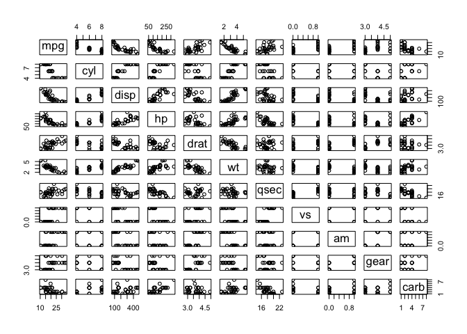

You should be able to see cases where there seems to be a strong
relationship between two variables. “mpg” vs. “wt” is a good example of
this. This is miles per gallon vs. the weight of the car, and this makes
sense, a heavier car should consume more petrol per distance. We should
transform miles to kilometers, because, what kind of measurement is
miles? But in appreciation of all my American friends, we will use
miles, just for this exercise. Is the slope here positive or negative?

We can plot these two variables against each other to examine the
relationship closer.

    plot(mtcars$mpg ~ mtcars$wt)

You could plot any of the variables in the data frame. Plotting the data
is one of the simplest ways to look and explore the data.

In **R** you can customize your plots. We will dedicate a section to
ggplot2. But for now, can you change the ‘x’ and ‘y’ variable names and
add a title to this plot? Use the help file `help(plot)` or `?plot` to
determine the proper syntax, or simply Google “add tile to plot in R”.

    plot(mtcars$mpg ~ mtcars$wt, xlab="Weight", ylab="MPG", main="MPG vs Weight")

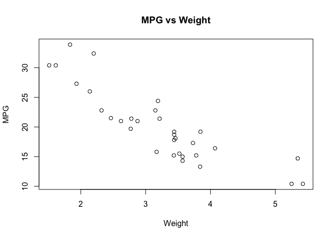

Calculate the correlation coefficient between the two variables, then
perform a correlation test to see if they are significantly correlated.

    cor(mtcars$mpg, mtcars$wt)

    ## [1] -0.8676594

    cor.test(mtcars$mpg, mtcars$wt)

    ## 
    ##  Pearson's product-moment correlation
    ## 
    ## data:  mtcars$mpg and mtcars$wt
    ## t = -9.559, df = 30, p-value = 1.294e-10
    ## alternative hypothesis: true correlation is not equal to 0
    ## 95 percent confidence interval:
    ##  -0.9338264 -0.7440872
    ## sample estimates:
    ##        cor 
    ## -0.8676594

The *p-value* is very small and the correlation coefficient of
-0.8676594 is very high. We also note that this value is negative,
meaning that as the weight increases, the fuel efficiency decreases.
This makes intuitive sense. We will talk about the difference between
correlation and causation later.

Let’s practice some data management before we look into these variables
in more detail.

Create a new data set called “my\_mtcars”, excluding the variables “vs”
and “am” using vector notation. Then look at your new data set to make
sure it worked. We don’t necessarily need to remove these variables to
continue the analysis. We are simply doing this so that you get more
familiar with manipulating data frames.

    head(mtcars)

    ##                    mpg cyl disp  hp drat    wt  qsec vs am gear
    ## Mazda RX4         21.0   6  160 110 3.90 2.620 16.46  0  1    4
    ## Mazda RX4 Wag     21.0   6  160 110 3.90 2.875 17.02  0  1    4
    ## Datsun 710        22.8   4  108  93 3.85 2.320 18.61  1  1    4
    ## Hornet 4 Drive    21.4   6  258 110 3.08 3.215 19.44  1  0    3
    ## Hornet Sportabout 18.7   8  360 175 3.15 3.440 17.02  0  0    3
    ## Valiant           18.1   6  225 105 2.76 3.460 20.22  1  0    3
    ##                   carb
    ## Mazda RX4            4
    ## Mazda RX4 Wag        4
    ## Datsun 710           1
    ## Hornet 4 Drive       1
    ## Hornet Sportabout    2
    ## Valiant              1

    my_mtcars <- mtcars[, -c(8,9)] #Remove columns 8 and 9
    head(my_mtcars, 10) 

    ##                    mpg cyl  disp  hp drat    wt  qsec gear carb
    ## Mazda RX4         21.0   6 160.0 110 3.90 2.620 16.46    4    4
    ## Mazda RX4 Wag     21.0   6 160.0 110 3.90 2.875 17.02    4    4
    ## Datsun 710        22.8   4 108.0  93 3.85 2.320 18.61    4    1
    ## Hornet 4 Drive    21.4   6 258.0 110 3.08 3.215 19.44    3    1
    ## Hornet Sportabout 18.7   8 360.0 175 3.15 3.440 17.02    3    2
    ## Valiant           18.1   6 225.0 105 2.76 3.460 20.22    3    1
    ## Duster 360        14.3   8 360.0 245 3.21 3.570 15.84    3    4
    ## Merc 240D         24.4   4 146.7  62 3.69 3.190 20.00    4    2
    ## Merc 230          22.8   4 140.8  95 3.92 3.150 22.90    4    2
    ## Merc 280          19.2   6 167.6 123 3.92 3.440 18.30    4    4

Now, keeping the same name for your data set, exclude the “gear” and
“carb” columns without using vector notation. Instead use the “subset”
function. Check out the help (`?subset`) for this function to figure out
how to exclude columns by name.

    my_mtcars <- subset(my_mtcars, select = -c(gear, carb))

Note that the initial data of my\_mycars with 9 variables no longer
exists, because my syntax states to save the modified 7 variable data
with the original name.

> QUESTION: How could you do this without overwriting the original data?

You should now have a data set called my\_mtcars that has 32
observations of 7 variables. Check this.

    str(my_mtcars)

    ## 'data.frame':    32 obs. of  7 variables:
    ##  $ mpg : num  21 21 22.8 21.4 18.7 18.1 14.3 24.4 22.8 19.2 ...
    ##  $ cyl : num  6 6 4 6 8 6 8 4 4 6 ...
    ##  $ disp: num  160 160 108 258 360 ...
    ##  $ hp  : num  110 110 93 110 175 105 245 62 95 123 ...
    ##  $ drat: num  3.9 3.9 3.85 3.08 3.15 2.76 3.21 3.69 3.92 3.92 ...
    ##  $ wt  : num  2.62 2.88 2.32 3.21 3.44 ...
    ##  $ qsec: num  16.5 17 18.6 19.4 17 ...

    dim(my_mtcars)

    ## [1] 32  7

> QUESTION: What does `## [1] 32 7` tells us? Hint, recall vector
> notation.

Another way of checking the number of rows and columns is using `nrow()`
and `ncol()` functions.

The variable “cyl” represents the number of cylinders in the car engine.
You’ll see this is classified as a numeric variable. However, we aren’t
necessarily interested in this as an actual number. For us, the number
of cylinders is more useful as a grouping mechanisms to serve as a
factor, or categorical variable. Let’s use the `as.factor` function to
convert it, keeping the same variable name. Then check what the class of
the variable is, to confirm the conversion worked.

    my_mtcars$cyl <- as.factor(my_mtcars$cyl)
    class(my_mtcars$cyl)

    ## [1] "factor"

Creating a categorical factor variable will enable us to generate
summary statistics and plot data by groups.

We can now use this factor variable to group different operations.
`tapply` is a great function to use for grouped operations. Check the
help for `?tapply` and try to calculate the mean of “mpg” for each
factor of the “cyl” variable.

    tapply(my_mtcars$mpg, my_mtcars$cyl, mean)

    ##        4        6        8 
    ## 26.66364 19.74286 15.10000

Now let’s create box plots of our two variables of interest (mpg, wt) to
visualize their distribution. First, change your graphic parameter to
show two graphs side by side.

> Question: How do you think you’d specify the title of each box plot?

    par(mfrow=c(1, 2))
    boxplot(my_mtcars$mpg, main = "mpg")
    boxplot(my_mtcars$wt, main = "weight")  

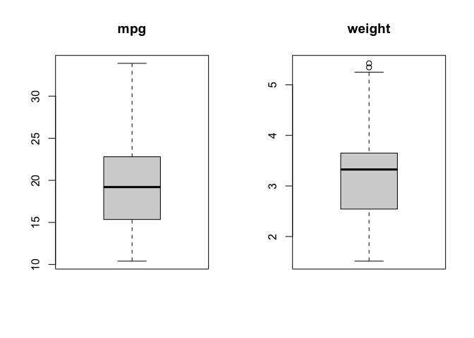

You can see that two points are potential outliers in the plot for`wt`.
The plot gives you a tool to make a decision whether to remove the data
points. Here we will keep them.

Since `cyl` is a categorical variable, we can also visualize the
distribution of `mpg` and `wt` across different cylinder classes.

    par(mfrow=c(1, 2))
    boxplot(my_mtcars$mpg ~ my_mtcars$cyl, main = "mpg")
    boxplot(my_mtcars$wt ~ my_mtcars$cyl, main = "weight") 

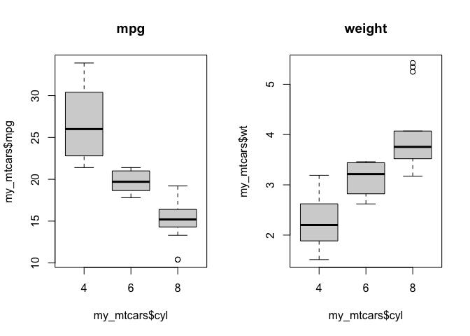

> QUESTION: How do you modify the label for x axis and y axis?

Before we move forward, let’s exclude these two observations by using a
logical expression that removes the points (rows in the dataframe) in
the data set where weight is greater than 5.3 tons. There are a few
different ways to do this, as is the case with most things in **R**.
Let’s use the `subset` function again.

    my_mtcars <- subset(my_mtcars, wt <= 5.3)

You should now have a data set with 30 observations of 7 variables.

Note that removing data points from an analysis is not a good
statistical practice and when done, it should be justified. But here,
the goal is to use different functions on how we can work with data
frames.

## Data Table Manipulation with Dplyr

The most basic R skills is to query and manipulate various data tables.
Table manipulation is also something that is almost always required,
regardless of what you decide to apply R for. For beginners,
familiarizing and reinforcing table manipulation skills to meet
different needs is a great way of improving R skills. If you wish to
become really good at R, but don’t know where to start, start with
tables!

The base R functions that come with the default R installation have the
capacity for almost all the table manipulation you will need (e.g.,
`split(), subset(), apply(), sapply(), lapply(), tapply(), aggregate()`).
However, sometimes their syntax are less user-friendly and intuitive
than some of the special packages built for table manipulation purposes.
So, here we are introducing a few of the most useful table manipulation
functions within `dplyr` package. This is a package I use a lot.

Note that you will have to use `install.packages()` and `library()`
function to download and activate the `dplyr` before using it.

    #install.packages("dplyr")
    library(dplyr)

Now, we will see how different functions of this package work.

### `select()`

We can use `select()` to select column(s) that meet an specific pattern:

    select(mtcars, mpg) # select column called mpg (miles per galon)

    ##                      mpg
    ## Mazda RX4           21.0
    ## Mazda RX4 Wag       21.0
    ## Datsun 710          22.8
    ## Hornet 4 Drive      21.4
    ## Hornet Sportabout   18.7
    ## Valiant             18.1
    ## Duster 360          14.3
    ## Merc 240D           24.4
    ## Merc 230            22.8
    ## Merc 280            19.2
    ## Merc 280C           17.8
    ## Merc 450SE          16.4
    ## Merc 450SL          17.3
    ## Merc 450SLC         15.2
    ## Cadillac Fleetwood  10.4
    ## Lincoln Continental 10.4
    ## Chrysler Imperial   14.7
    ## Fiat 128            32.4
    ## Honda Civic         30.4
    ## Toyota Corolla      33.9
    ## Toyota Corona       21.5
    ## Dodge Challenger    15.5
    ## AMC Javelin         15.2
    ## Camaro Z28          13.3
    ## Pontiac Firebird    19.2
    ## Fiat X1-9           27.3
    ## Porsche 914-2       26.0
    ## Lotus Europa        30.4
    ## Ford Pantera L      15.8
    ## Ferrari Dino        19.7
    ## Maserati Bora       15.0
    ## Volvo 142E          21.4

    select(mtcars, -mpg) # select all columns in the data except mpg column

    ##                     cyl  disp  hp drat    wt  qsec vs am gear carb
    ## Mazda RX4             6 160.0 110 3.90 2.620 16.46  0  1    4    4
    ## Mazda RX4 Wag         6 160.0 110 3.90 2.875 17.02  0  1    4    4
    ## Datsun 710            4 108.0  93 3.85 2.320 18.61  1  1    4    1
    ## Hornet 4 Drive        6 258.0 110 3.08 3.215 19.44  1  0    3    1
    ## Hornet Sportabout     8 360.0 175 3.15 3.440 17.02  0  0    3    2
    ## Valiant               6 225.0 105 2.76 3.460 20.22  1  0    3    1
    ## Duster 360            8 360.0 245 3.21 3.570 15.84  0  0    3    4
    ## Merc 240D             4 146.7  62 3.69 3.190 20.00  1  0    4    2
    ## Merc 230              4 140.8  95 3.92 3.150 22.90  1  0    4    2
    ## Merc 280              6 167.6 123 3.92 3.440 18.30  1  0    4    4
    ## Merc 280C             6 167.6 123 3.92 3.440 18.90  1  0    4    4
    ## Merc 450SE            8 275.8 180 3.07 4.070 17.40  0  0    3    3
    ## Merc 450SL            8 275.8 180 3.07 3.730 17.60  0  0    3    3
    ## Merc 450SLC           8 275.8 180 3.07 3.780 18.00  0  0    3    3
    ## Cadillac Fleetwood    8 472.0 205 2.93 5.250 17.98  0  0    3    4
    ## Lincoln Continental   8 460.0 215 3.00 5.424 17.82  0  0    3    4
    ## Chrysler Imperial     8 440.0 230 3.23 5.345 17.42  0  0    3    4
    ## Fiat 128              4  78.7  66 4.08 2.200 19.47  1  1    4    1
    ## Honda Civic           4  75.7  52 4.93 1.615 18.52  1  1    4    2
    ## Toyota Corolla        4  71.1  65 4.22 1.835 19.90  1  1    4    1
    ## Toyota Corona         4 120.1  97 3.70 2.465 20.01  1  0    3    1
    ## Dodge Challenger      8 318.0 150 2.76 3.520 16.87  0  0    3    2
    ## AMC Javelin           8 304.0 150 3.15 3.435 17.30  0  0    3    2
    ## Camaro Z28            8 350.0 245 3.73 3.840 15.41  0  0    3    4
    ## Pontiac Firebird      8 400.0 175 3.08 3.845 17.05  0  0    3    2
    ## Fiat X1-9             4  79.0  66 4.08 1.935 18.90  1  1    4    1
    ## Porsche 914-2         4 120.3  91 4.43 2.140 16.70  0  1    5    2
    ## Lotus Europa          4  95.1 113 3.77 1.513 16.90  1  1    5    2
    ## Ford Pantera L        8 351.0 264 4.22 3.170 14.50  0  1    5    4
    ## Ferrari Dino          6 145.0 175 3.62 2.770 15.50  0  1    5    6
    ## Maserati Bora         8 301.0 335 3.54 3.570 14.60  0  1    5    8
    ## Volvo 142E            4 121.0 109 4.11 2.780 18.60  1  1    4    2

    select(mtcars, hp:vs) # select a continuous block columns starting from hp column and end on vs column 

    ##                      hp drat    wt  qsec vs
    ## Mazda RX4           110 3.90 2.620 16.46  0
    ## Mazda RX4 Wag       110 3.90 2.875 17.02  0
    ## Datsun 710           93 3.85 2.320 18.61  1
    ## Hornet 4 Drive      110 3.08 3.215 19.44  1
    ## Hornet Sportabout   175 3.15 3.440 17.02  0
    ## Valiant             105 2.76 3.460 20.22  1
    ## Duster 360          245 3.21 3.570 15.84  0
    ## Merc 240D            62 3.69 3.190 20.00  1
    ## Merc 230             95 3.92 3.150 22.90  1
    ## Merc 280            123 3.92 3.440 18.30  1
    ## Merc 280C           123 3.92 3.440 18.90  1
    ## Merc 450SE          180 3.07 4.070 17.40  0
    ## Merc 450SL          180 3.07 3.730 17.60  0
    ## Merc 450SLC         180 3.07 3.780 18.00  0
    ## Cadillac Fleetwood  205 2.93 5.250 17.98  0
    ## Lincoln Continental 215 3.00 5.424 17.82  0
    ## Chrysler Imperial   230 3.23 5.345 17.42  0
    ## Fiat 128             66 4.08 2.200 19.47  1
    ## Honda Civic          52 4.93 1.615 18.52  1
    ## Toyota Corolla       65 4.22 1.835 19.90  1
    ## Toyota Corona        97 3.70 2.465 20.01  1
    ## Dodge Challenger    150 2.76 3.520 16.87  0
    ## AMC Javelin         150 3.15 3.435 17.30  0
    ## Camaro Z28          245 3.73 3.840 15.41  0
    ## Pontiac Firebird    175 3.08 3.845 17.05  0
    ## Fiat X1-9            66 4.08 1.935 18.90  1
    ## Porsche 914-2        91 4.43 2.140 16.70  0
    ## Lotus Europa        113 3.77 1.513 16.90  1
    ## Ford Pantera L      264 4.22 3.170 14.50  0
    ## Ferrari Dino        175 3.62 2.770 15.50  0
    ## Maserati Bora       335 3.54 3.570 14.60  0
    ## Volvo 142E          109 4.11 2.780 18.60  1

    select(mtcars, starts_with("c")) # select all columns that start with "c" in their column names

    ##                     cyl carb
    ## Mazda RX4             6    4
    ## Mazda RX4 Wag         6    4
    ## Datsun 710            4    1
    ## Hornet 4 Drive        6    1
    ## Hornet Sportabout     8    2
    ## Valiant               6    1
    ## Duster 360            8    4
    ## Merc 240D             4    2
    ## Merc 230              4    2
    ## Merc 280              6    4
    ## Merc 280C             6    4
    ## Merc 450SE            8    3
    ## Merc 450SL            8    3
    ## Merc 450SLC           8    3
    ## Cadillac Fleetwood    8    4
    ## Lincoln Continental   8    4
    ## Chrysler Imperial     8    4
    ## Fiat 128              4    1
    ## Honda Civic           4    2
    ## Toyota Corolla        4    1
    ## Toyota Corona         4    1
    ## Dodge Challenger      8    2
    ## AMC Javelin           8    2
    ## Camaro Z28            8    4
    ## Pontiac Firebird      8    2
    ## Fiat X1-9             4    1
    ## Porsche 914-2         4    2
    ## Lotus Europa          4    2
    ## Ford Pantera L        8    4
    ## Ferrari Dino          6    6
    ## Maserati Bora         8    8
    ## Volvo 142E            4    2

-   `starts_with` argument is very convenient because it allow you to
    select multiple columns that start with the same text. A few similar
    arguments are available to define other naming patterns.  
-   `ends_with()`= Select columns that end with a character string.  
-   `contains()`= Select columns that contain a character string.  
-   `matches()`= Select columns that match a regular expression.  
-   `one_of()`= Select columns names that are from a group of names.

> Question: How do you select or exclude two columns: mpg and cyl?

### `filter()`

Filter/select row(s) of data based on specific requirement of column(s)
values:

    filter(mtcars, cyl %in% c(4,6)) # select cars with 4 or 6 cylinders

    ##                 mpg cyl  disp  hp drat    wt  qsec vs am gear carb
    ## Mazda RX4      21.0   6 160.0 110 3.90 2.620 16.46  0  1    4    4
    ## Mazda RX4 Wag  21.0   6 160.0 110 3.90 2.875 17.02  0  1    4    4
    ## Datsun 710     22.8   4 108.0  93 3.85 2.320 18.61  1  1    4    1
    ## Hornet 4 Drive 21.4   6 258.0 110 3.08 3.215 19.44  1  0    3    1
    ## Valiant        18.1   6 225.0 105 2.76 3.460 20.22  1  0    3    1
    ## Merc 240D      24.4   4 146.7  62 3.69 3.190 20.00  1  0    4    2
    ## Merc 230       22.8   4 140.8  95 3.92 3.150 22.90  1  0    4    2
    ## Merc 280       19.2   6 167.6 123 3.92 3.440 18.30  1  0    4    4
    ## Merc 280C      17.8   6 167.6 123 3.92 3.440 18.90  1  0    4    4
    ## Fiat 128       32.4   4  78.7  66 4.08 2.200 19.47  1  1    4    1
    ## Honda Civic    30.4   4  75.7  52 4.93 1.615 18.52  1  1    4    2
    ## Toyota Corolla 33.9   4  71.1  65 4.22 1.835 19.90  1  1    4    1
    ## Toyota Corona  21.5   4 120.1  97 3.70 2.465 20.01  1  0    3    1
    ## Fiat X1-9      27.3   4  79.0  66 4.08 1.935 18.90  1  1    4    1
    ## Porsche 914-2  26.0   4 120.3  91 4.43 2.140 16.70  0  1    5    2
    ## Lotus Europa   30.4   4  95.1 113 3.77 1.513 16.90  1  1    5    2
    ## Ferrari Dino   19.7   6 145.0 175 3.62 2.770 15.50  0  1    5    6
    ## Volvo 142E     21.4   4 121.0 109 4.11 2.780 18.60  1  1    4    2

    filter (mtcars, mpg>20) # select rows that have mpg > 20

    ##                 mpg cyl  disp  hp drat    wt  qsec vs am gear carb
    ## Mazda RX4      21.0   6 160.0 110 3.90 2.620 16.46  0  1    4    4
    ## Mazda RX4 Wag  21.0   6 160.0 110 3.90 2.875 17.02  0  1    4    4
    ## Datsun 710     22.8   4 108.0  93 3.85 2.320 18.61  1  1    4    1
    ## Hornet 4 Drive 21.4   6 258.0 110 3.08 3.215 19.44  1  0    3    1
    ## Merc 240D      24.4   4 146.7  62 3.69 3.190 20.00  1  0    4    2
    ## Merc 230       22.8   4 140.8  95 3.92 3.150 22.90  1  0    4    2
    ## Fiat 128       32.4   4  78.7  66 4.08 2.200 19.47  1  1    4    1
    ## Honda Civic    30.4   4  75.7  52 4.93 1.615 18.52  1  1    4    2
    ## Toyota Corolla 33.9   4  71.1  65 4.22 1.835 19.90  1  1    4    1
    ## Toyota Corona  21.5   4 120.1  97 3.70 2.465 20.01  1  0    3    1
    ## Fiat X1-9      27.3   4  79.0  66 4.08 1.935 18.90  1  1    4    1
    ## Porsche 914-2  26.0   4 120.3  91 4.43 2.140 16.70  0  1    5    2
    ## Lotus Europa   30.4   4  95.1 113 3.77 1.513 16.90  1  1    5    2
    ## Volvo 142E     21.4   4 121.0 109 4.11 2.780 18.60  1  1    4    2

    filter(mtcars, mpg>20 & cyl == 6) # select rows that have mpg>20 AND cyl == 6

    ##                 mpg cyl disp  hp drat    wt  qsec vs am gear carb
    ## Mazda RX4      21.0   6  160 110 3.90 2.620 16.46  0  1    4    4
    ## Mazda RX4 Wag  21.0   6  160 110 3.90 2.875 17.02  0  1    4    4
    ## Hornet 4 Drive 21.4   6  258 110 3.08 3.215 19.44  1  0    3    1

    filter(mtcars, mpg>20 | hp > 100) # select rows that have mpg>20 OR hp > 100

    ##                      mpg cyl  disp  hp drat    wt  qsec vs am gear
    ## Mazda RX4           21.0   6 160.0 110 3.90 2.620 16.46  0  1    4
    ## Mazda RX4 Wag       21.0   6 160.0 110 3.90 2.875 17.02  0  1    4
    ## Datsun 710          22.8   4 108.0  93 3.85 2.320 18.61  1  1    4
    ## Hornet 4 Drive      21.4   6 258.0 110 3.08 3.215 19.44  1  0    3
    ## Hornet Sportabout   18.7   8 360.0 175 3.15 3.440 17.02  0  0    3
    ## Valiant             18.1   6 225.0 105 2.76 3.460 20.22  1  0    3
    ## Duster 360          14.3   8 360.0 245 3.21 3.570 15.84  0  0    3
    ## Merc 240D           24.4   4 146.7  62 3.69 3.190 20.00  1  0    4
    ## Merc 230            22.8   4 140.8  95 3.92 3.150 22.90  1  0    4
    ## Merc 280            19.2   6 167.6 123 3.92 3.440 18.30  1  0    4
    ## Merc 280C           17.8   6 167.6 123 3.92 3.440 18.90  1  0    4
    ## Merc 450SE          16.4   8 275.8 180 3.07 4.070 17.40  0  0    3
    ## Merc 450SL          17.3   8 275.8 180 3.07 3.730 17.60  0  0    3
    ## Merc 450SLC         15.2   8 275.8 180 3.07 3.780 18.00  0  0    3
    ## Cadillac Fleetwood  10.4   8 472.0 205 2.93 5.250 17.98  0  0    3
    ## Lincoln Continental 10.4   8 460.0 215 3.00 5.424 17.82  0  0    3
    ## Chrysler Imperial   14.7   8 440.0 230 3.23 5.345 17.42  0  0    3
    ## Fiat 128            32.4   4  78.7  66 4.08 2.200 19.47  1  1    4
    ## Honda Civic         30.4   4  75.7  52 4.93 1.615 18.52  1  1    4
    ## Toyota Corolla      33.9   4  71.1  65 4.22 1.835 19.90  1  1    4
    ## Toyota Corona       21.5   4 120.1  97 3.70 2.465 20.01  1  0    3
    ## Dodge Challenger    15.5   8 318.0 150 2.76 3.520 16.87  0  0    3
    ## AMC Javelin         15.2   8 304.0 150 3.15 3.435 17.30  0  0    3
    ## Camaro Z28          13.3   8 350.0 245 3.73 3.840 15.41  0  0    3
    ## Pontiac Firebird    19.2   8 400.0 175 3.08 3.845 17.05  0  0    3
    ## Fiat X1-9           27.3   4  79.0  66 4.08 1.935 18.90  1  1    4
    ## Porsche 914-2       26.0   4 120.3  91 4.43 2.140 16.70  0  1    5
    ## Lotus Europa        30.4   4  95.1 113 3.77 1.513 16.90  1  1    5
    ## Ford Pantera L      15.8   8 351.0 264 4.22 3.170 14.50  0  1    5
    ## Ferrari Dino        19.7   6 145.0 175 3.62 2.770 15.50  0  1    5
    ## Maserati Bora       15.0   8 301.0 335 3.54 3.570 14.60  0  1    5
    ## Volvo 142E          21.4   4 121.0 109 4.11 2.780 18.60  1  1    4
    ##                     carb
    ## Mazda RX4              4
    ## Mazda RX4 Wag          4
    ## Datsun 710             1
    ## Hornet 4 Drive         1
    ## Hornet Sportabout      2
    ## Valiant                1
    ## Duster 360             4
    ## Merc 240D              2
    ## Merc 230               2
    ## Merc 280               4
    ## Merc 280C              4
    ## Merc 450SE             3
    ## Merc 450SL             3
    ## Merc 450SLC            3
    ## Cadillac Fleetwood     4
    ## Lincoln Continental    4
    ## Chrysler Imperial      4
    ## Fiat 128               1
    ## Honda Civic            2
    ## Toyota Corolla         1
    ## Toyota Corona          1
    ## Dodge Challenger       2
    ## AMC Javelin            2
    ## Camaro Z28             4
    ## Pontiac Firebird       2
    ## Fiat X1-9              1
    ## Porsche 914-2          2
    ## Lotus Europa           2
    ## Ford Pantera L         4
    ## Ferrari Dino           6
    ## Maserati Bora          8
    ## Volvo 142E             2

> Question 1: How do you select rows with 6 and 8 cylinders knowing that
> cyl is a factor?

### pipe operator

The pipe operator allows you to pipe the output from one function to the
input of the next function. Instead of nesting functions (reading from
the inside to the outside), the idea of of piping is to read the
functions from left to right. It can also help you avoid creating and
saving a lot of intermediate variables that you don’t need to keep. The
old operator for pipes was `%>%`, but now a new version has been
introduced, `|>`

    # old operator
    pipe_result<- mtcars %>%
      select(mpg, cyl) %>%
      head()
    pipe_result

    ##                    mpg cyl
    ## Mazda RX4         21.0   6
    ## Mazda RX4 Wag     21.0   6
    ## Datsun 710        22.8   4
    ## Hornet 4 Drive    21.4   6
    ## Hornet Sportabout 18.7   8
    ## Valiant           18.1   6

    # new operator
    pipe_result<- mtcars |>
      select(mpg, cyl) |>
      head()
    pipe_result

    ##                    mpg cyl
    ## Mazda RX4         21.0   6
    ## Mazda RX4 Wag     21.0   6
    ## Datsun 710        22.8   4
    ## Hornet 4 Drive    21.4   6
    ## Hornet Sportabout 18.7   8
    ## Valiant           18.1   6

### `arrange()`

This function arranges or re-orders rows based on their value, the rows
are arranged by default in ascending order

    order_data1<- mtcars %>% 
        arrange(mpg) 
    order_data1

    ##                      mpg cyl  disp  hp drat    wt  qsec vs am gear
    ## Cadillac Fleetwood  10.4   8 472.0 205 2.93 5.250 17.98  0  0    3
    ## Lincoln Continental 10.4   8 460.0 215 3.00 5.424 17.82  0  0    3
    ## Camaro Z28          13.3   8 350.0 245 3.73 3.840 15.41  0  0    3
    ## Duster 360          14.3   8 360.0 245 3.21 3.570 15.84  0  0    3
    ## Chrysler Imperial   14.7   8 440.0 230 3.23 5.345 17.42  0  0    3
    ## Maserati Bora       15.0   8 301.0 335 3.54 3.570 14.60  0  1    5
    ## Merc 450SLC         15.2   8 275.8 180 3.07 3.780 18.00  0  0    3
    ## AMC Javelin         15.2   8 304.0 150 3.15 3.435 17.30  0  0    3
    ## Dodge Challenger    15.5   8 318.0 150 2.76 3.520 16.87  0  0    3
    ## Ford Pantera L      15.8   8 351.0 264 4.22 3.170 14.50  0  1    5
    ## Merc 450SE          16.4   8 275.8 180 3.07 4.070 17.40  0  0    3
    ## Merc 450SL          17.3   8 275.8 180 3.07 3.730 17.60  0  0    3
    ## Merc 280C           17.8   6 167.6 123 3.92 3.440 18.90  1  0    4
    ## Valiant             18.1   6 225.0 105 2.76 3.460 20.22  1  0    3
    ## Hornet Sportabout   18.7   8 360.0 175 3.15 3.440 17.02  0  0    3
    ## Merc 280            19.2   6 167.6 123 3.92 3.440 18.30  1  0    4
    ## Pontiac Firebird    19.2   8 400.0 175 3.08 3.845 17.05  0  0    3
    ## Ferrari Dino        19.7   6 145.0 175 3.62 2.770 15.50  0  1    5
    ## Mazda RX4           21.0   6 160.0 110 3.90 2.620 16.46  0  1    4
    ## Mazda RX4 Wag       21.0   6 160.0 110 3.90 2.875 17.02  0  1    4
    ## Hornet 4 Drive      21.4   6 258.0 110 3.08 3.215 19.44  1  0    3
    ## Volvo 142E          21.4   4 121.0 109 4.11 2.780 18.60  1  1    4
    ## Toyota Corona       21.5   4 120.1  97 3.70 2.465 20.01  1  0    3
    ## Datsun 710          22.8   4 108.0  93 3.85 2.320 18.61  1  1    4
    ## Merc 230            22.8   4 140.8  95 3.92 3.150 22.90  1  0    4
    ## Merc 240D           24.4   4 146.7  62 3.69 3.190 20.00  1  0    4
    ## Porsche 914-2       26.0   4 120.3  91 4.43 2.140 16.70  0  1    5
    ## Fiat X1-9           27.3   4  79.0  66 4.08 1.935 18.90  1  1    4
    ## Honda Civic         30.4   4  75.7  52 4.93 1.615 18.52  1  1    4
    ## Lotus Europa        30.4   4  95.1 113 3.77 1.513 16.90  1  1    5
    ## Fiat 128            32.4   4  78.7  66 4.08 2.200 19.47  1  1    4
    ## Toyota Corolla      33.9   4  71.1  65 4.22 1.835 19.90  1  1    4
    ##                     carb
    ## Cadillac Fleetwood     4
    ## Lincoln Continental    4
    ## Camaro Z28             4
    ## Duster 360             4
    ## Chrysler Imperial      4
    ## Maserati Bora          8
    ## Merc 450SLC            3
    ## AMC Javelin            2
    ## Dodge Challenger       2
    ## Ford Pantera L         4
    ## Merc 450SE             3
    ## Merc 450SL             3
    ## Merc 280C              4
    ## Valiant                1
    ## Hornet Sportabout      2
    ## Merc 280               4
    ## Pontiac Firebird       2
    ## Ferrari Dino           6
    ## Mazda RX4              4
    ## Mazda RX4 Wag          4
    ## Hornet 4 Drive         1
    ## Volvo 142E             2
    ## Toyota Corona          1
    ## Datsun 710             1
    ## Merc 230               2
    ## Merc 240D              2
    ## Porsche 914-2          2
    ## Fiat X1-9              1
    ## Honda Civic            2
    ## Lotus Europa           2
    ## Fiat 128               1
    ## Toyota Corolla         1

    order_data2<- mtcars %>%
        arrange(cyl, mpg)
    order_data2

    ##                      mpg cyl  disp  hp drat    wt  qsec vs am gear
    ## Volvo 142E          21.4   4 121.0 109 4.11 2.780 18.60  1  1    4
    ## Toyota Corona       21.5   4 120.1  97 3.70 2.465 20.01  1  0    3
    ## Datsun 710          22.8   4 108.0  93 3.85 2.320 18.61  1  1    4
    ## Merc 230            22.8   4 140.8  95 3.92 3.150 22.90  1  0    4
    ## Merc 240D           24.4   4 146.7  62 3.69 3.190 20.00  1  0    4
    ## Porsche 914-2       26.0   4 120.3  91 4.43 2.140 16.70  0  1    5
    ## Fiat X1-9           27.3   4  79.0  66 4.08 1.935 18.90  1  1    4
    ## Honda Civic         30.4   4  75.7  52 4.93 1.615 18.52  1  1    4
    ## Lotus Europa        30.4   4  95.1 113 3.77 1.513 16.90  1  1    5
    ## Fiat 128            32.4   4  78.7  66 4.08 2.200 19.47  1  1    4
    ## Toyota Corolla      33.9   4  71.1  65 4.22 1.835 19.90  1  1    4
    ## Merc 280C           17.8   6 167.6 123 3.92 3.440 18.90  1  0    4
    ## Valiant             18.1   6 225.0 105 2.76 3.460 20.22  1  0    3
    ## Merc 280            19.2   6 167.6 123 3.92 3.440 18.30  1  0    4
    ## Ferrari Dino        19.7   6 145.0 175 3.62 2.770 15.50  0  1    5
    ## Mazda RX4           21.0   6 160.0 110 3.90 2.620 16.46  0  1    4
    ## Mazda RX4 Wag       21.0   6 160.0 110 3.90 2.875 17.02  0  1    4
    ## Hornet 4 Drive      21.4   6 258.0 110 3.08 3.215 19.44  1  0    3
    ## Cadillac Fleetwood  10.4   8 472.0 205 2.93 5.250 17.98  0  0    3
    ## Lincoln Continental 10.4   8 460.0 215 3.00 5.424 17.82  0  0    3
    ## Camaro Z28          13.3   8 350.0 245 3.73 3.840 15.41  0  0    3
    ## Duster 360          14.3   8 360.0 245 3.21 3.570 15.84  0  0    3
    ## Chrysler Imperial   14.7   8 440.0 230 3.23 5.345 17.42  0  0    3
    ## Maserati Bora       15.0   8 301.0 335 3.54 3.570 14.60  0  1    5
    ## Merc 450SLC         15.2   8 275.8 180 3.07 3.780 18.00  0  0    3
    ## AMC Javelin         15.2   8 304.0 150 3.15 3.435 17.30  0  0    3
    ## Dodge Challenger    15.5   8 318.0 150 2.76 3.520 16.87  0  0    3
    ## Ford Pantera L      15.8   8 351.0 264 4.22 3.170 14.50  0  1    5
    ## Merc 450SE          16.4   8 275.8 180 3.07 4.070 17.40  0  0    3
    ## Merc 450SL          17.3   8 275.8 180 3.07 3.730 17.60  0  0    3
    ## Hornet Sportabout   18.7   8 360.0 175 3.15 3.440 17.02  0  0    3
    ## Pontiac Firebird    19.2   8 400.0 175 3.08 3.845 17.05  0  0    3
    ##                     carb
    ## Volvo 142E             2
    ## Toyota Corona          1
    ## Datsun 710             1
    ## Merc 230               2
    ## Merc 240D              2
    ## Porsche 914-2          2
    ## Fiat X1-9              1
    ## Honda Civic            2
    ## Lotus Europa           2
    ## Fiat 128               1
    ## Toyota Corolla         1
    ## Merc 280C              4
    ## Valiant                1
    ## Merc 280               4
    ## Ferrari Dino           6
    ## Mazda RX4              4
    ## Mazda RX4 Wag          4
    ## Hornet 4 Drive         1
    ## Cadillac Fleetwood     4
    ## Lincoln Continental    4
    ## Camaro Z28             4
    ## Duster 360             4
    ## Chrysler Imperial      4
    ## Maserati Bora          8
    ## Merc 450SLC            3
    ## AMC Javelin            2
    ## Dodge Challenger       2
    ## Ford Pantera L         4
    ## Merc 450SE             3
    ## Merc 450SL             3
    ## Hornet Sportabout      2
    ## Pontiac Firebird       2

    # Now we learn pipe operator, can you understand what order_data1 and order_data2 are producing? 

> Question: Can you arrange the table first by wt and then by hp in
> decending order?

### `mutate()`

The `mutate()` command creates new column(s) and define their values.
For instance, we can create a new column with random numbers between 0
and 100 using a uniform distribution.

    new_col<- mtcars %>%
        mutate(new_col = runif(n = nrow(mtcars), min = 0, max = 100)) # note the use of nrow to get the exact number of random numbers as there are rows in the dataframe.
    new_col

    ##                      mpg cyl  disp  hp drat    wt  qsec vs am gear
    ## Mazda RX4           21.0   6 160.0 110 3.90 2.620 16.46  0  1    4
    ## Mazda RX4 Wag       21.0   6 160.0 110 3.90 2.875 17.02  0  1    4
    ## Datsun 710          22.8   4 108.0  93 3.85 2.320 18.61  1  1    4
    ## Hornet 4 Drive      21.4   6 258.0 110 3.08 3.215 19.44  1  0    3
    ## Hornet Sportabout   18.7   8 360.0 175 3.15 3.440 17.02  0  0    3
    ## Valiant             18.1   6 225.0 105 2.76 3.460 20.22  1  0    3
    ## Duster 360          14.3   8 360.0 245 3.21 3.570 15.84  0  0    3
    ## Merc 240D           24.4   4 146.7  62 3.69 3.190 20.00  1  0    4
    ## Merc 230            22.8   4 140.8  95 3.92 3.150 22.90  1  0    4
    ## Merc 280            19.2   6 167.6 123 3.92 3.440 18.30  1  0    4
    ## Merc 280C           17.8   6 167.6 123 3.92 3.440 18.90  1  0    4
    ## Merc 450SE          16.4   8 275.8 180 3.07 4.070 17.40  0  0    3
    ## Merc 450SL          17.3   8 275.8 180 3.07 3.730 17.60  0  0    3
    ## Merc 450SLC         15.2   8 275.8 180 3.07 3.780 18.00  0  0    3
    ## Cadillac Fleetwood  10.4   8 472.0 205 2.93 5.250 17.98  0  0    3
    ## Lincoln Continental 10.4   8 460.0 215 3.00 5.424 17.82  0  0    3
    ## Chrysler Imperial   14.7   8 440.0 230 3.23 5.345 17.42  0  0    3
    ## Fiat 128            32.4   4  78.7  66 4.08 2.200 19.47  1  1    4
    ## Honda Civic         30.4   4  75.7  52 4.93 1.615 18.52  1  1    4
    ## Toyota Corolla      33.9   4  71.1  65 4.22 1.835 19.90  1  1    4
    ## Toyota Corona       21.5   4 120.1  97 3.70 2.465 20.01  1  0    3
    ## Dodge Challenger    15.5   8 318.0 150 2.76 3.520 16.87  0  0    3
    ## AMC Javelin         15.2   8 304.0 150 3.15 3.435 17.30  0  0    3
    ## Camaro Z28          13.3   8 350.0 245 3.73 3.840 15.41  0  0    3
    ## Pontiac Firebird    19.2   8 400.0 175 3.08 3.845 17.05  0  0    3
    ## Fiat X1-9           27.3   4  79.0  66 4.08 1.935 18.90  1  1    4
    ## Porsche 914-2       26.0   4 120.3  91 4.43 2.140 16.70  0  1    5
    ## Lotus Europa        30.4   4  95.1 113 3.77 1.513 16.90  1  1    5
    ## Ford Pantera L      15.8   8 351.0 264 4.22 3.170 14.50  0  1    5
    ## Ferrari Dino        19.7   6 145.0 175 3.62 2.770 15.50  0  1    5
    ## Maserati Bora       15.0   8 301.0 335 3.54 3.570 14.60  0  1    5
    ## Volvo 142E          21.4   4 121.0 109 4.11 2.780 18.60  1  1    4
    ##                     carb   new_col
    ## Mazda RX4              4 45.325167
    ## Mazda RX4 Wag          4 71.595137
    ## Datsun 710             1 22.307502
    ## Hornet 4 Drive         1 76.575520
    ## Hornet Sportabout      2 64.404899
    ## Valiant                1 40.328984
    ## Duster 360             4 47.745387
    ## Merc 240D              2 31.470114
    ## Merc 230               2 13.385267
    ## Merc 280               4 94.321241
    ## Merc 280C              4 90.905093
    ## Merc 450SE             3 61.463729
    ## Merc 450SL             3 54.021893
    ## Merc 450SLC            3 89.290931
    ## Cadillac Fleetwood     4 34.698049
    ## Lincoln Continental    4 80.192777
    ## Chrysler Imperial      4 86.516655
    ## Fiat 128               1 80.952402
    ## Honda Civic            2 28.039848
    ## Toyota Corolla         1  9.075513
    ## Toyota Corona          1 47.913452
    ## Dodge Challenger       2 74.917562
    ## AMC Javelin            2 69.675243
    ## Camaro Z28             4 68.928527
    ## Pontiac Firebird       2 98.925896
    ## Fiat X1-9              1 71.136517
    ## Porsche 914-2          2 32.845551
    ## Lotus Europa           2 48.634291
    ## Ford Pantera L         4 50.484564
    ## Ferrari Dino           6  9.983938
    ## Maserati Bora          8 14.290994
    ## Volvo 142E             2 70.938767

    new_col2 <- mtcars %>%
        mutate(new_col = runif(n = nrow(mtcars), min = 0, max = 100),  wt_kg = wt * 1000) # you can create multiple columns at once. Lets transform the weight from tones to kg
    new_col2

    ##                      mpg cyl  disp  hp drat    wt  qsec vs am gear
    ## Mazda RX4           21.0   6 160.0 110 3.90 2.620 16.46  0  1    4
    ## Mazda RX4 Wag       21.0   6 160.0 110 3.90 2.875 17.02  0  1    4
    ## Datsun 710          22.8   4 108.0  93 3.85 2.320 18.61  1  1    4
    ## Hornet 4 Drive      21.4   6 258.0 110 3.08 3.215 19.44  1  0    3
    ## Hornet Sportabout   18.7   8 360.0 175 3.15 3.440 17.02  0  0    3
    ## Valiant             18.1   6 225.0 105 2.76 3.460 20.22  1  0    3
    ## Duster 360          14.3   8 360.0 245 3.21 3.570 15.84  0  0    3
    ## Merc 240D           24.4   4 146.7  62 3.69 3.190 20.00  1  0    4
    ## Merc 230            22.8   4 140.8  95 3.92 3.150 22.90  1  0    4
    ## Merc 280            19.2   6 167.6 123 3.92 3.440 18.30  1  0    4
    ## Merc 280C           17.8   6 167.6 123 3.92 3.440 18.90  1  0    4
    ## Merc 450SE          16.4   8 275.8 180 3.07 4.070 17.40  0  0    3
    ## Merc 450SL          17.3   8 275.8 180 3.07 3.730 17.60  0  0    3
    ## Merc 450SLC         15.2   8 275.8 180 3.07 3.780 18.00  0  0    3
    ## Cadillac Fleetwood  10.4   8 472.0 205 2.93 5.250 17.98  0  0    3
    ## Lincoln Continental 10.4   8 460.0 215 3.00 5.424 17.82  0  0    3
    ## Chrysler Imperial   14.7   8 440.0 230 3.23 5.345 17.42  0  0    3
    ## Fiat 128            32.4   4  78.7  66 4.08 2.200 19.47  1  1    4
    ## Honda Civic         30.4   4  75.7  52 4.93 1.615 18.52  1  1    4
    ## Toyota Corolla      33.9   4  71.1  65 4.22 1.835 19.90  1  1    4
    ## Toyota Corona       21.5   4 120.1  97 3.70 2.465 20.01  1  0    3
    ## Dodge Challenger    15.5   8 318.0 150 2.76 3.520 16.87  0  0    3
    ## AMC Javelin         15.2   8 304.0 150 3.15 3.435 17.30  0  0    3
    ## Camaro Z28          13.3   8 350.0 245 3.73 3.840 15.41  0  0    3
    ## Pontiac Firebird    19.2   8 400.0 175 3.08 3.845 17.05  0  0    3
    ## Fiat X1-9           27.3   4  79.0  66 4.08 1.935 18.90  1  1    4
    ## Porsche 914-2       26.0   4 120.3  91 4.43 2.140 16.70  0  1    5
    ## Lotus Europa        30.4   4  95.1 113 3.77 1.513 16.90  1  1    5
    ## Ford Pantera L      15.8   8 351.0 264 4.22 3.170 14.50  0  1    5
    ## Ferrari Dino        19.7   6 145.0 175 3.62 2.770 15.50  0  1    5
    ## Maserati Bora       15.0   8 301.0 335 3.54 3.570 14.60  0  1    5
    ## Volvo 142E          21.4   4 121.0 109 4.11 2.780 18.60  1  1    4
    ##                     carb   new_col wt_kg
    ## Mazda RX4              4 21.726533  2620
    ## Mazda RX4 Wag          4 76.479457  2875
    ## Datsun 710             1 28.338550  2320
    ## Hornet 4 Drive         1 44.659981  3215
    ## Hornet Sportabout      2 97.065341  3440
    ## Valiant                1 21.809142  3460
    ## Duster 360             4 19.656055  3570
    ## Merc 240D              2 30.474729  3190
    ## Merc 230               2 72.416235  3150
    ## Merc 280               4 81.880788  3440
    ## Merc 280C              4  9.650029  3440
    ## Merc 450SE             3 26.996484  4070
    ## Merc 450SL             3  3.633103  3730
    ## Merc 450SLC            3 25.531053  3780
    ## Cadillac Fleetwood     4 70.150704  5250
    ## Lincoln Continental    4 18.229201  5424
    ## Chrysler Imperial      4 13.783610  5345
    ## Fiat 128               1 99.729064  2200
    ## Honda Civic            2 10.482039  1615
    ## Toyota Corolla         1 44.710859  1835
    ## Toyota Corona          1 82.108444  2465
    ## Dodge Challenger       2 33.709436  3520
    ## AMC Javelin            2 31.310435  3435
    ## Camaro Z28             4 93.793183  3840
    ## Pontiac Firebird       2 59.477393  3845
    ## Fiat X1-9              1 59.247134  1935
    ## Porsche 914-2          2 41.332330  2140
    ## Lotus Europa           2 26.183015  1513
    ## Ford Pantera L         4 61.933894  3170
    ## Ferrari Dino           6 52.228334  2770
    ## Maserati Bora          8 57.030247  3570
    ## Volvo 142E             2 33.710105  2780

> Can you create a new column call zero and give it a value of 0 ?

### `summarise()`

This function calculates a summary statistics among all rows or rows
within certain grouping, often used in combination with `group_by()`

    sum_table <- mtcars %>% 
    summarise(mean(wt))
    sum_table

    ##   mean(wt)
    ## 1  3.21725

    sum_table2 <- mtcars%>% 
    summarise(avg_wt= mean(wt), min_wt= min(wt))
    sum_table2

    ##    avg_wt min_wt
    ## 1 3.21725  1.513

### `group_by()`

This is a great function. `group_by()` divides data rows into groups
based on grouping column(s) provided, often used in combination with
other functions which define what you do with them after placing them in
groups. When `group_by()` and `summarise()` are used together, you are
essentially telling R to separate rows into different groups, and for
each groups you use `summarise()` to generate a series of summary
statistics that characterize the column values.

    group_summary <- mtcars |>
      group_by(cyl) |>
      summarise(avg_wt= mean(wt), min_wt= min(wt))
    group_summary

    ## # A tibble: 3 × 3
    ##     cyl avg_wt min_wt
    ##   <dbl>  <dbl>  <dbl>
    ## 1     4   2.29   1.51
    ## 2     6   3.12   2.62
    ## 3     8   4.00   3.17

You can also create groups by the combination of two or multiple columns

    group_summary2<- mtcars |>
      group_by(cyl, gear) |>
      summarise(avg_wt= mean(wt), min_wt= min(wt))

    ## `summarise()` has grouped output by 'cyl'. You can override using
    ## the `.groups` argument.

    group_summary2

    ## # A tibble: 8 × 4
    ## # Groups:   cyl [3]
    ##     cyl  gear avg_wt min_wt
    ##   <dbl> <dbl>  <dbl>  <dbl>
    ## 1     4     3   2.46   2.46
    ## 2     4     4   2.38   1.62
    ## 3     4     5   1.83   1.51
    ## 4     6     3   3.34   3.22
    ## 5     6     4   3.09   2.62
    ## 6     6     5   2.77   2.77
    ## 7     8     3   4.10   3.44
    ## 8     8     5   3.37   3.17

### Join table

Let’s read two other tables that are available in the package ‘dplyr’

    data(band_members)
    band_members

    ## # A tibble: 3 × 2
    ##   name  band   
    ##   <chr> <chr>  
    ## 1 Mick  Stones 
    ## 2 John  Beatles
    ## 3 Paul  Beatles

    data(band_instruments)
    band_instruments

    ## # A tibble: 3 × 2
    ##   name  plays 
    ##   <chr> <chr> 
    ## 1 John  guitar
    ## 2 Paul  bass  
    ## 3 Keith guitar

-   `left_join()`

Returns all records from the left table, and the matched (matched by
shared ID columns) records from the right table. The result is NULL from
the right side, if there is no match.

    left_join(band_members, band_instruments, by = c("name"= "name"))

    ## # A tibble: 3 × 3
    ##   name  band    plays 
    ##   <chr> <chr>   <chr> 
    ## 1 Mick  Stones  <NA>  
    ## 2 John  Beatles guitar
    ## 3 Paul  Beatles bass

-   `full_join()`

Return all records in both tables.

    full_join(band_members, band_instruments, by = c("name"= "name"))

    ## # A tibble: 4 × 3
    ##   name  band    plays 
    ##   <chr> <chr>   <chr> 
    ## 1 Mick  Stones  <NA>  
    ## 2 John  Beatles guitar
    ## 3 Paul  Beatles bass  
    ## 4 Keith <NA>    guitar

Other than `left_join()` and `full_join()` there are a few other join
functions that would join table differently. Sometimes you will find
them useful for a specific table you want to make, but in general, you
can reply on `left_join()` for most of the job.

-   `right_join()`: similar to left join, it keeps all records from the
    right table instead.

-   `inner_join()`: return only the matched records from both tables.

### Conclusion on data management

This has been a glimpse to what can be done in R to work with tabular
data. There are plenty other packages that in time you will learn by
Googling and learning from other people, but for now, all the functions
we covered are a very good set of tools to do most of what you will
need.

## Statistical Modelling

Let’s move on into data analysis.

### General Principles

When building an statistical model, you need to specify a **dependent
variable** (what you are trying to explain) and one or more
**independent variables** (the variables that you are using to explain
the dependent variable).

Thus, to build a model you will first need to identify the dependent and
independent variables which come from the research question. Once you
have identified the variables, you need to decide what kind of model
structure is appropriate for the data set at hand. For this reason,
knowing models and model structures can help you design the data
collection process as you have a good idea of what type of data you need
for a specific model.

Running models can be easy, but before you can make interpretations from
the model, you need to check that the assumptions of the model are valid
**(model validation)**, decide what is the best model structure **(model
selection)** and then, finally, **interpret the parameters of the model
and/or make predictions.**

The general structure for defining any model in **R** is:

**model.type(dependent.variable ~ independent.variable1 +
independent.variable2, data = dataframe)**

Note that in the model equation you do not have to specify the
intercept. We have assumed in this example that there are 2 different
independent variables in the example provided (independent.variable1 and
independent.variable2), but the model could contain any number of
independent variables.

### Regression vs Classification

The dependent variable can either be continuous or categorical data. We
refer to these separate parameterizations as a regression model or a
classification model, respectively. Most of the models we demonstrate
here are regression models, but the structure to build classification
models in **R** are almost identical. In most cases, the data type of
the dependent variable determines whether the model is a regression
(non-categorical numeric-type dependent variable) or classification
(categorical factor-type dependent variable). You can use functions such
as `as.factor()` and `as.numeric()` to convert different data types of
data to a factor or numeric variable. Note, just because a data set
contains numbers, does **NOT** necessarily mean the numbers are
numeric-type. Numbers can be used as symbols to differentiate categories
as well. It is always a good practice to confirm the data type of the
dependent and independent variables that you are inputing into the
model.

## Linear Regression

We will start with a simple linear regression analysis.

> QUESTION: What is the difference between correlation and regression?

### Model design and model fit

Model design involves deciding **what we are trying to explain** (i.e.,
the dependent variable) and **what we are going to use to explain it**
(i.e., the independent variables). These are questions that are informed
by the researcher.

Then, we need to decide **what kind of model structure** is appropriate
to the data set. In our case, we will start with a simple linear
regression model. Later in the course, however, we will investigate more
complex model structures.

Run a basic linear regression model, attempting to predict/explain the
fuel efficiency of a car (mpg) based on its weight. Finally, assign the
model output “lm1”. Remember to specify the `my_mtcars` data set in the
model so the **R** understands that the name of dependent and
independent variables are columns in that specific dataframe.

    lm1 <- lm(mpg ~ wt, data = my_mtcars)

### Investigate your model

Once you have fit the model, you can use the summary function to
investigate the beta coefficient, SE, and intercept values.

    summary(lm1)

    ## 
    ## Call:
    ## lm(formula = mpg ~ wt, data = my_mtcars)
    ## 
    ## Residuals:
    ##     Min      1Q  Median      3Q     Max 
    ## -4.1820 -2.4603 -0.4526  1.5046  6.3191 
    ## 
    ## Coefficients:
    ##             Estimate Std. Error t value Pr(>|t|)    
    ## (Intercept)   39.913      2.002  19.936  < 2e-16 ***
    ## wt            -6.287      0.630  -9.979 1.01e-10 ***
    ## ---
    ## Signif. codes:  0 '***' 0.001 '**' 0.01 '*' 0.05 '.' 0.1 ' ' 1
    ## 
    ## Residual standard error: 2.793 on 28 degrees of freedom
    ## Multiple R-squared:  0.7805, Adjusted R-squared:  0.7727 
    ## F-statistic: 99.59 on 1 and 28 DF,  p-value: 1.007e-10

### Model validation - Checking the assumptions of your model

IMPORTANT: Before you can trust your model, you need to examine whether
the assumptions on which the model is based are actually valid. **If the
assumptions are not satisfied, then your model will be unreliable**, at
least to some extent!

If you apply the function **plot** to the model, **R** will provide a
series of plots that will help you to inspect model assumptions. Click
enter to get all the plots.

    plot(lm1)

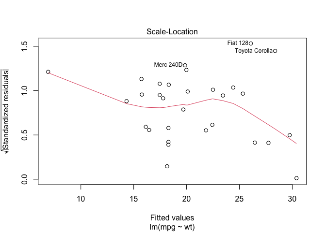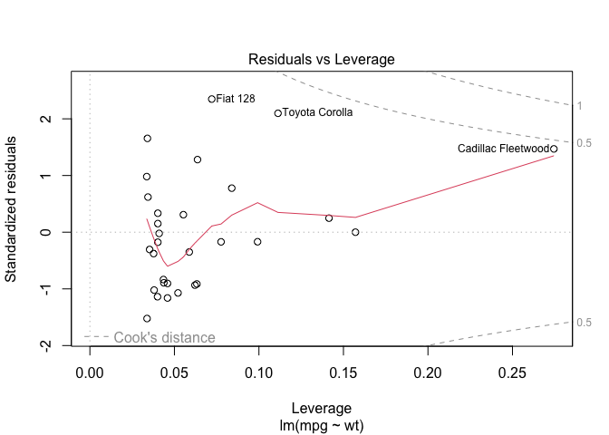

1.  **Assumption 1**: The residuals are normally distributed

Check the Q-Q (quantile-quantile) plot. A perfect normal distribution is
represented by a straight line. Your residuals should be close to a
straight line.

1.  **Assumption 2**: The variances of the residuals are homogeneous
    (homoscedasticity)

The variability of the residuals should be uniform across the range of
fitted values of the dependent variable. In the plot of **residuals vs
fitted values of y** and **standardized residuals vs. fitted values**
there should be a “scatter” of dots across the graphs, with no
discernible pattern. Points should be randomly distributed. If you have
a scatter of points on one side of the graph, your data may NOT be
homogeneous.

1.  **Assumption 3**: The independent variables are independent of each
    other (no collinearity)

There are different ways you can address this before you fit your model.
For instance, you can estimate the correlation of each pair of
covariates and discard variables or exclude them from analysis if they
highly correlated (positively or negatively). We will examine this later
in the course when dealing with more complex models.

1.  **Assumption 4**: The data set does not contain serial
    auto-correlation

Serial autocorrelation is when there is significant correlation between
successive data points in the data set. Spatial data or time-series data
tend to be autocorrelated. There are different ways to deal with
autocorrelation, such as using mixed-effect models.

1.  **Assumption 5**: The model is not biased by unduly influential
    observations.

We can check this by looking at the plot of standardized residuals vs
leverage and “Cook’s Distance.”

Leverage is a measure of the influence of individual data points on the
model’s parameters, measured on the scale of 0-1, where high values
indicate a strong influence on the model’s parameters.

Cook’s distance is the sum of squared distances between the fitted
values using the whole data set, and the fitted values with the *i*th
observation removed. A large difference indicates that the *i*th
observation exerts a strong influence on the model’s parameters.

No values beyond 1.

------------------------------------------------------------------------

> QUESTION: How does the QQ plot look? Does it indicate a potential
> problem?

If your standardized residuals are not normally distributed you can
**transform the dependent variable**.

Let’s try a log transformation, which is commonly used:

    lm1 <- lm(log(mpg) ~ wt, data = my_mtcars)
    plot(lm1)

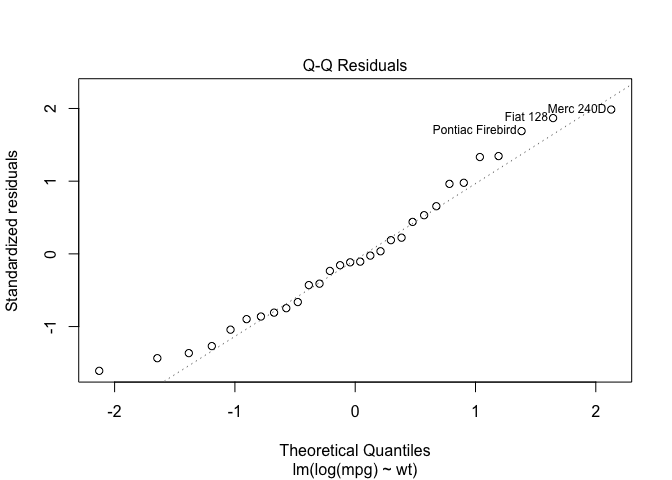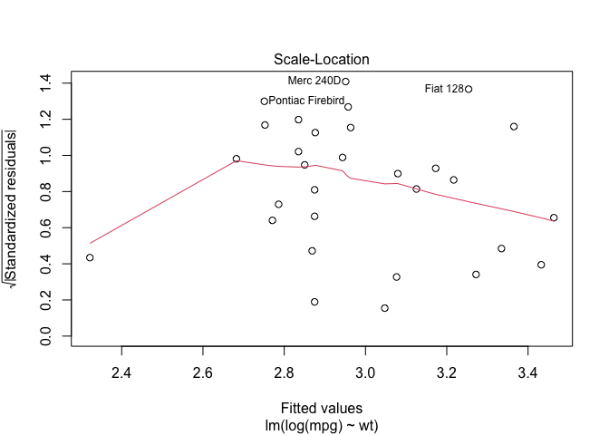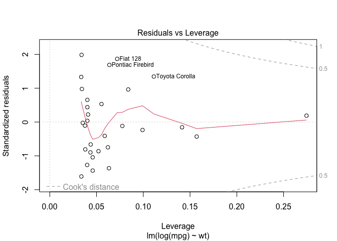

> QUESTION: Does this improve the result?

The residuals are now randomly distributed and are homogeneous. We can
now trust model results.

------------------------------------------------------------------------

Continuing with interpreting results, the slope value should be
-0.3055548. This means that for each unit of weight added to a car (1
ton), the log of miles per gallon it achieves is predicted to REDUCE by
a value of 0.3055548. There is a negative effect of weight on car
efficiency.

The intercept of 3.9259255 sets the start of the regression line at the
weight of zero. In this case, this isn’t very useful (a car will not
weigh zero tons) but it is a necessary element of describing a linear
relationship. Here, the equation for the line is
`log(mpg) = 3.92593 -0.30555 (wt)`. Note that you can call the
individual coefficients from a model directly using, in this example,
“lm1$coefficients”.

Now, plot again a scatterplot of weight vs. mpg and draw the regression
line, in blue. First return your
graphing parameter to it’s default setting of (1,1)

    par(mfrow=c(1, 1))
    plot(log(mpg) ~ wt, data = my_mtcars)
    abline(lm1, col="blue")

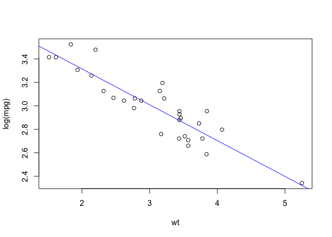

Here are two other ways you can draw the predicted regression line:

    abline(coef = lm1$coefficients, col="green")
    abline(lm1$coefficients, col="red")

### Model Selection

In any mathematical modeling approach, there may be other variables, or
some combination of variables, that are most effective and efficient at
predicting your response variable of interest. In this case, our
response variable is `mpg`. Looking at your plot of all the two-way
relationships between variables, are there any other variables that may
help predict `mpg`? Horsepower (`hp`) seems to be potentially
informative. The question now is, which model might be **best** at
predicting `mpg`.

Let’s say we have three options: 1. mpg ~ wt 2. mpg ~ wt + hp 3. mpg ~
hp

We’ve already fitted the first model. Now, fit a linear regression model
for the next two parameter combinations, giving them unique names (`lm2`
and `lm3`), and look at the summary of their results.

    lm2 <- lm(log(mpg) ~ wt + hp, data = my_mtcars)
    lm3 <- lm(log(mpg) ~ hp, data = my_mtcars)
    summary(lm2)

    ## 
    ## Call:
    ## lm(formula = log(mpg) ~ wt + hp, data = my_mtcars)
    ## 
    ## Residuals:
    ##      Min       1Q   Median       3Q      Max 
    ## -0.17048 -0.05589 -0.03043  0.07386  0.19392 
    ## 
    ## Coefficients:
    ##               Estimate Std. Error t value Pr(>|t|)    
    ## (Intercept)  3.8995420  0.0705574  55.268  < 2e-16 ***
    ## wt          -0.2287735  0.0284846  -8.031 1.25e-08 ***
    ## hp          -0.0014795  0.0003458  -4.278 0.000211 ***
    ## ---
    ## Signif. codes:  0 '***' 0.001 '**' 0.01 '*' 0.05 '.' 0.1 ' ' 1
    ## 
    ## Residual standard error: 0.09807 on 27 degrees of freedom
    ## Multiple R-squared:  0.8857, Adjusted R-squared:  0.8772 
    ## F-statistic: 104.6 on 2 and 27 DF,  p-value: 1.932e-13

    summary(lm3)

    ## 
    ## Call:
    ## lm(formula = log(mpg) ~ hp, data = my_mtcars)
    ## 
    ## Residuals:
    ##      Min       1Q   Median       3Q      Max 
    ## -0.44058 -0.06574 -0.02156  0.09492  0.34549 
    ## 
    ## Coefficients:
    ##               Estimate Std. Error t value Pr(>|t|)    
    ## (Intercept)  3.4444246  0.0759960  45.324  < 2e-16 ***
    ## hp          -0.0032294  0.0004855  -6.652 3.22e-07 ***
    ## ---
    ## Signif. codes:  0 '***' 0.001 '**' 0.01 '*' 0.05 '.' 0.1 ' ' 1
    ## 
    ## Residual standard error: 0.1773 on 28 degrees of freedom
    ## Multiple R-squared:  0.6125, Adjusted R-squared:  0.5986 
    ## F-statistic: 44.25 on 1 and 28 DF,  p-value: 3.225e-07

As you’ll see, all 3 of these models are reasonably good. Which is
optimal? You might know that when you add more independent variables to
a model, the model fit will often improve. But, it is certainly not
ideal to have a model with a large number of independent variables
(because we want to avoid overfitting). Akaike’s Information Criteria
(AIC) provides a good mechanism for model comparison. AIC ranks a
model’s performance by accounting for model fit while penalizing models
with more variables. When adding a variable, the improved fit of the
model must outweight the penalty, otherwise the improved fit will not be
deemed worthwhile given the additional model complexity.

Use the `AIC` function to compare the AIC values of our 3 models. The
lowest AIC indicates that the model is a “better” representation of the
data and has a better predictive power. Note, AIC is not a measure of
fit.

    AIC(lm1)

    ## [1] -35.82462

    AIC(lm2)

    ## [1] -49.35107

    AIC(lm3)

    ## [1] -14.73444

What can we conclude? The best model (from the three we have tried) for
predicting miles per gallon of a car uses the horsepower and weight of
the car in the prediction (`lm2`).

To finish, let’s see if we can now use this model (`lm2`) to predict the
fuel efficiency of a car with a `hp = 225` and a `wt = 4.0` tons. Making
prediction with a new set of independent variables when dependent
variable is absent, is ultimately one of the main goals of a regression
analyses.

First, we need a dataframe with our new independent variables to be used
in the prediction. Then, we can use the `predict()` function to apply
our established linear model to the new information. Lastly, we need to
transform miles per gallon back from the log scale to make it more
easily interpretable.

    nd <- data.frame(hp = 225, wt = 4.0)
    exp(predict(lm2, newdata = nd, type = "response"))

    ##        1 
    ## 14.17612

We can get this same result without using the `predict` command, simply
by writing out the linear equation. That is, our predicted response
equals our intercept term, plus our coefficient for `wt` multiplied by
the weight value, plus our coefficient for `hp` multiplied by our
horsepower value (The function `predict()` just makes things a little
easier for us). That is:

*y**i* = *β*0 + *β**i**x**i* + *ϵ**i*

We must also use the `exp()` function to back-transform from the
log-scale.

    exp(lm2$coefficients[[1]] + (lm2$coefficients[[2]]*4.0) + (lm2$coefficients[[3]]*225))

    ## [1] 14.17612

## Analysis of Variance: ANOVA

The analysis of variance (ANOVA) is a lineal model, but the explanatory
variable is categorical. As we saw before, the categorical variable must
be a factor. Remember that if the category has been coded with numbers,
**R** will assume the variable is continuous.

We will continue working with the `mtcars` data set. As we did before,
we specified cylinders as a categorical variable:

    mtcars$cyl <- as.factor(mtcars$cyl)
    class(mtcars$cyl)

    ## [1] "factor"

### One-way ANOVA

Here we ask the question, do different cylinders imply more power?

Our hypothesis (*H*1) is that more cylinders will provide
more power to the car, expressed in gross horsepower (HP). The null
hypothesis (*H*0) is that there is no difference in HP among
number of cylinders.

To perform an ANOVA in **R**, we use the function `aov()` and
`summary()` to see the results.

    model1 <- aov(hp ~ cyl, data=mtcars)
    summary(model1)

    ##             Df Sum Sq Mean Sq F value   Pr(>F)    
    ## cyl          2 104031   52015   36.18 1.32e-08 ***
    ## Residuals   29  41696    1438                     
    ## ---
    ## Signif. codes:  0 '***' 0.001 '**' 0.01 '*' 0.05 '.' 0.1 ' ' 1

In the results, the table shows us a *p-value*, representing the overall
probability of significance for the categorical variable. If the term is
significant, then we know at least one level is significantly different
from the others.

We can reject the null hypothesis and conclude that gross horsepower
differs among different number of cylinders.

However, before we know we can trust this result, we need to check the
model assumptions. We will do this in the same way we did for the lineal
model, using `plot()`

    plot(model1)

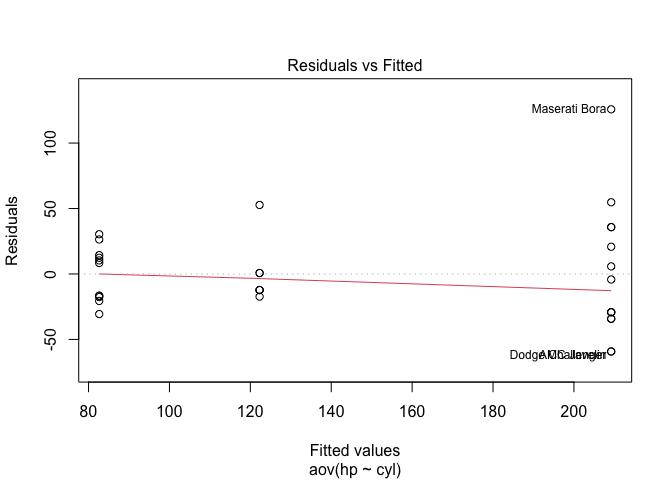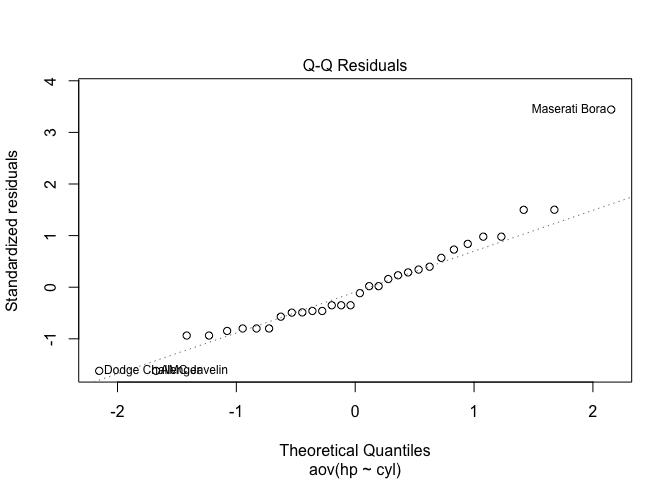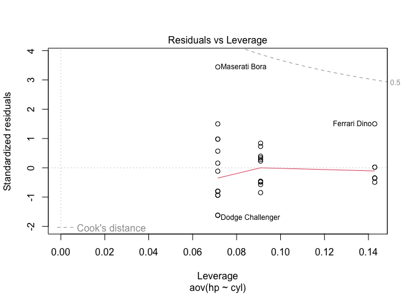

From the second plot we can conclude that the residuals are normally
distributed (straight line). From the first and third plots, we can see
that the variances of the residuals are homogeneous (homoscedasticity).
From the final plot, we can conclude that the model is not biased by
unduly influential observations.

### Pairwise port-hoc tests

To understand how levels compare to each other once we know that the
ANOVA is significant, we can use a post-hoc test. We will use the
**Tukey post-hoc test** with the function `TukeyHSD()`.

    TukeyHSD(model1)

    ##   Tukey multiple comparisons of means
    ##     95% family-wise confidence level
    ## 
    ## Fit: aov(formula = hp ~ cyl, data = mtcars)
    ## 
    ## $cyl
    ##          diff       lwr       upr     p adj
    ## 6-4  39.64935 -5.627454  84.92616 0.0949068
    ## 8-4 126.57792 88.847251 164.30859 0.0000000
    ## 8-6  86.92857 43.579331 130.27781 0.0000839

**diff** is the difference in mean between two levels, **lwr** and
**upr** are the lower and upper 95% confidence intervals for the
difference and **padj** is the `p-value` for the difference.

In this example, we can see that there is not HP significant difference
between 6 and 4 cylinders (`p > 0.05`), and that 8 cylinders have more
HP than 4 and 6 cylinders (`p < 0.05`).

## Non-parametric Random Forest Model

In the past few decades, there has been an increasing number of studies
that use non-parametric machine learning models for classification or
regression. In the most simplistic of terms, non-parametric/machine
learning models do not require the predictive variables to take a
predetermined distribution (e.g. normal distribution). They are also
relatively less stringent in terms of model assumptions.

One of the most popular and also most powerful machine learning tools is
Random Forest. Random Forests is an ensemble method for classification-
or regression-typed analyses that operate by constructing a series of
decision trees. We will not go into detail to discuss the Random Forest
algorithm or how it works. But in general, Random Forest models perform
really well when there are:

1.  Large number of independent variables.
2.  Significant correlation among independent variables.
3.  Independent variables that are not normally distributed.

### Random Forest Regression

Although the Random Forest algorithm is complicated, running a Random
Forest model in **R** is as easy as running a linear model. For the most
part, we just need to specify the data set, and the regression model
formula. Let’s use the “mtcars” data set again for this example.

Load the “mtcars”” data set, and load the random forest package.

    install.packages("randomForest")

    data(mtcars)
    library( randomForest)

Now let’s run a model that includes all metrics in the data set to
predict the `mpg` of a car.

Note that in the following code, the formula was simplified `mpg ~ .`.
The `.`. represents the rest of the columns in the dataframe that are
not defined as predictive variable. Whenever you have a dataframe that
contains only the independent and dependent variables you need in the
model, you can simplify the formula in this way. This essentially tells
**R** to use all the variables included in the dataframe.

    rf.model<-  randomForest(mpg ~ ., data=mtcars)
    rf.model

    ## 
    ## Call:
    ##  randomForest(formula = mpg ~ ., data = mtcars) 
    ##                Type of random forest: regression
    ##                      Number of trees: 500
    ## No. of variables tried at each split: 3
    ## 
    ##           Mean of squared residuals: 5.8623
    ##                     % Var explained: 83.34

Notice that one of the most important results of Random Forest is the “%
variance explained”. It can be considered equivalet to a *R*2
value in a linear models quantifying how “good” the model fits the data.
The closer the “% var explained” is to 100, the better the model’s
performance.

Here you can see the default number of trees used in the model is 500.
In reality, the number of tree is one of very few parameters that need
to be modified by the user. The number of trees determines the number of
ensemble models that are created in the modeling process. As we increase
the tree number, the model results will tend to vary and eventually
stabilize. But we don’t want to create too many ensemble tree models
because it will take more computational time. The general rule is to
increase the number of trees incrementally until the value of “% var
explained” changes very little.

Let’s change the default number of trees parameter to 1000 and 5000 and
observe the difference in model results

    rf.model.1000<- randomForest( mpg ~ ., data=mtcars, ntree=1000)
    rf.model.1000

    ## 
    ## Call:
    ##  randomForest(formula = mpg ~ ., data = mtcars, ntree = 1000) 
    ##                Type of random forest: regression
    ##                      Number of trees: 1000
    ## No. of variables tried at each split: 3
    ## 
    ##           Mean of squared residuals: 5.728827
    ##                     % Var explained: 83.72

    rf.model.5000<- randomForest( mpg ~ ., data=mtcars, ntree=5000)
    rf.model.5000

    ## 
    ## Call:
    ##  randomForest(formula = mpg ~ ., data = mtcars, ntree = 5000) 
    ##                Type of random forest: regression
    ##                      Number of trees: 5000
    ## No. of variables tried at each split: 3
    ## 
    ##           Mean of squared residuals: 5.650456
    ##                     % Var explained: 83.94

The bigger number of trees (`ntree`) does not change the “% var
explained” significantly. So the default `ntree= 500` is as good as
`ntree= 1000` or `ntree=5000`.

Lastly, a convenient feature of Random Forest model is that it
internally summarizes how important each variable is to model
performance. The model does this by replacing each predictive variable
separately with randomly permuted values. After running the model with
replacement, the more the model accuracy decreases, the more important
the specific variable (that was replaced in the process) is. You can
retrieve and visualize the variable importance data using `importance()`
and `varImPlot()` functions.

    importance(rf.model)        

    ##      IncNodePurity
    ## cyl      167.20002
    ## disp     249.45925
    ## hp       198.12700
    ## drat      65.09282
    ## wt       242.46816
    ## qsec      31.99083
    ## vs        32.47995
    ## am        14.66387
    ## gear      15.03880
    ## carb      29.43084

    varImpPlot(rf.model)  

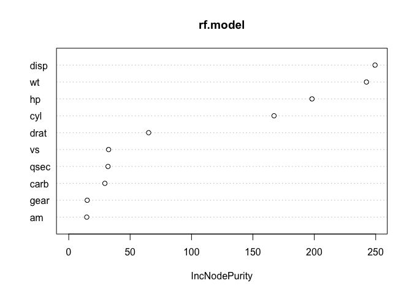

Note that “IncNodePurity” is just a measure of how much the model
performance has decreased. The higher that value, the more important the
variable is.

> QUESTION: Which variable is contributing most to predicting mpg of a
> car?

Lastly, just as with all the other models, the most powerful use of
Random Forest model is to predict the dependent variable when you have a
set of independent variables. You can, once again, use the `predict()`
function to perform this action. Below, we will create a fictitious car,
changing the Hornet-4 Drive from 6 cylinder to 8 cylinders. We want to
know what the mpg of this new car is.

    new.car<- mtcars[4,]
    new.car$cyl<- 8
    new.car

    ##                 mpg cyl disp  hp drat    wt  qsec vs am gear carb
    ## Hornet 4 Drive 21.4   8  258 110 3.08 3.215 19.44  1  0    3    1

    predict(rf.model, newdata = new.car, type = "response")

> QUESTIONS:

> 1.  Do you think the prediction make sense? Why?
> 2.  Can you build a random forest classification model to predict the
>     number of cylinders based on other metrics included in the
>     dataset?

## Generalized Linear Models

A primary goal of basic ecological and applied conservation research is
to understand how species are distributed across space and through time.
However, animal locations or abundance data typically cannot be modelled
by a normal distribution. As a result, other types of model structures
are needed.

Generalized linear models (GLM) are used when the residuals are
non-normal, when there are non-linear relationships between dependent
and independent variables, and/or when the variance in the dependent
variable is not uniform across its range. E.g., presence-absence data,
count data.

GLMs consist of three elements:

1.  A probability distribution from the exponential family.
2.  A linear predictor *η* = *X**β*.
3.  A link function *g*

A GLM allows the specification of a variety of different error
distributions:

1.  Poisson errors (useful with count data)
2.  Binomial errors (useful with data on proportions)
3.  Gamma errors (useful with data showing a constant coefficient of
    variation)
4.  Exponential errors (useful with data on time to event - e.g.,
    survival analysis)

The linear predictor η (eta) is the quantity which incorporates the
information about the independent variables into the model. It is
related to the expected value of the dependent variable through the link
function.

η is expressed as linear combinations of unknown parameters β.

The linear predictor can be represented as a vector of coefficient
values that is multiplied the matrix containing your independent
variables  X. . η can thus be expressed as *η* = *X**β*.

The link function `g` provides the relationship between the linear
predictor and the mean, or expected value, of the distribution function.

There are many commonly used link functions, and their choice can seem
somewhat arbitrary. It can be convenient to match the domain of the link
function to the range of the distribution function’s mean.

<figure>
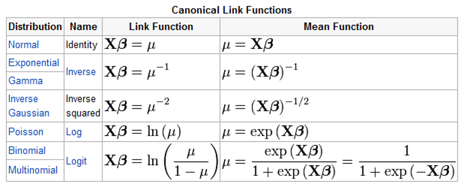
<figcaption aria-hidden="true">Commonly used link functions</figcaption>
</figure>

### Binomial GLM for binary data (logistic regression/logistic GLM)

A logistic regression model allows us to establish a relationship
between a binary (0 vs. 1) outcome variable and a group of predictor
variables. It models the logit-transformed probability of a certain
outcome as a linear relationship with the predictor variables.

To demonstrate how linear regression model works, we will use the
following study:

[Bolger et
al. (1997)](https://esajournals.onlinelibrary.wiley.com/doi/abs/10.1890/1051-0761(1997)007%5B0552:RORTHF%5D2.0.CO;2)
investigated the impacts of habitat fragmentation on the occurrence of
native rodents. [Quinn and Keough
(2002)](https://www2.ib.unicamp.br/profs/fsantos/apostilas/Quinn%20&%20Keough.pdf)
subsequently modeled the presence/absence native rodents against some
Bolger et al. (1997) biogeographic variables.

Bolger et al. (1997) studied whether small fragments of the shrub
habitats in canyons of San Diego, CA, isolated by urbanization, were
capable of supporting viable populations of native rodent species.

The data set consists of rodent presence/absence and three predictor
variables: 1. PERSHRUB = percentage of shrub cover 2. DISTX = the
distance to the nearest large (&gt;100 ha) “source canyon.” 3. AGE =
time elapsed since the fragment was isolated by development

<figure>

<figcaption aria-hidden="true">From Bolger et al. 1997</figcaption>
</figure>

------------------------------------------------------------------------

For this demonstration we need to install and load a new package.

    #install.packages("usdm") #Install package if it is not installed in your computer.
    library(usdm)

### Import data set

Import the data set suing the ‘read.table’ function. The data for this
example is in a .txt format. `Read.table` will read the .txt file and
load it as a data frame into the **R** environment.

Look at the first lines of data using the `head` function.

    bolger <- read.table("data/bolger.txt", header=T, sep= "")
    head(bolger)

    ##   PERSHRUB DISTX AGE RODENTSP
    ## 1       66  2100  50        1
    ## 2       90   914  20        1
    ## 3       75  1676  34        1
    ## 4       75   243  34        1
    ## 5       60   822  16        1
    ## 6       50   121  14        1

------------------------------------------------------------------------

> Note: It is often best to rescale continuous covariates to improve
> numerical stability in the models. We will skip this step for this
> example, but we will look into scaling in other examples.

------------------------------------------------------------------------

### Investigate potential (multi)collinearity

When we fit a model we assume that the estimated effects of predictor
variables are independent of each other. Thus, before we fit a model we
first need to check our independent variables for potential
collinearity.

Collinearity occurs when 2 or more independent variables have a strong
linear relationship, making it difficult to determine which of the two
collinear variables are more strongly associated with the response
variable. Collinearity affects parameter estimates and increases both
standard errors and p-values of parameters, likely obscuring some
important relationships.

    plot(bolger[,1:3])

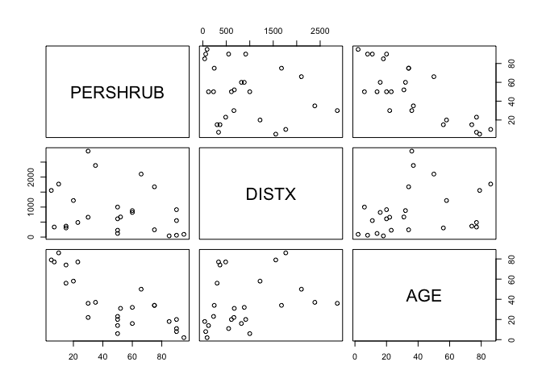

To make sure we do not have a (multi)collinearity problem in our
predictor variables, we can look at the Variance Inflation Factor (VIF)
for each covariate. Variance inflation is a measure of the degree of
collinearity between variables. Any variables with a VIF value &gt; to 3
(or 5 or 10 depending who you ask) are the cause of concerning
collinearity in the model. If a covariate has a VIF &gt; 3, remove it
(or other correlated variables) and recalculate VIF after deletion.

    vifstep(bolger[,1:3])

    ## No variable from the 3 input variables has collinearity problem. 
    ## 
    ## The linear correlation coefficients ranges between: 
    ## min correlation ( DISTX ~ PERSHRUB ):  -0.2745893 
    ## max correlation ( AGE ~ PERSHRUB ):  -0.7952976 
    ## 
    ## ---------- VIFs of the remained variables -------- 
    ##   Variables      VIF
    ## 1  PERSHRUB 2.743579
    ## 2     DISTX 1.093362
    ## 3       AGE 2.750798

In our example there is no evidence of collinearity as all VIFs are &lt;
3. Good!

### Fit a Binomial GLM

    bolger.glm <- glm(RODENTSP ~ DISTX + AGE + PERSHRUB,
                    family=binomial (link= "logit"),
                    data=bolger)
    summary(bolger.glm)

    ## 
    ## Call:
    ## glm(formula = RODENTSP ~ DISTX + AGE + PERSHRUB, family = binomial(link = "logit"), 
    ##     data = bolger)
    ## 
    ## Coefficients:
    ##               Estimate Std. Error z value Pr(>|z|)  
    ## (Intercept) -5.9099159  3.1125426  -1.899   0.0576 .
    ## DISTX        0.0003087  0.0007741   0.399   0.6900  
    ## AGE          0.0250077  0.0376618   0.664   0.5067  
    ## PERSHRUB     0.0958695  0.0406119   2.361   0.0182 *
    ## ---
    ## Signif. codes:  0 '***' 0.001 '**' 0.01 '*' 0.05 '.' 0.1 ' ' 1
    ## 
    ## (Dispersion parameter for binomial family taken to be 1)
    ## 
    ##     Null deviance: 34.617  on 24  degrees of freedom
    ## Residual deviance: 19.358  on 21  degrees of freedom
    ## AIC: 27.358
    ## 
    ## Number of Fisher Scoring iterations: 5

### Model assumptions validation

In the case of a linear model, we used ‘plot(model1)’ to check the
standardized residuals for any “patterns”. For binomial data, however,
you will just see two bands in the residuals due to the binomial nature
of the dependent variable.

What we need to check is evidence of model fit, thus, that the model
fits the data well. To do this we extract the **deviance residuals** and
examine their distribution. Observations with a deviance residual &gt; 2
may indicate a lack of fit.

    devresid<-resid(bolger.glm, type = "deviance")
    hist(devresid)

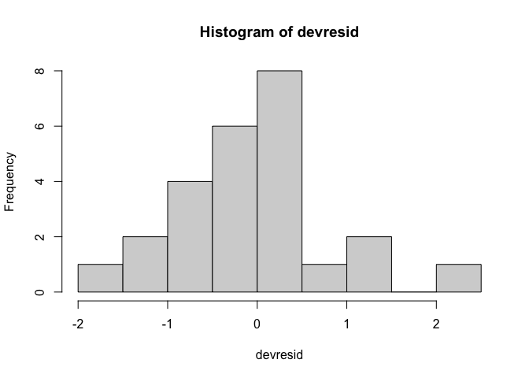

In this case, we can conclude there is no strong evidence of lack of
fit. We can now feel confident about our model to make interpretations.

### Model interpretation and predictions

Let’s look again at the model summary:

    summary(bolger.glm)

    ## 
    ## Call:
    ## glm(formula = RODENTSP ~ DISTX + AGE + PERSHRUB, family = binomial(link = "logit"), 
    ##     data = bolger)
    ## 
    ## Coefficients:
    ##               Estimate Std. Error z value Pr(>|z|)  
    ## (Intercept) -5.9099159  3.1125426  -1.899   0.0576 .
    ## DISTX        0.0003087  0.0007741   0.399   0.6900  
    ## AGE          0.0250077  0.0376618   0.664   0.5067  
    ## PERSHRUB     0.0958695  0.0406119   2.361   0.0182 *
    ## ---
    ## Signif. codes:  0 '***' 0.001 '**' 0.01 '*' 0.05 '.' 0.1 ' ' 1
    ## 
    ## (Dispersion parameter for binomial family taken to be 1)
    ## 
    ##     Null deviance: 34.617  on 24  degrees of freedom
    ## Residual deviance: 19.358  on 21  degrees of freedom
    ## AIC: 27.358
    ## 
    ## Number of Fisher Scoring iterations: 5

The chance of native rodent occurrence increases significantly with
increasing shrub cover (*B* = 0.096, *p* = 0.0182). Neither fragment
isolation age or distance had significant effects.

The default results are on the logit scale. The coefficient of PERSHRUB
is: 0.096, so that a one unit change in percentage of shrub cover
produces approximately a 0.096 unit change in the log odds of presence
(i.e. a 0.096 unit change on the logit scale).

> The odds of presence are defined as the ratio of the probability of
> presence over the probability of absence. For instance, if the
> probability of presence is 0.8 and the probability of absence is 0.2,
> the odd ratios is 0.8/0.2=4, or the odds of presence are 4 to 1. For
> more information on how to interpret odds visit:
> <https://stats.idre.ucla.edu/other/mult-pkg/faq/general/faq-how-do-i-interpret-odds-ratios-in-logistic-regression/>

It is hard to think in terms of logits. We can plot the association
between the probability of native rodent presence and percentage shrub
cover.

See how the code for this plot has gotten much longer and more complex.
Make sure you understand each line of code. Remember to use the `help`
command when you do not understand a specific function and all its
arguments.

    xs <- seq(0, 100, 1)
    bolger.predict <- predict(bolger.glm, type="response", se=T, 
                              newdata=data.frame(DISTX=mean(bolger$DISTX), AGE=mean(bolger$AGE), PERSHRUB=xs))

    # Plot results
    plot(bolger$RODENTSP ~ bolger$PERSHRUB, xlab="Pecentage shrub cover", ylab="Rodent presence probability", axes=T, pch=16)
    lines(bolger.predict$fit~xs, type="l", col="gray")
    lines(bolger.predict$fit + bolger.predict$se.fit~xs, col="red", type= "l", lty=2)
    lines(bolger.predict$fit - bolger.predict$se.fit~xs, col="red", type= "l", lty=2)

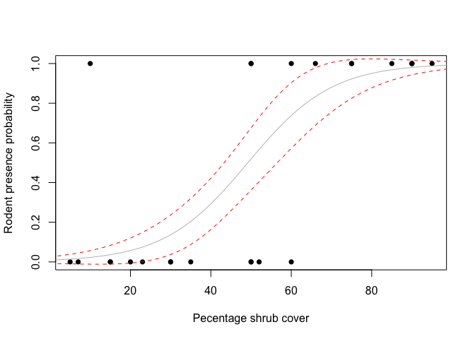
\*\*\*

What is the probability of native rodent occurrence with a shrub cover
of 80%, distanceX of 100, and fragment isolation age of 5.

    predict(bolger.glm, type="response", se=T, newdata=data.frame(DISTX=100, AGE=5, PERSHRUB=80))

    ## $fit
    ##         1 
    ## 0.8716415 
    ## 
    ## $se.fit
    ##         1 
    ## 0.1277815 
    ## 
    ## $residual.scale
    ## [1] 1

Note that the predict function already converts values from the logit
scale back to the probability scale.

To do that manually, we can do the following:

    x <- -5.9099159 + 0.0003087*100 + 0.0250077 * 5 + 0.0958695 * 80
    exp(x)/(exp(x)+1) # This is the inverse of the logit scale

    ## [1] 0.8716417

    plogis(x) # Use a built in function

    ## [1] 0.8716417

------------------------------------------------------------------------

This is the end of part 1. In the next section, we will learn to do spatial analyses in R. We will then combine modeling with spatial analysis in a case study.
