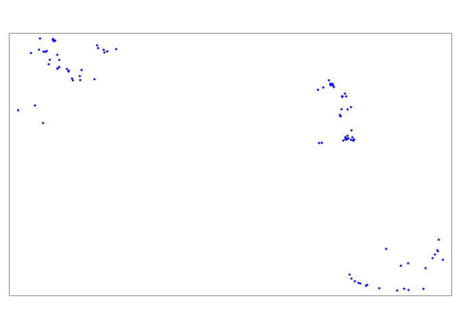

Ramiro D. Crego a,b, Majaliwa M. Masolele c, Grant Connette a,b, and Jared A. Stabach a

a - Smithsonian National Zoo and Conservation Biology Institute,
Conservation Ecology Center, 1500 Remount Rd, Front Royal, VA 22630,
USA.

b - Working Land and Seascapes, Conservation Commons, Smithsonian
Institution, Washington, DC 20013, USA.

c - Boyd Orr Centre for Population and Ecosystem Health, Institute of
Biodiversity, Animal Health & Comparative Medicine (IBAHCM), University
of Glasgow, G12 8QQ, UK.

------------------------------------------------------------------------

The following tutorial describes the code workflow presented in the
manuscript “Enhancing animal movement analyses - Spatiotemporal matching
of animal positions with remotely sensed data using Google Earth Engine
and R.”

The code workflow allows you to find the closest image from an image
collection to the time at which each GPS location was acquired and
extract the pixel value.

To use this code it is necessary to have a [Google Earth
Engine](https://earthengine.google.com/) account and to install the
`rgee`
[package](https://r-spatial.github.io/rgee/#quick-start-users-guide-for-rgee).

## Loading and preparing tracking data

The first step is to read a csv file with the telemetry data.

For this example we randomly selected 100 GPS fixes from the entire
wildebeest dataset used in the manuscript, obtained from
[Movebank](https://www.datarepository.movebank.org/handle/10255/move.1098).
The data is provided in the repository within the folder Data.

    library(sf)
    library(dplyr)
    trackingdata <- read.csv("./Data/Data.csv", header = T) #Load your dataset
    head(trackingdata)

    ##             timestamp location.long location.lat
    ## 1 2010-08-10 15:00:00      35.21622    -1.164488
    ## 2 2011-06-26 12:00:00      36.83339    -1.462866
    ## 3 2011-10-19 03:00:00      36.90053    -1.404862
    ## 4 2011-11-20 12:00:00      36.91039    -1.430901
    ## 5 2010-08-29 14:00:00      35.30668    -1.345507
    ## 6 2010-12-20 05:00:00      36.91189    -1.433012

In the next step, we need to convert the dataframe into an sf object. We
also need to set the date as a string with a ‘YYYY-MM-DDTHH:MM:SS’. We
will use this data to convert it into milliseconds since midnight on
January 1, 1970, a format used in Google Earth Engine to manage dates.

    trackingdata$Date <- as.POSIXct(trackingdata$timestamp, format = "%Y-%m-%d %H:%M:%S", tz="UTC") #Modify as necessary
    trackingdata$Date <- as.factor(trackingdata$Date)
    trackingdata$Date <- sub(" ", "T", trackingdata$Date) #Put in a format that can be read by javascript
    trackingdata$ID <- seq(1:nrow(trackingdata)) # Add ID to each point (optional)
    datasf <- st_as_sf(trackingdata, coords = c('location.long','location.lat'), crs = 4326) #Transform the dataframe into sf object. Make sure the name of the columns for the coordinates match. CRS needs to be in longlat WGS84.
    head(datasf)

    ## Simple feature collection with 6 features and 3 fields
    ## Geometry type: POINT
    ## Dimension:     XY
    ## Bounding box:  xmin: 35.21622 ymin: -1.462866 xmax: 36.91189 ymax: -1.164488
    ## Geodetic CRS:  WGS 84
    ##             timestamp                Date ID
    ## 1 2010-08-10 15:00:00 2010-08-10T15:00:00  1
    ## 2 2011-06-26 12:00:00 2011-06-26T12:00:00  2
    ## 3 2011-10-19 03:00:00 2011-10-19T03:00:00  3
    ## 4 2011-11-20 12:00:00 2011-11-20T12:00:00  4
    ## 5 2010-08-29 14:00:00 2010-08-29T14:00:00  5
    ## 6 2010-12-20 05:00:00 2010-12-20T05:00:00  6
    ##                     geometry
    ## 1 POINT (35.21622 -1.164488)
    ## 2 POINT (36.83339 -1.462866)
    ## 3 POINT (36.90053 -1.404862)
    ## 4 POINT (36.91039 -1.430901)
    ## 5 POINT (35.30668 -1.345507)
    ## 6 POINT (36.91189 -1.433012)

## Initialize rgee

Next, we need to load and initialize rgee.

    library(rgee)
    ee_Initialize()
    ee_check()

## Define Google Earth Engine functions

The next set of functions will be used to match images to the data and
extract pixel values.

Note that you can edit the maximum temporal window allowed to find a
match.

    #Function to add property with time in milliseconds
    add_date<-function(feature) {
      date <- ee$Date(ee$String(feature$get("Date")))$millis()
      feature$set(list(date_millis=date))
    }

    #Join Image and Points based on a maxDifference Filter within a temporal window

    #Set temporal window in days for filter. This will depend on the remote sensing data used.
    tempwin <- 16 

    #Set the filter
    maxDiffFilter<-ee$Filter$maxDifference(
      difference=tempwin*24*60*60*1000, #days * hr * min * sec * milliseconds
      leftField= "date_millis", #Timestamp of the telemetry data
      rightField="system:time_start" #Image date
    )

    # Define the join. We implement the saveBest function for the join, which finds the image that best matches the filter (i.e., the image closest in time to the particular GPS fix location). 
    saveBestJoin<-ee$Join$saveBest(
      matchKey="bestImage",
      measureKey="timeDiff"
    )

    #Function to add property with raster pixel value from the matched image
    add_value<-function(feature){
      #Get the image selected by the join
      img1<-ee$Image(feature$get("bestImage"))$select(band)
      #Extract geometry from the feature
      point<-feature$geometry()
      #Get pixel value for each point at the desired spatial resolution (argument scale)
      pixel_value<-img1$sample(region=point, scale=250, tileScale = 16, dropNulls = F) 
      #Return the data containing pixel value and image date.
      feature$setMulti(list(PixelVal = pixel_value$first()$get(band), DateTimeImage = img1$get('system:index')))
    }

    # Function to remove image property from features
    removeProperty<- function(feature) {
      #Get the properties of the data
      properties = feature$propertyNames()
      #Select all items except images
      selectProperties = properties$filter(ee$Filter$neq("item", "bestImage"))
      #Return selected features
      feature$select(selectProperties)
    }

## Load image collection

In this example, we are using NDVI from MODIS Terra Vegetation Indexes
16-Day Global 250m data set. However, you can use any other remote
sensing product of interest and filter to the desired dates.

One of the main advantages offered by Google Earth Engine is the
enormous amount of data available to be used. The constantly growing
database consists on more than a petabyte archive of publicly available
remotely sensed imagery and other related data sets. In the study cases
of the manuscript we used MOD13Q1 and ERA5\_LAND/HOURLY, but data
available includes other products from MODIS, data from other satellites
such as Landsat, National Oceanographic and Atmospheric Administration
Advanced Very High Resolution Radiometer (NOAA AVHRR), Sentinel 1, 2, 3
and 5-P, Advanced Land Observing Satellite (ALOS), and other products
such as sea surface temperature data, CHIRPS climate data, topography
data, and land cover data. The entire list of datasets is available at
this
[link](https://developers.google.com/earth-engine/datasets/catalog).

Note that all image collections in Earth Engine have a code that you can
extract from the link provided above and use to import into the workflow
by modifying this example.

We will set the start and end days to filter the image collections.
Temporal availability depends on each dataset.

We will also create an object with the name of the band we are
interested in working with. The name of the band is also specific to
each image collection.

    start<-"2010-01-01"
    end<-"2013-01-01"
    imagecoll<-ee$ImageCollection('MODIS/006/MOD13Q1')$filterDate(start,end)
    band <- "NDVI" #Name of the band to use. You can change to EVI for instance when using MOD13Q1.

## Extract pixel value

A key function in this process is the `ee_as_sf` which converts the
Google Earth Engine table in a sf object. This function provides three
different options to convert the table (feature collection) into a sf
object:

1.  getInfo: which is fast and direct but has a limit of 5000 features
2.  drive: which exports data through your Google Drive account
3.  gsc: which exports data through your Google Cloud Storage account

You can find more information about this function in the help:
?ee\_as\_sf

We use here the `getInfo` option given it is direct and simple. However,
this option has a limit of 5000 features to convert. For that reason, we
are going to run a loop, processing 1000 features (points) per time to
avoid errors. If memory limit errors are display, then you can reduce
the number of points to extract each time by changing the `each`
argument on the `rep` function.

In this example we only have 100 points so the loop will only run once,
but for larger datasets the loop may run multiple times.

    datasf$uniq <- rep(1:1000, each=1000)[1:nrow(datasf)] #This is for up to 1 million points. To increase the max number of points, increase the value for max repetitions. To change the number of points to run per time, change the value in the argument each (up to 5000).

    start_time <- Sys.time()
    dataoutput <- data.frame()
    for(x in unique(datasf$uniq)){
      data1 <- datasf %>% filter(uniq == x)
      # Send sf to GEE
      data <- sf_as_ee(data1)
      # Transform day into milliseconds
      data<-data$map(add_date)
      # Apply the join
      Data_match<-saveBestJoin$apply(data, imagecoll, maxDiffFilter)
      # Add pixel value to the data
      DataFinal<-Data_match$map(add_value)
      # Remove image property from the data
      DataFinal<-DataFinal$map(removeProperty)
      # Move GEE object into R
      temp<- ee_as_sf(DataFinal, via = 'getInfo')
      # Append
      dataoutput <- rbind(dataoutput, temp)
    }
    end_time <- Sys.time()

The time needed to run 100 points was:

    end_time - start_time

    ## Time difference of 3.245632 secs

The new sf data frame with the pixel values in now stored as the
`dataoutput` object. You can use this for further analysis.

    names(dataoutput)[4] <- band
    dataoutput

    ## Simple feature collection with 100 features and 7 fields
    ## Geometry type: POINT
    ## Dimension:     XY
    ## Bounding box:  xmin: 34.99598 ymin: -2.693471 xmax: 37.5994 ymax: -1.148282
    ## Geodetic CRS:  WGS 84
    ## First 10 features:
    ##                   Date DateTimeImage ID NDVI date_millis
    ## 1  2010-08-10 15:00:00    2010_08_13  1 3011  1552145792
    ## 2  2011-06-26 12:00:00    2011_06_26  2 3632  -875425280
    ## 3  2011-10-19 03:00:00    2011_10_16  3 2957   438240128
    ## 4  2011-11-20 12:00:00    2011_11_17  4 4952 -1059527168
    ## 5  2010-08-29 14:00:00    2010_08_29  5 2699 -1104821504
    ## 6  2010-12-20 05:00:00    2010_12_19  6 3518    36043904
    ## 7  2010-07-16 18:01:00    2010_07_12  7 3227  -596994208
    ## 8  2011-12-09 03:01:00    2011_12_03  8 4460   549732832
    ## 9  2012-01-01 07:00:00    2012_01_01  9 2624 -1743694464
    ## 10 2012-04-16 04:00:00    2012_04_22 10 5840 -1186029056
    ##              timestamp uniq                   geometry
    ## 1  2010-08-10 15:00:00    1 POINT (35.21622 -1.164488)
    ## 2  2011-06-26 12:00:00    1 POINT (36.83339 -1.462866)
    ## 3  2011-10-19 03:00:00    1 POINT (36.90053 -1.404862)
    ## 4  2011-11-20 12:00:00    1 POINT (36.91039 -1.430901)
    ## 5  2010-08-29 14:00:00    1 POINT (35.30668 -1.345507)
    ## 6  2010-12-20 05:00:00    1 POINT (36.91189 -1.433012)
    ## 7  2010-07-16 18:01:00    1 POINT (35.24742 -1.324172)
    ## 8  2011-12-09 03:01:00    1   POINT (37.565 -2.446763)
    ## 9  2012-01-01 07:00:00    1 POINT (37.03885 -2.620116)
    ## 10 2012-04-16 04:00:00    1 POINT (35.52517 -1.233949)

## Visualize locations

    Pres <- dataoutput

    library(tmap)
    tmap_mode('plot')
    tm_shape(Pres) + tm_dots(col = 'blue', title = "Presence")

## Session

    devtools::session_info()

    ## ─ Session info ─────────────────────────────────────────────────
    ##  setting  value
    ##  version  R version 4.4.1 (2024-06-14)
    ##  os       macOS Sonoma 14.5
    ##  system   aarch64, darwin20
    ##  ui       RStudio
    ##  language (EN)
    ##  collate  en_US.UTF-8
    ##  ctype    en_US.UTF-8
    ##  tz       Europe/Dublin
    ##  date     2024-07-20
    ##  rstudio  2024.04.2+764 Chocolate Cosmos (desktop)
    ##  pandoc   3.1.11 @ /Applications/RStudio.app/Contents/Resources/app/quarto/bin/tools/aarch64/ (via rmarkdown)
    ## 
    ## ─ Packages ─────────────────────────────────────────────────────
    ##  package           * version   date (UTC) lib source
    ##  abind               1.4-5     2016-07-21 [1] CRAN (R 4.4.0)
    ##  base64enc           0.1-3     2015-07-28 [1] CRAN (R 4.4.0)
    ##  cachem              1.1.0     2024-05-16 [1] CRAN (R 4.4.0)
    ##  class               7.3-22    2023-05-03 [1] CRAN (R 4.4.1)
    ##  classInt            0.4-10    2023-09-05 [1] CRAN (R 4.4.0)
    ##  cli                 3.6.3     2024-06-21 [1] CRAN (R 4.4.0)
    ##  codetools           0.2-20    2024-03-31 [1] CRAN (R 4.4.1)
    ##  crayon              1.5.3     2024-06-20 [1] CRAN (R 4.4.0)
    ##  crosstalk           1.2.1     2023-11-23 [1] CRAN (R 4.4.0)
    ##  crul                1.5.0     2024-07-19 [1] CRAN (R 4.4.0)
    ##  curl                5.2.1     2024-03-01 [1] CRAN (R 4.4.0)
    ##  DBI                 1.2.3     2024-06-02 [1] CRAN (R 4.4.0)
    ##  devtools            2.4.5     2022-10-11 [1] CRAN (R 4.4.0)
    ##  dichromat           2.0-0.1   2022-05-02 [1] CRAN (R 4.4.0)
    ##  digest              0.6.36    2024-06-23 [1] CRAN (R 4.4.0)
    ##  dplyr             * 1.1.4     2023-11-17 [1] CRAN (R 4.4.0)
    ##  e1071               1.7-14    2023-12-06 [1] CRAN (R 4.4.0)
    ##  ellipsis            0.3.2     2021-04-29 [1] CRAN (R 4.4.0)
    ##  evaluate            0.24.0    2024-06-10 [1] CRAN (R 4.4.0)
    ##  fansi               1.0.6     2023-12-08 [1] CRAN (R 4.4.0)
    ##  fastmap             1.2.0     2024-05-15 [1] CRAN (R 4.4.0)
    ##  fs                  1.6.4     2024-04-25 [1] CRAN (R 4.4.0)
    ##  generics            0.1.3     2022-07-05 [1] CRAN (R 4.4.0)
    ##  geojson             0.3.5     2023-08-08 [1] CRAN (R 4.4.0)
    ##  geojsonio           0.11.3    2023-09-06 [1] CRAN (R 4.4.0)
    ##  geojsonsf           2.0.3     2022-05-30 [1] CRAN (R 4.4.0)
    ##  glue                1.7.0     2024-01-09 [1] CRAN (R 4.4.0)
    ##  highr               0.11      2024-05-26 [1] CRAN (R 4.4.0)
    ##  htmltools           0.5.8.1   2024-04-04 [1] CRAN (R 4.4.0)
    ##  htmlwidgets         1.6.4     2023-12-06 [1] CRAN (R 4.4.0)
    ##  httpcode            0.3.0     2020-04-10 [1] CRAN (R 4.4.0)
    ##  httpuv              1.6.15    2024-03-26 [1] CRAN (R 4.4.0)
    ##  jqr                 1.3.3     2023-12-04 [1] CRAN (R 4.4.0)
    ##  jquerylib           0.1.4     2021-04-26 [1] CRAN (R 4.4.0)
    ##  jsonlite            1.8.8     2023-12-04 [1] CRAN (R 4.4.0)
    ##  KernSmooth          2.23-24   2024-05-17 [1] CRAN (R 4.4.1)
    ##  knitr               1.48      2024-07-07 [1] CRAN (R 4.4.0)
    ##  later               1.3.2     2023-12-06 [1] CRAN (R 4.4.0)
    ##  lattice             0.22-6    2024-03-20 [1] CRAN (R 4.4.1)
    ##  lazyeval            0.2.2     2019-03-15 [1] CRAN (R 4.4.0)
    ##  leafem              0.2.3     2023-09-17 [1] CRAN (R 4.4.0)
    ##  leaflet             2.2.2     2024-03-26 [1] CRAN (R 4.4.0)
    ##  leaflet.providers   2.0.0     2023-10-17 [1] CRAN (R 4.4.0)
    ##  leafsync            0.1.0     2019-03-05 [1] CRAN (R 4.4.0)
    ##  lifecycle           1.0.4     2023-11-07 [1] CRAN (R 4.4.0)
    ##  lwgeom              0.2-14    2024-02-21 [1] CRAN (R 4.4.0)
    ##  magrittr            2.0.3     2022-03-30 [1] CRAN (R 4.4.0)
    ##  Matrix              1.7-0     2024-04-26 [1] CRAN (R 4.4.1)
    ##  memoise             2.0.1     2021-11-26 [1] CRAN (R 4.4.0)
    ##  mime                0.12      2021-09-28 [1] CRAN (R 4.4.0)
    ##  miniUI              0.1.1.1   2018-05-18 [1] CRAN (R 4.4.1)
    ##  pillar              1.9.0     2023-03-22 [1] CRAN (R 4.4.0)
    ##  pkgbuild            1.4.4     2024-03-17 [1] CRAN (R 4.4.0)
    ##  pkgconfig           2.0.3     2019-09-22 [1] CRAN (R 4.4.0)
    ##  pkgload             1.4.0     2024-06-28 [1] CRAN (R 4.4.0)
    ##  png                 0.1-8     2022-11-29 [1] CRAN (R 4.4.0)
    ##  prettydoc           0.4.1     2021-01-10 [1] CRAN (R 4.4.0)
    ##  processx            3.8.4     2024-03-16 [1] CRAN (R 4.4.0)
    ##  profvis             0.3.8     2023-05-02 [1] CRAN (R 4.4.0)
    ##  promises            1.3.0     2024-04-05 [1] CRAN (R 4.4.0)
    ##  proxy               0.4-27    2022-06-09 [1] CRAN (R 4.4.0)
    ##  ps                  1.7.7     2024-07-02 [1] CRAN (R 4.4.0)
    ##  purrr               1.0.2     2023-08-10 [1] CRAN (R 4.4.0)
    ##  R6                  2.5.1     2021-08-19 [1] CRAN (R 4.4.0)
    ##  raster              3.6-26    2023-10-14 [1] CRAN (R 4.4.0)
    ##  RColorBrewer        1.1-3     2022-04-03 [1] CRAN (R 4.4.0)
    ##  Rcpp                1.0.12    2024-01-09 [1] CRAN (R 4.4.0)
    ##  remotes             2.5.0     2024-03-17 [1] CRAN (R 4.4.0)
    ##  reticulate          1.38.0    2024-06-19 [1] CRAN (R 4.4.0)
    ##  rgee              * 1.1.7     2023-09-27 [1] CRAN (R 4.4.0)
    ##  rlang               1.1.4     2024-06-04 [1] CRAN (R 4.4.0)
    ##  rmarkdown         * 2.27      2024-05-17 [1] CRAN (R 4.4.0)
    ##  rstudioapi          0.16.0    2024-03-24 [1] CRAN (R 4.4.0)
    ##  s2                  1.1.7     2024-07-17 [1] CRAN (R 4.4.0)
    ##  sessioninfo         1.2.2     2021-12-06 [1] CRAN (R 4.4.0)
    ##  sf                * 1.0-16    2024-03-24 [1] CRAN (R 4.4.0)
    ##  shiny               1.8.1.1   2024-04-02 [1] CRAN (R 4.4.0)
    ##  sp                  2.1-4     2024-04-30 [1] CRAN (R 4.4.0)
    ##  stars               0.6-6     2024-07-16 [1] CRAN (R 4.4.0)
    ##  stringi             1.8.4     2024-05-06 [1] CRAN (R 4.4.0)
    ##  stringr             1.5.1     2023-11-14 [1] CRAN (R 4.4.0)
    ##  terra               1.7-78    2024-05-22 [1] CRAN (R 4.4.0)
    ##  tibble              3.2.1     2023-03-20 [1] CRAN (R 4.4.0)
    ##  tidyselect          1.2.1     2024-03-11 [1] CRAN (R 4.4.0)
    ##  tmap              * 3.3-4     2023-09-12 [1] CRAN (R 4.4.0)
    ##  tmaptools           3.1-1     2021-01-19 [1] CRAN (R 4.4.0)
    ##  units               0.8-5     2023-11-28 [1] CRAN (R 4.4.0)
    ##  urlchecker          1.0.1     2021-11-30 [1] CRAN (R 4.4.0)
    ##  usethis             2.2.3     2024-02-19 [1] CRAN (R 4.4.0)
    ##  utf8                1.2.4     2023-10-22 [1] CRAN (R 4.4.0)
    ##  V8                  4.4.2     2024-02-15 [1] CRAN (R 4.4.0)
    ##  vctrs               0.6.5     2023-12-01 [1] CRAN (R 4.4.0)
    ##  viridisLite         0.4.2     2023-05-02 [1] CRAN (R 4.4.0)
    ##  wk                  0.9.2     2024-07-09 [1] CRAN (R 4.4.0)
    ##  xfun                0.45      2024-06-16 [1] CRAN (R 4.4.0)
    ##  XML                 3.99-0.17 2024-06-25 [1] CRAN (R 4.4.0)
    ##  xtable              1.8-4     2019-04-21 [1] CRAN (R 4.4.0)
    ##  yaml                2.3.9     2024-07-05 [1] CRAN (R 4.4.0)
    ## 
    ##  [1] /Library/Frameworks/R.framework/Versions/4.4-arm64/Resources/library
    ## 
    ## ─ Python configuration ─────────────────────────────────────────
    ##  python:         /Users/ramirocrego/.virtualenvs/rgee/bin/python
    ##  libpython:      /Users/ramirocrego/Library/r-miniconda-arm64/lib/libpython3.10.dylib
    ##  pythonhome:     /Users/ramirocrego/.virtualenvs/rgee:/Users/ramirocrego/.virtualenvs/rgee
    ##  version:        3.10.12 (main, Jul  5 2023, 15:02:25) [Clang 14.0.6 ]
    ##  numpy:          /Users/ramirocrego/.virtualenvs/rgee/lib/python3.10/site-packages/numpy
    ##  numpy_version:  1.25.1
    ##  ee:             /Users/ramirocrego/.virtualenvs/rgee/lib/python3.10/site-packages/ee
    ##  
    ##  NOTE: Python version was forced by use_python() function
    ## 
    ## ────────────────────────────────────────────────────────────────
